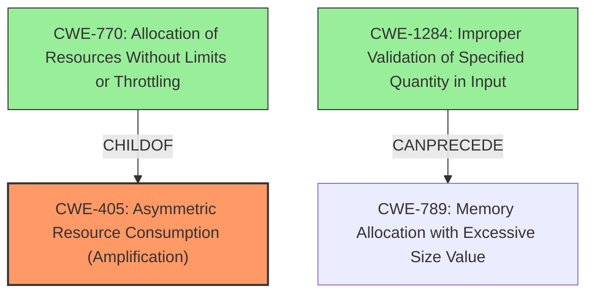

# Analysis Report for CVE-2022-40735

# Vulnerability Analysis Report: CVE-2022-40735

## Description


## Analysis (with Relationship Data)

# Summary
| CWE ID | CWE Name | Confidence | CWE Abstraction Level | CWE Vulnerability Mapping Label | CWE-Vulnerability Mapping Notes |
|---|---|---|---|---|---|
| CWE-405 | Asymmetric Resource Consumption (Amplification) | 0.9 | Class | Primary | Allowed-with-Review |
| CWE-770 | Allocation of Resources Without Limits or Throttling | 0.8 | Base | Secondary | Allowed |
| CWE-1284 | Improper Validation of Specified Quantity in Input | 0.7 | Base | Secondary | Allowed |

## Evidence and Confidence

*   **Confidence Score:** 0.9
*   **Evidence Strength:** HIGH

## Relationship Analysis
The primary CWE selected is CWE-405 Asymmetric Resource Consumption (Amplification), which is a Class-level CWE. This vulnerability involves an attacker causing excessive resource consumption on the server with minimal effort. The root cause is the use of long exponents in the Diffie-Hellman key exchange and **lack of validation of input**. CWE-405 is a parent of other CWEs such as CWE-770 Allocation of Resources Without Limits or Throttling. CWE-1284 Improper Validation of Specified Quantity in Input can precede CWE-789 Memory Allocation with Excessive Size Value.



## Vulnerability Chain
The vulnerability chain starts with the **use of long exponents** in Diffie-Hellman key exchange, leading to computationally expensive server-side calculations. The **lack of input validation** allows attackers to exploit this by providing invalid public keys, which amplifies the resource consumption, ultimately resulting in a denial of service.

## Summary of Analysis
The initial assessment focused on identifying the root cause and the impact of the vulnerability. The vulnerability description highlights the **use of long exponents** and the potential for denial of service due to server-side resource consumption. The CVE Reference Links Content Summary confirms the root cause, the **lack of input validation**, and the asymmetric nature of the attack, where minimal attacker resources can cause significant server resource exhaustion.

The relationship analysis helped in understanding the connections between different types of weaknesses. CWE-405 (Asymmetric Resource Consumption) is a high-level classification that encompasses the general problem, while CWE-770 (Allocation of Resources Without Limits or Throttling) and CWE-1284 (Improper Validation of Specified Quantity in Input) describe specific mechanisms contributing to the vulnerability.

The final decision to select CWE-405 as the primary CWE is based on its accurate representation of the vulnerability's core characteristic: the asymmetric nature of resource consumption. The supporting CWEs, CWE-770 and CWE-1284, provide additional context by specifying the allocation of resources without limits and the **lack of input validation**, respectively. The selected CWEs are at the optimal level of specificity because they directly address the root cause and contributing factors, avoiding overly broad classifications.

Relevant CWE Information:

# Enhanced Context (25 CWEs)
The following CWEs were identified as potentially relevant to this vulnerability:

## CWE-405: Asymmetric Resource Consumption (Amplification)
**Abstraction Level**: Class
**Similarity Score**: 0.79
**Source**: dense

**Description**:
The product does not properly control situations in which an adversary can cause the product to consume or produce excessive resources without requiring the adversary to invest equivalent work or otherwise prove authorization, i.e., the adversary's influence is "asymmetric."

**Mapping Guidance**:
- Usage: Allowed-with-Review
- Rationale: This CWE entry is a Class and might have Base-level children that would be more appropriate

## CWE-770: Allocation of Resources Without Limits or Throttling
**Abstraction Level**: Base
**Similarity Score**: 0.75
**Source**: dense

**Description**:
The product allocates a reusable resource or group of resources on behalf of an actor without imposing any restrictions on the size or number of resources that can be allocated, in violation of the intended security policy for that actor.

**Mapping Guidance**:
- Usage: Allowed
- Rationale: This CWE entry is at the Base level of abstraction, which is a preferred level of abstraction for mapping to the root causes of vulnerabilities.

## CWE-1284: Improper Validation of Specified Quantity in Input
**Abstraction Level**: base
**Similarity Score**: 4.33
**Source**: graph

**Description**:
CWE-1284: Improper Validation of Specified Quantity in Input

**Mapping Guidance**:
- Usage: Allowed
- Rationale: This CWE entry is at the Base level of abstraction, which is a preferred level of abstraction for mapping to the root causes of vulnerabilities.

CWE-400 Uncontrolled Resource Consumption was considered but not selected as the primary CWE because it is a more general case of resource exhaustion. The vulnerability description specifically points to the asymmetric nature of the resource consumption, making CWE-405 a more accurate fit. CWE-203 Observable Discrepancy and CWE-327 Use of a Broken or Risky Cryptographic Algorithm were also considered but deemed less relevant as they do not directly address the root cause of the vulnerability. CWE-789 Memory Allocation with Excessive Size Value was considered but deemed less directly relevant than CWE-770 and CWE-1284.


## CWE Relationship Analysis

Current CWEs represent these abstraction levels: .


### Vulnerability Chain Analysis

**Chain starting from CWE-203:**
- 203 (Observable Discrepancy) - ROOT


**Chain starting from CWE-327:**
- 327 (Use of a Broken or Risky Cryptographic Algorithm) - ROOT


### CWE Relationship Diagram

```mermaid
graph TD
    classDef primary fill:#f96,stroke:#333,stroke-width:2px
    classDef secondary fill:#69f,stroke:#333
    classDef tertiary fill:#9e9,stroke:#333
```


*Report generated on 2025-03-31 10:33:14*
