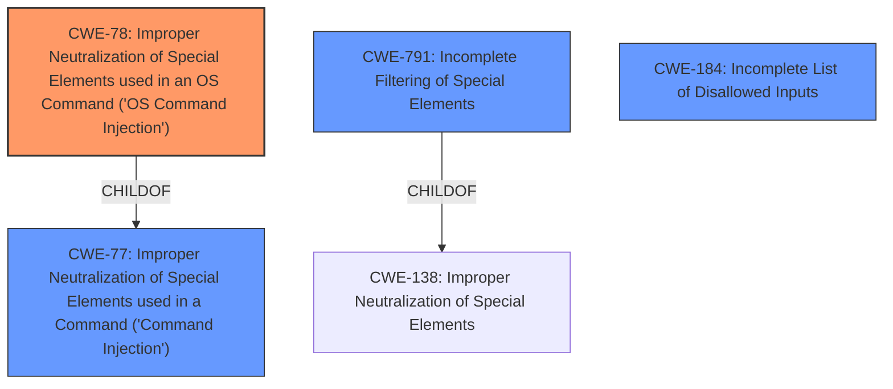

# Analysis for CVE-2022-40740

# Summary
| CWE ID | CWE Name | Confidence | CWE Abstraction Level | CWE Vulnerability Mapping Label | CWE-Vulnerability Mapping Notes |
|---|---|---|---|---|---|
| **CWE-78** | Improper Neutralization of Special Elements used in an OS Command ('OS Command Injection') | 1.0 | Base | Primary | Allowed |
| CWE-77 | Improper Neutralization of Special Elements used in a Command ('Command Injection') | 0.7 | Class | Secondary | Allowed-with-Review, consider if not OS Command Injection. |
| CWE-791 | Incomplete Filtering of Special Elements | 0.6 | Base | Secondary | Allowed, consider if filtering is the root cause and is incomplete. |
| CWE-184 | Incomplete List of Disallowed Inputs | 0.5 | Base | Secondary | Allowed, consider if a denylist is the root cause. |

## Evidence and Confidence

*   **Confidence Score:** 1.0
*   **Evidence Strength:** HIGH

## Relationship Analysis
The primary CWE is CWE-78, which is a Base level weakness and a child of CWE-77. CWE-77 is a more general Class-level weakness. The vulnerability involves **command injection** attacks, which aligns with the descriptions of both CWE-78 and CWE-77. Because the **command injection** leads to arbitrary system commands, CWE-78 is a more specific fit. CWE-791 and CWE-184 are also related in that they describe **insufficient filtering**, which is the root cause here.

## Vulnerability Chain
The vulnerability chain starts with **insufficient input filtering**, which allows an attacker to perform **command injection**. The **command injection** leads to arbitrary system command execution, system manipulation, or service disruption.

## Summary of Analysis
The initial assessment strongly points towards **CWE-78 (Improper Neutralization of Special Elements used in an OS Command ('OS Command Injection'))** as the primary CWE. The vulnerability description explicitly mentions **command injection** leading to arbitrary system command execution, and the CVE Reference Links Content Summary confirms that the root cause is the Realtek GPON router **does not filter special characters**.

The vulnerability description states: "Realtek GPON router has **insufficient filtering** for special characters. A remote attacker authenticated as an administrator can exploit this vulnerability to perform **command injection** attacks, to execute arbitrary system command, manipulate system or disrupt service."

The "CVE Reference Links Content Summary" states: "Root cause of vulnerability: The Realtek GPON router **does not filter special characters** in specific function fields."
"Weaknesses/vulnerabilities: Command Injection"

CWE-78 is at the Base level of abstraction, which is the preferred level. The mapping guidance for CWE-78 states that it is "Allowed" and the rationale is "This CWE entry is at the Base level of abstraction, which is a preferred level of abstraction for mapping to the root causes of vulnerabilities."

CWE-77 was considered but not chosen as the primary because it is a more general class that applies to command injection in general, not specifically OS commands.

CWE-791 (Incomplete Filtering of Special Elements) was considered as a secondary CWE. This could be a contributing factor, as the filtering is present but insufficient.

CWE-184 (Incomplete List of Disallowed Inputs) was considered as a secondary CWE. If the **insufficient filtering** is specifically due to a denylist, then this CWE would be applicable.

Other CWEs considered but rejected:
*   CWE-20 (Improper Input Validation): This is too general and discouraged.
*   CWE-89 (Improper Neutralization of Special Elements used in an SQL Command ('SQL Injection')): This is specific to SQL injection and not applicable here.
*   CWE-94 (Improper Control of Generation of Code ('Code Injection')): The vulnerability is not about generating code, but about executing commands.

Relevant CWE Information:

# Enhanced Context (25 CWEs)

## CWE-78: Improper Neutralization of Special Elements used in an OS Command ('OS Command Injection')
**Abstraction:** Base
**Similarity Score**: 5.03
**Source**: graph

**Description**:
The product constructs all or part of an OS command using externally-influenced input from an upstream component, but it does not neutralize or incorrectly neutralizes special elements that could modify the intended OS command when it is sent to a downstream component.

**Mapping Guidance**:
- Usage: Allowed
- Rationale: This CWE entry is at the Base level of abstraction, which is a preferred level of abstraction for mapping to the root causes of vulnerabilities.

**Relationships**:
- CANFOLLOW -> CWE-184
- CANALSOBE -> CWE-88
- CHILDOF -> CWE-77

## CWE-77: Improper Neutralization of Special Elements used in a Command ('Command Injection')
**Abstraction:** Class
**Similarity Score**: 1.00
**Source**: alternate_terms

**Description**:
The product constructs all or part of a command using externally-influenced input from an upstream component, but it does not neutralize or incorrectly neutralizes special elements that could modify the intended command when it is sent to a downstream component.

**Mapping Guidance**:
- Usage: Allowed-with-Review
- Rationale: CWE-77 is often misused when OS command injection (CWE-78) was intended instead [REF-1287]. If the weakness involves a command language besides OS shell invocation, then CWE-77 could be used.
- Suggested Alternatives: CWE-78: OS Command Injection

## CWE-791: Incomplete Filtering of Special Elements
**Abstraction:** Base
**Similarity Score**: 0.271
**Source**: sparse

**Description**:
The product receives data from an upstream component, but does not completely filter special elements before sending it to a downstream component.

**Mapping Guidance**:
- Usage: Allowed
- Rationale: This CWE entry is at the Base level of abstraction, which is a preferred level of abstraction for mapping to the root causes of vulnerabilities.

## CWE-184: Incomplete List of Disallowed Inputs
**Abstraction:** Base
**Similarity Score**: 0.002
**Source**: graph

**Description**:
The product implements a protection mechanism that relies on a list of inputs (or properties of inputs) that are not allowed by policy or otherwise require other action to neutralize before additional processing takes place, but the list is incomplete.

**Mapping Guidance**:
- Usage: Allowed
- Rationale: This CWE entry is at the Base level of abstraction, which is a preferred level of abstraction for mapping to the root causes of vulnerabilities.