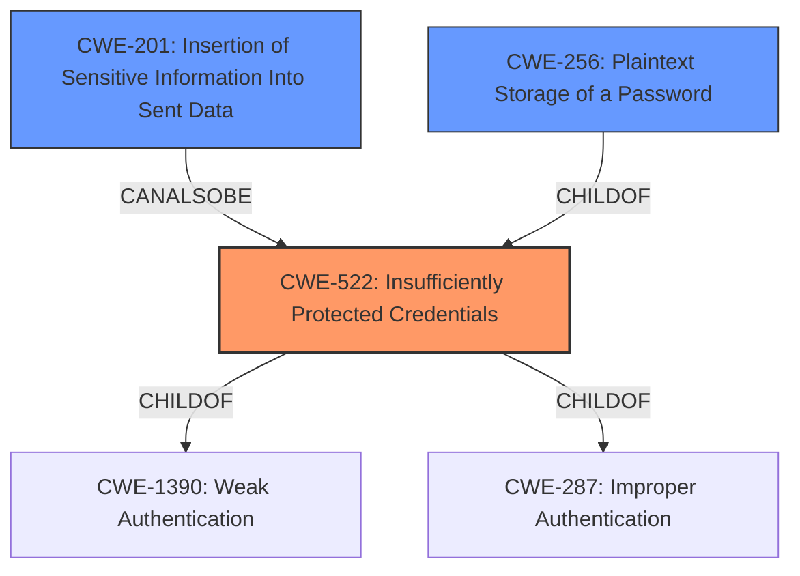

# Analysis for CVE-2022-40751

# Summary
| CWE ID | CWE Name | Confidence | CWE Abstraction Level | CWE Vulnerability Mapping Label | CWE-Vulnerability Mapping Notes |
|---|---|---|---|---|---|
| CWE-522 | Insufficiently Protected Credentials | 1.0 | Class | Allowed-with-Review | Primary CWE |
| CWE-201 | Insertion of Sensitive Information Into Sent Data | 0.7 | Base | Allowed | Secondary Candidate |
| CWE-256 | Plaintext Storage of a Password | 0.6 | Base | Allowed | Secondary Candidate |

## Evidence and Confidence

*   **Confidence Score:** 0.9
*   **Evidence Strength:** HIGH

## Relationship Analysis
The primary CWE, CWE-522 (Insufficiently Protected Credentials), is a class-level CWE. It has child relationships with CWE-1390 (Weak Authentication) and CWE-287 (Improper Authentication). The vulnerability involves the **recovery of previously saved credentials**, indicating that the credentials were not adequately protected. CWE-201 (Insertion of Sensitive Information Into Sent Data) is a base-level CWE and a candidate because the vulnerability leads to the exposure of sensitive information. CWE-256 (Plaintext Storage of a Password) is a potential related issue, although the description focuses on recovery of previously saved credentials, not necessarily that they were stored in plaintext.

## Vulnerability Chain
The vulnerability chain starts with the **insufficient protection of LDAP search credentials**, leading to the **exposure of these credentials to an administrator user**. The final impact is the **potential unauthorized access to the LDAP server and the information stored within it**.

## Summary of Analysis
The initial analysis focused on the **weakness of recovering previously saved credentials**. The retriever results pointed to CWE-522 (Insufficiently Protected Credentials) as a potential match.

The vulnerability description states that a user with administrative privileges "...may be able to **recover a credential previously saved** for performing authenticated LDAP searches." The CVE Reference Links Content Summary supports this by stating, "Insufficiently protected LDAP search credentials. An Administrator user could gain access to previously configured LDAP search credentials used during authentication."

CWE-522 is a Class-level CWE, and the mapping guidance suggests examining child CWEs for a better fit. However, based on the available evidence, the core issue is the **insufficient protection of the credentials themselves**, rather than a specific method of exposure or storage.

CWE-201 (Insertion of Sensitive Information Into Sent Data) is considered a secondary candidate because the **recovery of the credentials** leads to sensitive information being exposed. CWE-256 (Plaintext Storage of a Password) is a possible contributing factor if the credentials were, in fact, stored in plaintext, but there isn't sufficient evidence to confirm this. Thus, my primary assessment is based only on the provided evidence.

The selection of CWE-522 is at an appropriate level of specificity, given the available information. While more specific child CWEs might exist, the current description primarily highlights the **insufficient protection** as the root cause.

Relevant CWE Information:
# Enhanced Context (25 CWEs)
The following CWEs were identified as potentially relevant to this vulnerability:

## CWE-312: Cleartext Storage of Sensitive Information
**Abstraction Level**: Base
**Similarity Score**: 0.77
**Source**: dense

**Description**:
The product stores sensitive information in cleartext within a resource that might be accessible to another control sphere.

**Mapping Guidance**:
- Usage: Allowed
- Rationale: This CWE entry is at the Base level of abstraction, which is a preferred level of abstraction for mapping to the root causes of vulnerabilities.

CWE-312, while related to storing sensitive information, is not the best fit because the primary issue is the ability to **recover** the credential, not necessarily that it was stored in cleartext (though that is a possibility).

## CWE-212: Improper Removal of Sensitive Information Before Storage or Transfer
**Abstraction Level**: Base
**Similarity Score**: 0.76
**Source**: dense

**Description**:
The product stores, transfers, or shares a resource that contains sensitive information, but it does not properly remove that information before the product makes the resource available to unauthorized actors.

**Mapping Guidance**:
- Usage: Allowed
- Rationale: This CWE entry is at the Base level of abstraction, which is a preferred level of abstraction for mapping to the root causes of vulnerabilities.

CWE-212 is also not the best fit as it deals with the **improper removal** of sensitive information before storage/transfer, whereas this vulnerability is focused on the ability to **recover** credentials.

## CWE-538: Insertion of Sensitive Information into Externally-Accessible File or Directory
**Abstraction Level**: Base
**Similarity Score**: 0.76
**Source**: dense

**Description**:
The product places sensitive information into files or directories that are accessible to actors who are allowed to have access to the files, but not to the sensitive information.

**Mapping Guidance**:
- Usage: Allowed
- Rationale: This CWE entry is at the Base level of abstraction, which is a preferred level of abstraction for mapping to the root causes of vulnerabilities.

CWE-538 is not directly relevant because the described vulnerability is about **recovering** stored credentials, not placing sensitive information into files.

## CWE-319: Cleartext Transmission of Sensitive Information
**Abstraction Level**: Base
**Similarity Score**: 0.76
**Source**: dense

**Description**:
The product transmits sensitive or security-critical data in cleartext in a communication channel that can be sniffed by unauthorized actors.

**Mapping Guidance**:
- Usage: Allowed
- Rationale: This CWE entry is at the Base level of abstraction, which is a preferred level of abstraction for mapping to the root causes of vulnerabilities.

CWE-319 is not relevant because the vulnerability doesn't involve **transmission** of sensitive information in cleartext, but **recovering** previously stored credentials.

## CWE-1391: Use of Weak Credentials
**Abstraction Level**: Class
**Similarity Score**: 0.75
**Source**: dense

**Description**:
The product uses weak credentials (such as a default key or hard-coded password) that can be calculated, derived, reused, or guessed by an attacker.

**Mapping Guidance**:
- Usage: Allowed-with-Review
- Rationale: This CWE entry is a Class and might have Base-level children that would be more appropriate

CWE-1391 is not the primary issue here. The vulnerability description focuses on the **insufficient protection of credentials**, making them recoverable, rather than the use of weak credentials.

## CWE-668: Exposure of Resource to Wrong Sphere
**Abstraction Level**: Class
**Similarity Score**: 0.75
**Source**: dense

**Description**:
The product exposes a resource to the wrong control sphere, providing unintended actors with inappropriate access to the resource.

**Mapping Guidance**:
- Usage: Discouraged
- Rationale: CWE-668 is high-level and is often misused as a catch-all when lower-level CWE IDs might be applicable. It is sometimes used for low-information vulnerability reports [REF-1287]. It is a level-1 Class (i.e., a child of a Pillar). It is not useful for trend analysis.

CWE-668 is too high-level and doesn't accurately describe the vulnerability. CWE-522 provides a more specific classification.

## CWE-226: Sensitive Information in Resource Not Removed Before Reuse
**Abstraction Level**: Base
**Similarity Score**: 0.75
**Source**: dense

**Description**:
The product releases a resource such as memory or a file so that it can be made available for reuse, but it does not clear or "zeroize" the information contained in the resource before the product performs a critical state transition or makes the resource available for reuse by other entities.

**Mapping Guidance**:
- Usage: Allowed
- Rationale: This CWE entry is at the Base level of abstraction, which is a preferred level of abstraction for mapping to the root causes of vulnerabilities.

CWE-226 is about resources not being cleared before reuse, which isn't directly applicable to the vulnerability described.

## CWE-74: Improper Neutralization of