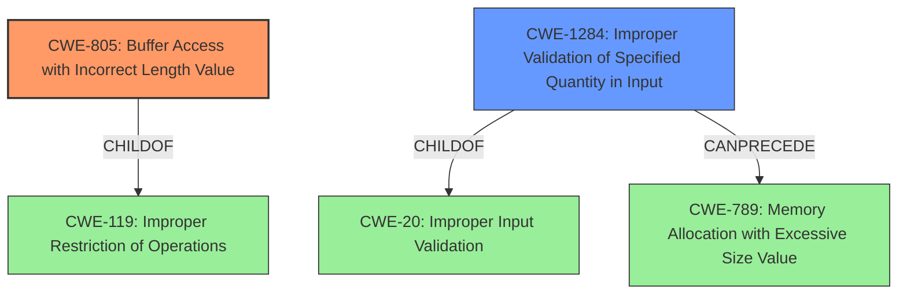

# Analysis Report for CVE-2022-40757

# Vulnerability Analysis Report: CVE-2022-40757

## Description


## Analysis (with Relationship Data)

# Summary
| CWE ID | CWE Name | Confidence | CWE Abstraction Level | CWE Vulnerability Mapping Label | CWE-Vulnerability Mapping Notes |
|---|---|---|---|---|---|
| CWE-805 | Buffer Access with Incorrect Length Value | 1.0 | Base | Allowed | Primary CWE |
| CWE-1284 | Improper Validation of Specified Quantity in Input | 0.9 | Base | Allowed | Secondary Candidate |

## Evidence and Confidence

*   **Confidence Score:** 0.95
*   **Evidence Strength:** HIGH

## Relationship Analysis
The primary CWE, CWE-805 (**Buffer Access with Incorrect Length Value**), is a base-level CWE that accurately describes the vulnerability. It is a child of CWE-119 (**Improper Restriction of Operations within the Bounds of a Memory Buffer**), indicating a more general class of buffer-related errors. CWE-1284 (**Improper Validation of Specified Quantity in Input**) is a child of CWE-20 (**Improper Input Validation**). CWE-1284 can precede CWE-789 (**Allocation of Resources Without Limits or Throttling**) in a vulnerability chain.



## Vulnerability Chain
The vulnerability chain starts with the **lack of input validation** (CWE-1284) of the `messageLen` parameter. This leads to **buffer access with an incorrect length value** (CWE-805) within the `TEE_MACComputeFinal` function, ultimately resulting in a denial of service (DoS).

## Summary of Analysis
The initial analysis correctly identifies the **Buffer Access with Incorrect Length Value** as the primary weakness. The evidence from both the vulnerability description and the CVE Reference Links Content Summary support this. The vulnerability description states that the function `TEE_MACComputeFinal` is invoked with an **excessive size value** of `messageLen`. The CVE Reference Links Content Summary confirms that the root cause is the lack of proper size validation of the `messageLen` argument, leading to potential buffer overflows.

The choice of CWE-805 is further supported by the Retriever Results, which lists it as the top combined result with a similarity score of 0.81. The CWE's description, "The product uses a sequential operation to read or write a buffer, but it uses an incorrect length value that causes it to access memory that is outside of the bounds of the buffer," aligns perfectly with the vulnerability.

CWE-1284 is included as a secondary weakness because the root cause involves a **lack of validation** of the size parameter, which allows an attacker to specify an excessive size. It is listed in the Retriever Results with a good score as well.

CWE-787 (**Out-of-bounds Write**) was considered, since a buffer overflow is possible. However, since no write is mentioned in the description, CWE-805 is preferred.

The selected CWEs are at the optimal level of specificity, as they accurately represent the specific weakness and its root cause.

Relevant CWE Information:
- Vulnerability Description Key Phrases:
  - **rootcause:** **Buffer Access with Incorrect Length Value**
  - **vector:** excessive size value of messageLen
- CVE Reference Links Content Summary:
  - **Weaknesses/vulnerabilities present:**
    - **Buffer Access with Incorrect Length Value:** The vulnerability is present due to the incorrect handling of size parameters passed to the mentioned functions. The functions use these size values directly in memory copy operations (`memcpy`, `utee_cipher_update`, `utee_hash_final`), which can lead to out-of-bounds memory access.
  - **Lack of Input Validation:** The core issue is that the `TEE_MACUpdate`, `TEE_MACComputeFinal`, and `TEE_CipherUpdate` do not validate if the `chunkSize`, `messageLen`, and `srcLen` arguments correspond to the actual buffer sizes leading to potential buffer overflow.


## CWE Relationship Analysis

Current CWEs represent these abstraction levels: .


### Vulnerability Chain Analysis

**Chain starting from CWE-805:**
- 805 (Buffer Access with Incorrect Length Value) - ROOT


**Chain starting from CWE-20:**
- 20 (Improper Input Validation) - ROOT


### CWE Relationship Diagram

```mermaid
graph TD
    classDef primary fill:#f96,stroke:#333,stroke-width:2px
    classDef secondary fill:#69f,stroke:#333
    classDef tertiary fill:#9e9,stroke:#333
```


*Report generated on 2025-03-31 08:51:40*
