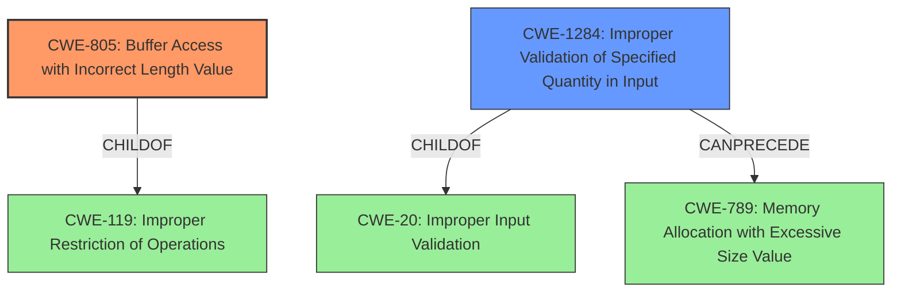

# Analysis Report for CVE-2022-40758

# Vulnerability Analysis Report: CVE-2022-40758

## Description


## Analysis (with Relationship Data)

# Summary
| CWE ID | CWE Name | Confidence | CWE Abstraction Level | CWE Vulnerability Mapping Label | CWE-Vulnerability Mapping Notes |
|---|---|---|---|---|---|
| CWE-805 | Buffer Access with Incorrect Length Value | 0.9 | Base | Allowed | Primary CWE |
| CWE-1284 | Improper Validation of Specified Quantity in Input | 0.7 | Base | Allowed | Secondary Candidate |

## Evidence and Confidence

*   **Confidence Score:** 0.8
*   **Evidence Strength:** HIGH

## Relationship Analysis
The primary relationship that influenced the selection of CWE-805 is its direct correlation to the **root cause**, which is a **Buffer Access with Incorrect Length Value**. CWE-805 is a `Base` level CWE, which is preferred. CWE-805 is a `ChildOf` CWE-119 (Improper Restriction of Operations within the Bounds of a Memory Buffer). CWE-1284 also has a `ChildOf` CWE-20 (Improper Input Validation). There is a chain relationship where CWE-1284 can precede CWE-789 (Memory Allocation with Excessive Size Value) .



## Vulnerability Chain
The vulnerability chain starts with the **Buffer Access with Incorrect Length Value** (CWE-805) due to **lack of input validation for size parameters from TA in TEE OS functions**, leading to out-of-bounds memory access. This ultimately results in a Denial of Service (DoS). A more complete chain would include **Improper Validation of Specified Quantity in Input** (CWE-1284) which could have prevented the **Buffer Access with Incorrect Length Value** (CWE-805) and lead to a DoS.

## Summary of Analysis
The initial analysis focused on identifying the **root cause** of the vulnerability, which is the **Buffer Access with Incorrect Length Value** in the `TEE_CipherUpdate` function. The vulnerability description explicitly mentions this weakness. The "CVE Reference Links Content Summary" confirms that the **root cause** is due to a **lack of input validation for size parameters from TA in TEE OS functions**. This lack of validation allows an attacker to trigger a Denial of Service (DoS) by providing an excessively large `srcLen` value.

The graph relationships helped to refine the selection of CWE-805 as the primary CWE, as it is a direct consequence of the **Buffer Access with Incorrect Length Value**. CWE-1284 was considered as a possible cause and included as a secondary CWE as that weakness could have prevented CWE-805.

The selected CWEs are at the optimal level of specificity, as they accurately represent the **root cause** and contributing factors of the vulnerability. CWE-805 directly describes the **Buffer Access with Incorrect Length Value**, while CWE-1284 highlights the **improper validation** of input.

Relevant CWE Information:

# Enhanced Context (25 CWEs)

## CWE-805: Buffer Access with Incorrect Length Value
**Abstraction Level**: Base
**Similarity Score**: 0.79
**Source**: dense

**Description**:
The product uses a sequential operation to read or write a buffer, but it uses an incorrect length value that causes it to access memory that is outside of the bounds of the buffer.

**Mapping Guidance**:
- Usage: Allowed
- Rationale: This CWE entry is at the Base level of abstraction, which is a preferred level of abstraction for mapping to the root causes of vulnerabilities.

## CWE-1284: Improper Validation of Specified Quantity in Input
**Abstraction Level**: Base
**Similarity Score**: 6156.56
**Source**: sparse

**Description**:
The product receives input that is expected to specify a quantity (such as size or length), but it does not validate or incorrectly validates that the quantity has the required properties.

**Mapping Guidance**:
- Usage: Allowed
- Rationale: This CWE entry is at the Base level of abstraction, which is a preferred level of abstraction for mapping to the root causes of vulnerabilities.


## CWE Relationship Analysis

Current CWEs represent these abstraction levels: .


### Vulnerability Chain Analysis

**Chain starting from CWE-805:**
- 805 (Buffer Access with Incorrect Length Value) - ROOT


**Chain starting from CWE-20:**
- 20 (Improper Input Validation) - ROOT


### CWE Relationship Diagram

```mermaid
graph TD
    classDef primary fill:#f96,stroke:#333,stroke-width:2px
    classDef secondary fill:#69f,stroke:#333
    classDef tertiary fill:#9e9,stroke:#333
```


*Report generated on 2025-03-31 02:52:22*
