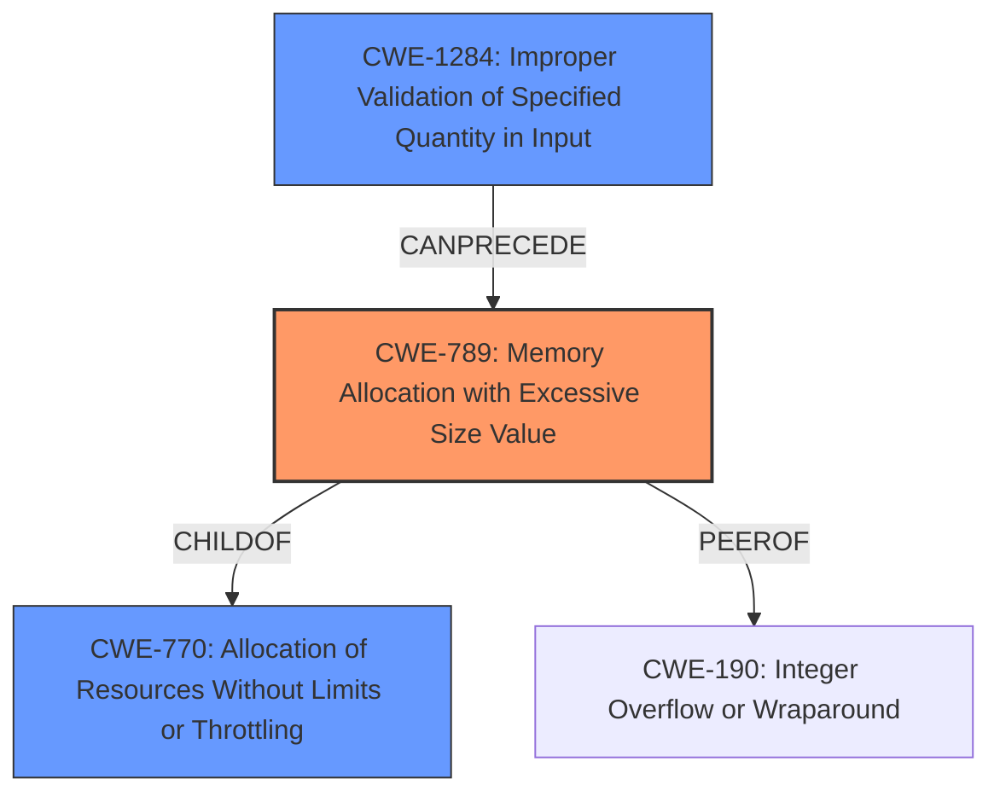

# Analysis for CVE-2022-40762

# Summary
| CWE ID  | CWE Name | Confidence | CWE Abstraction Level | CWE Vulnerability Mapping Label | CWE-Vulnerability Mapping Notes |
|----------------|------------------------------------------------------|------------|-----------------------|-----------------------------------|------------------------------------|
| **CWE-789** | Memory Allocation with Excessive Size Value | 0.9 | Variant | Primary | Allowed |
| CWE-770 | Allocation of Resources Without Limits or Throttling | 0.7 | Base | Secondary | Allowed |
| CWE-1284 | Improper Validation of Specified Quantity in Input | 0.6 | Base | Secondary | Allowed |

## Evidence and Confidence

*   **Confidence Score:** 0.8
*   **Evidence Strength:** HIGH

## Relationship Analysis
The primary CWE, CWE-789 **Memory Allocation with Excessive Size Value**, is a Variant of CWE-770 **Allocation of Resources Without Limits or Throttling**. CWE-789 is often related to CWE-190 **Integer Overflow or Wraparound** and can be preceded by CWE-1284 **Improper Validation of Specified Quantity in Input**. Choosing CWE-789 as the primary is based on its specific nature related to memory allocation sizes. CWE-770 describes a broader class of resource allocation issues, while CWE-1284 highlights the validation aspect of the input, which is relevant as a contributing factor.

## Vulnerability Chain
The vulnerability chain starts with **Improper Validation of Specified Quantity in Input** (CWE-1284), which leads to **Memory Allocation with Excessive Size Value** (CWE-789), and finally results in a **Denial of Service** (impact).

## Summary of Analysis
The initial assessment identified **Memory Allocation with Excessive Size Value** as a key weakness. The evidence from the vulnerability description and CVE Reference Links Content Summary strongly supports this. The root cause lies in the `TEE_Realloc` function **failing to validate the size** requested for memory allocation. This allows an attacker (a trusted application) to request an excessively large amount of memory, leading to a crash of the trusted execution environment (TEE) kernel and a denial-of-service condition.

The Retriever results also point to CWE-789 as a highly relevant CWE. The relationship analysis and chain mapping helped in understanding the progression of the vulnerability from **input validation failure** to **excessive memory allocation** to **denial of service**. The selection of CWE-789 is based on its specific fit to the **root cause** of the vulnerability, as the function does not properly validate or limit the size value, which is explicitly mentioned in both the vulnerability description and CVE details.

Relevant CWE Information:

# Enhanced Context (25 CWEs)
The following CWEs were identified as potentially relevant to this vulnerability:

## CWE-789: Memory Allocation with Excessive Size Value
**Abstraction Level**: Variant
**Similarity Score**: 0.80
**Source**: dense

**Description**:
The product allocates memory based on an untrusted, large size value, but it does not ensure that the size is within expected limits, allowing arbitrary amounts of memory to be allocated.

**Mapping Guidance**:
- Usage: Allowed
- Rationale: This CWE entry is at the Variant level of abstraction, which is a preferred level of abstraction for mapping to the root causes of vulnerabilities.

## CWE-770: Allocation of Resources Without Limits or Throttling
**Abstraction Level**: Base
**Similarity Score**: 0.75
**Source**: dense

**Description**:
The product allocates a reusable resource or group of resources on behalf of an actor without imposing any restrictions on the size or number of resources that can be allocated, in violation of the intended security policy for that actor.

**Mapping Guidance**:
- Usage: Allowed
- Rationale: This CWE entry is at the Base level of abstraction, which is a preferred level of abstraction for mapping to the root causes of vulnerabilities.

## CWE-1284: Improper Validation of Specified Quantity in Input
**Abstraction Level**: Base
**Similarity Score**: 0.78
**Source**: sparse

**Description**:
The product receives input that is expected to specify a quantity (such as size or length), but it does not validate or incorrectly validates that the quantity has the required properties.

**Mapping Guidance**:
- Usage: Allowed
- Rationale: This CWE entry is at the Base level of abstraction, which is a preferred level of abstraction for mapping to the root causes of vulnerabilities.

The decision to use CWE-789 is based on the following evidence:
* Vulnerability Description Key Phrases: "**Memory Allocation with Excessive Size Value**"
* CVE Reference Links Content Summary: "**Lack of Size Validation:** The primary weakness is the absence of a check on the `newSize` parameter in the `TEE_Realloc` function. This allows a caller to request an allocation of an excessively large memory chunk."

CWEs considered but not used:

*   CWE-190 Integer Overflow or Wraparound: While a possibility, the report does not explicitly state an integer overflow occurred.
*   CWE-400 Uncontrolled Resource Consumption: Too general; CWE-789 is a more specific variant.
*   CWE-805 Buffer Access with Incorrect Length Value: This CWE is about accessing a buffer with an incorrect length. The issue is that the initial allocation is too large.