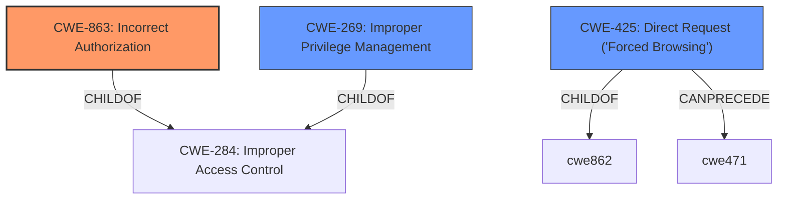

# Analysis for CVE-2022-40773

# Summary
| CWE ID    | CWE Name                                                        | Confidence | CWE Abstraction Level | CWE Vulnerability Mapping Label | CWE-Vulnerability Mapping Notes |
| :--------- | :-------------------------------------------------------------- | :--------- | :---------------------- | :------------------------------ | :------------------------------ |
| CWE-863     | Incorrect Authorization                                         | 0.90       | Class                 | Primary                         | Allowed-with-Review             |
| CWE-425    | Direct Request ('Forced Browsing')                                | 0.75       | Base                    | Secondary                        | Allowed            |
| CWE-269    | Improper Privilege Management                                      | 0.65       | Class                 | Secondary                         | Discouraged             |

## Evidence and Confidence

*   **Confidence Score:** 0.80
*   **Evidence Strength:** HIGH

## Relationship Analysis
The primary weakness is classified as CWE-863 (**Incorrect Authorization**), a Class-level CWE. While specific base-level CWEs may exist as children of CWE-863, the description indicates a general **incorrect authorization** mechanism rather than a more specific flaw. CWE-425 (**Direct Request**) is included because the vulnerability involves manipulating URL parameters to access unauthorized data, aligning with the concept of bypassing authorization checks on restricted URLs. CWE-269 (**Improper Privilege Management**) is considered because the vulnerability results in privilege escalation, though it is a more general Class-level CWE. The relationship analysis shows that a higher-level Class CWE (CWE-863) can encompass more specific Base CWEs when granular details are lacking.

## Vulnerability Chain
The vulnerability chain starts with **improper input validation** leading to **incorrect authorization**, which ultimately results in **privilege escalation** and **unauthorized access to restricted data**.

1.  **Improper Input Validation:** The application **fails to properly validate user-supplied data** during export.
2.  **Incorrect Authorization (CWE-863):** Due to the lack of validation, authorization checks are performed incorrectly or bypassed.
3.  **Privilege Escalation:** Attackers can escalate their privileges to resources normally protected.
4.  **Unauthorized Access to Restricted Data:** Attackers gain access to data they are not authorized to view.

## Summary of Analysis
The primary assessment is based on the provided vulnerability description and the CVE reference summary, which highlight the **lack of proper validation** and resulting **privilege escalation**. The relationship graph helped to clarify the connections between different authorization-related CWEs.

The selection of CWE-863 (**Incorrect Authorization**) as the primary CWE is based on the evidence stating that the application performs an authorization check, but does not correctly perform the check. CWE-863 is chosen because it describes the authorization mechanism **does not correctly perform the check**.

CWE-425 (**Direct Request ('Forced Browsing')**) is selected as a secondary CWE because the attack vector involves manipulating the URL parameters while exporting requests from the list view, as stated in the CVE Reference Links Content Summary: **URL manipulation**.

CWE-269 (**Improper Privilege Management**) is also considered a secondary CWE due to the impact of privilege escalation.

The chosen CWEs are at the optimal level of specificity given the available information. While more specific base-level CWEs may exist, the current evidence supports the broader classifications of **Incorrect Authorization**, **Direct Request**, and **Improper Privilege Management**.

Relevant CWE Information:
# Enhanced Context (25 CWEs)
The following CWEs were identified as potentially relevant to this vulnerability:

## CWE-274: Improper Handling of Insufficient Privileges
**Abstraction Level**: Base
**Similarity Score**: 0.79
**Source**: dense

**Description**:
The product does not handle or incorrectly handles when it has insufficient privileges to perform an operation, leading to resultant weaknesses.

**Mapping Guidance**:
- Usage: Discouraged
- Rationale: This CWE entry could be deprecated in a future version of CWE.

*   Not Selected: This CWE focuses on the product not handling insufficient privileges, whereas the described vulnerability revolves around a user gaining unauthorized access despite having some level of privileges.

## CWE-280: Improper Handling of Insufficient Permissions or Privileges 
**Abstraction Level**: Base
**Similarity Score**: 0.79
**Source**: dense

**Description**:
The product does not handle or incorrectly handles when it has insufficient privileges to access resources or functionality as specified by their permissions. This may cause it to follow unexpected code paths that may leave the product in an invalid state.

**Mapping Guidance**:
- Usage: Allowed
- Rationale: This CWE entry is at the Base level of abstraction, which is a preferred level of abstraction for mapping to the root causes of vulnerabilities.

*   Not Selected: Similar to CWE-274, this CWE is about the product's handling of insufficient privileges, not the incorrect granting or escalation of privileges.

## CWE-266: Incorrect Privilege Assignment
**Abstraction Level**: Base
**Similarity Score**: 0.78
**Source**: dense

**Description**:
A product incorrectly assigns a privilege to a particular actor, creating an unintended sphere of control for that actor.

**Mapping Guidance**:
- Usage: Allowed
- Rationale: This CWE entry is at the Base level of abstraction, which is a preferred level of abstraction for mapping to the root causes of vulnerabilities.

*   Not Selected: While this CWE is related to incorrect privilege assignment, the description suggests the issue is more about **incorrect authorization** during the export process rather than an explicit, flawed assignment of privileges.

## CWE-267: Privilege Defined With Unsafe Actions
**Abstraction Level**: Base
**Similarity Score**: 0.77
**Source**: dense

**Description**:
A particular privilege, role, capability, or right can be used to perform unsafe actions that were not intended, even when it is assigned to the correct entity.

**Mapping Guidance**:
- Usage: Allowed
- Rationale: This CWE entry is at the Base level of abstraction, which is a preferred level of abstraction for mapping to the root causes of vulnerabilities.

*   Not Selected: This CWE focuses on privileges that inherently allow unsafe actions, which is not the primary issue in the given vulnerability. The problem is that a user gains access to more data than they should through **incorrect authorization**.

## CWE-668: Exposure of Resource to Wrong Sphere
**Abstraction Level**: Class
**Similarity Score**: 0.77
**Source**: dense

**Description**:
The product exposes a resource to the wrong control sphere, providing unintended actors with inappropriate access to the resource.

**Mapping Guidance**:
- Usage: Discouraged
- Rationale: CWE-668 is high-level and is often misused as a catch-all when lower-level CWE IDs might be applicable. It is sometimes used for low-information vulnerability reports [REF-1287]. It is a level-1 Class (i.e., a child of a Pillar). It is not useful for trend analysis.

*   Not Selected: This CWE is too broad and does not accurately reflect the specific issue of **incorrect authorization** leading to privilege escalation.

## CWE-807: Reliance on Untrusted Inputs in a Security Decision
**Abstraction Level**: Base
**Similarity Score**: 0.77
**Source**: dense

**Description**:
The product uses a protection mechanism that relies on the existence or values of an input, but the input can be modified by an untrusted actor in a way that bypasses the protection mechanism.

**Mapping Guidance**:
- Usage: Allowed
- Rationale: This CWE entry is at the Base level of abstraction, which is a preferred level of abstraction for mapping to the root causes of vulnerabilities.

*   Not Selected: This is too specific. The issue is that the **authorization** is incorrect, not that it relies on untrusted input.

## CWE-639: Authorization Bypass Through User-Controlled Key
**Abstraction Level**: Base
**Similarity Score**: 0.77
**Source**: dense

**Description**:
The system's authorization functionality does not prevent one user from gaining access to another user's data or record by modifying the key value identifying the data.

**Mapping Guidance**:
- Usage: Allowed
- Rationale: This CWE entry is at the Base level of abstraction, which is a preferred level of abstraction for mapping to the root causes of vulnerabilities.