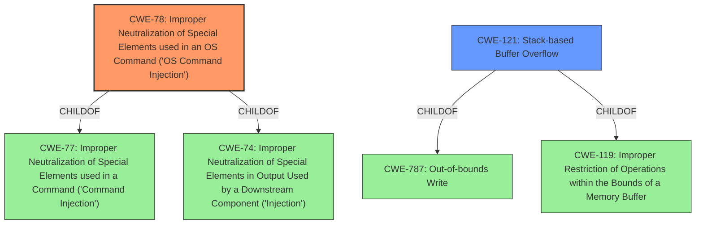

# Raw Analyzer Response for CVE-2022-40785

# Summary
| CWE ID    | CWE Name                                                                                               | Confidence | CWE Abstraction Level | CWE Vulnerability Mapping Label | CWE-Vulnerability Mapping Notes |
| :-------- | :----------------------------------------------------------------------------------------------------- | :--------- | :---------------------- | :------------------------------ | :------------------------------ |
| CWE-78 | Improper Neutralization of Special Elements used in an OS Command ('OS Command Injection') | 1          | Base                    | Allowed                       | Primary CWE                     |
| CWE-121   | Stack-based Buffer Overflow                                                                            | 0.7        | Variant                 | Allowed                       | Secondary Candidate             |

## Evidence and Confidence

*   **Confidence Score:** 0.9
*   **Evidence Strength:** HIGH

## Relationship Analysis
The primary CWE is CWE-78, which is a base-level CWE and fits the vulnerability well. It is related to CWE-77 (Improper Neutralization of Special Elements) and CWE-74 (Improper Neutralization of Special Elements in Output Used by a Downstream Component ('Injection')), but is more specific than those. CWE-121 is related to buffer overflows that can allow for Remote Code Execution and is a child of CWE-787 (Out-of-bounds Write) and CWE-119 (Improper Restriction of Operations within the Bounds of a Memory Buffer). CWE-121 is a secondary candidate because the root cause is command injection, and the stack overflow is a contributing factor.

## Vulnerability Chain
The vulnerability chain starts with **unsanitized input when setting a locale file**, which leads to **shell injection** and ultimately results in **remote code execution**.

## Summary of Analysis
The initial analysis pointed towards **CWE-78**, which accurately captures the essence of **OS Command Injection** due to **unsanitized input**. The presence of **stack-based buffer overflow** suggests a secondary weakness (**CWE-121**) that contributes to the exploitability of the command injection.

The evidence supporting **CWE-78** is derived from the vulnerability description which states **"Unsanitized input when setting a locale file leads to shell injection"**. Additionally, the CVE reference links content summary mentions: *"The mIPC firmware has insufficient input sanitization when setting a timezone, leading to command injection."*

The presence of a stack-based buffer overflow is also supported by *"Stack-based buffer overflow via strcpy in the `choose_utc_timezone` function when copying the timezone string to a stack buffer."*

The decision to classify **CWE-78** as the primary weakness is based on its direct relevance to the command injection vulnerability. **CWE-121** is a secondary contributing factor that facilitated the remote code execution by overwriting memory on the stack. Both CWEs are at appropriate levels of specificity (Base and Variant, respectively). The hierarchical relationships and chain patterns helped refine the selection, ensuring the chosen CWEs accurately represent the vulnerability and its exploitability.