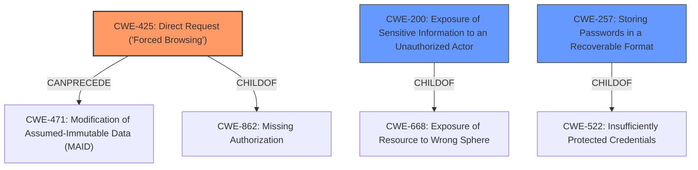

# Analysis for CVE-2022-40845

# Summary
| CWE ID | CWE Name | Confidence | CWE Abstraction Level | CWE Vulnerability Mapping Label | CWE-Vulnerability Mapping Notes |
|---|---|---|---|---|---|
| **CWE-425** | **Direct Request ('Forced Browsing')** | 0.9 | Base | Primary | Allowed |
| CWE-200 | Exposure of Sensitive Information to an Unauthorized Actor | 0.7 | Class | Secondary | Discouraged |
| CWE-257 | Storing Passwords in a Recoverable Format | 0.6 | Base | Secondary | Allowed |

## Evidence and Confidence

*   **Confidence Score:** 0.8
*   **Evidence Strength:** HIGH

## Relationship Analysis
The primary relationship influencing the CWE selection is the hierarchical structure with CWE-425 being a base-level weakness related to authorization bypass. CWE-200 represents the resulting information exposure. There's also a potential relationship with CWE-257 given the storage of passwords in a recoverable format within the configuration file.

## Vulnerability Chain
The vulnerability chain starts with a **missing authorization** check (CWE-425) allowing direct access to a configuration file. This leads to the **exposure of sensitive information** (CWE-200), including passwords stored in a **recoverable format** (CWE-257), potentially leading to full router access for the attacker.

## Summary of Analysis
The initial analysis identified a **password exposure vulnerability** due to **improper authorization**.

The evidence clearly shows that the router allows downloading the backup configuration file without authentication, which aligns directly with the description of CWE-425 (Direct Request ('Forced Browsing')). The "CVE Reference Links Content Summary" explicitly states this: "The router does not properly validate user sessions or authorization, allowing unauthenticated access to the backup configuration file." This is the root cause.

CWE-200 (Exposure of Sensitive Information to an Unauthorized Actor) is a valid secondary concern, as the configuration file contains sensitive information. However, CWE-200 is a class-level CWE and the mapping guidance discourages its use when more specific CWEs are applicable, and in this case, the unauthorized access (CWE-425) is the more direct cause of the information exposure. As the "CVE Reference Links Content Summary" states: "The backup configuration file contains sensitive information, including hashed user passwords, PSK keys, and other credentials in both encoded and decoded forms."

CWE-257 (Storing Passwords in a Recoverable Format) may also be present, as the configuration file contains hashed user passwords. As the "CVE Reference Links Content Summary" states: "An attacker can obtain the administrator's password hash, WiFi password, guest user credentials, and other sensitive information from the router's configuration."

The selection of CWE-425 is at the optimal level of specificity, as it accurately represents the **missing authorization** check that allows direct access to the configuration file. Other CWEs like CWE-287 (Improper Authentication) are more general and less precise in describing the root cause.

Relevant CWE Information:
- CWE-425: Direct Request ('Forced Browsing')
- CWE-200: Exposure of Sensitive Information to an Unauthorized Actor
- CWE-257: Storing Passwords in a Recoverable Format