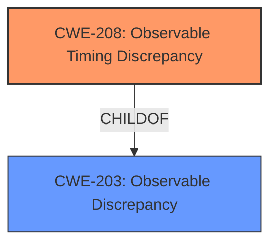

# Enhanced Analysis for CVE-2022-4087

# Summary
| CWE ID | CWE Name | Confidence | CWE Abstraction Level | CWE Vulnerability Mapping Label | CWE-Vulnerability Mapping Notes |
|---|---|---|---|---|---|
| CWE-208 | Observable Timing Discrepancy | 0.9 | Base | Allowed | Primary CWE |
| CWE-203 | Observable Discrepancy | 0.7 | Base | Allowed | Secondary CWE |

## Evidence and Confidence

*   **Confidence Score:** 0.8
*   **Evidence Strength:** HIGH

## Relationship Analysis
The primary CWE, CWE-208 Observable Timing Discrepancy, is a child of CWE-203 Observable Discrepancy. Selecting the more specific CWE-208 is appropriate because the vulnerability description clearly indicates that the **information exposure** occurs through timing differences related to how the TLS implementation handles invalid padding. This timing side channel allows an attacker to potentially infer information about the plaintext. The higher-level CWE-203 is still relevant as it captures the general concept of observable discrepancies, but CWE-208 provides a more precise classification.



## Vulnerability Chain
The vulnerability chain starts with the **manipulation of the pad_len argument** within the `tls_new_ciphertext` function. This leads to a padding oracle vulnerability, where the original code's behavior of immediately returning an error for invalid padding creates a timing side channel. The ultimate impact is **information exposure**, as an attacker can exploit the timing discrepancy to decrypt ciphertext or inject malicious payloads.

## Summary of Analysis
The initial analysis focused on identifying the root cause and impact of the vulnerability. The key evidence lies in the vulnerability description and CVE reference links content summary, which clearly describe the padding oracle vulnerability and the timing-based information exposure.

The vulnerability description mentions the **manipulation of the pad_len argument** leading to **information exposure through discrepancy**. The CVE reference links content summary elaborates on this, stating that the original code was susceptible to padding oracle attacks because it immediately returned an error if the padding length was invalid, allowing an attacker to determine if a block of ciphertext has valid or invalid padding by observing the timing. This creates a timing side channel.

Based on this evidence, CWE-208 Observable Timing Discrepancy is the most appropriate primary CWE. It accurately captures the essence of the vulnerability, where timing variations reveal security-relevant information. CWE-203 Observable Discrepancy is included as a secondary CWE to represent the broader category of observable differences.

The Retriever Results and Complete CWE Specifications further support this selection. CWE-208 is listed as a potential match, and its description aligns well with the vulnerability details. The MITRE mapping guidance for CWE-208 recommends its use when timing differences expose internal operations, which is precisely what occurs in this vulnerability.

Other CWEs were considered but ultimately deemed less suitable. CWE-79 Improper Neutralization of Input During Web Page Generation ('Cross-site Scripting'), CWE-89 Improper Neutralization of Special Elements used in an SQL Command ('SQL Injection'), and CWE-125 Out-of-bounds Read, are not relevant because the vulnerability does not involve input validation issues, SQL commands, or out-of-bounds memory access. CWE-1241 Use of Predictable Algorithm in Random Number Generator and CWE-341 Predictable from Observable State are also less relevant, as the vulnerability does not involve predictable random number generation or predictability based on system state.

The selected CWEs are at the optimal level of specificity. CWE-208 is a Base-level CWE that directly addresses the timing side channel, while CWE-203 is a higher-level CWE that provides a broader context.

Relevant CWE Information:

# Enhanced Context (25 CWEs)
The following CWEs were identified as potentially relevant to this vulnerability:

## CWE-681: Incorrect Conversion between Numeric Types
**Abstraction Level**: Base
**Similarity Score**: 0.77
**Source**: dense

**Description**:
When converting from one data type to another, such as long to integer, data can be omitted or translated in a way that produces unexpected values. If the resulting values are used in a sensitive context, then dangerous behaviors may occur.

**Mapping Guidance**:
- Usage: Allowed
- Rationale: This CWE entry is at the Base level of abstraction, which is a preferred level of abstraction for mapping to the root causes of vulnerabilities.


## CWE-704: Incorrect Type Conversion or Cast
**Abstraction Level**: Class
**Similarity Score**: 0.76
**Source**: dense

**Description**:
The product does not correctly convert an object, resource, or structure from one type to a different type.

**Mapping Guidance**:
- Usage: Allowed-with-Review
- Rationale: This CWE entry is a Class and might have Base-level children that would be more appropriate


## CWE-197: Numeric Truncation Error
**Abstraction Level**: Base
**Similarity Score**: 0.75
**Source**: dense

**Description**:
Truncation errors occur when a primitive is cast to a primitive of a smaller size and data is lost in the conversion.

**Mapping Guidance**:
- Usage: Allowed
- Rationale: This CWE entry is at the Base level of abstraction, which is a preferred level of abstraction for mapping to the root causes of vulnerabilities.


## CWE-1289: Improper Validation of Unsafe Equivalence in Input
**Abstraction Level**: Base
**Similarity Score**: 0.74
**Source**: dense

**Description**:
The product receives an input value that is used as a resource identifier or other type of reference, but it does not validate or incorrectly validates that the input is equivalent to a potentially-unsafe value.

**Mapping Guidance**:
- Usage: Allowed
- Rationale: This CWE entry is at the Base level of abstraction, which is a preferred level of abstraction for mapping to the root causes of vulnerabilities.


## CWE-843: Access of Resource Using Incompatible Type ('Type Confusion')
**Abstraction Level**: Base
**Similarity Score**: 0.74
**Source**: dense

**Description**:
The product allocates or initializes a resource such as a pointer, object, or variable using one type, but it later accesses that resource using a type that is incompatible with the original type.

**Mapping Guidance**:
- Usage: Allowed
- Rationale: This CWE entry is at the Base level of abstraction, which is a preferred level of abstraction for mapping to the root causes of vulnerabilities.


## CWE-131: Incorrect Calculation of Buffer Size
**Abstraction Level**: Base
**Similarity Score**: 0.74
**Source**: dense

**Description**:
The product does not correctly calculate the size to be used when allocating a buffer, which could lead to a buffer overflow.

**Mapping Guidance**:
- Usage: Allowed
- Rationale: This CWE entry is at the Base level of abstraction, which is a preferred level of abstraction for mapping to the root causes of vulnerabilities.


## CWE-682: Incorrect Calculation
**Abstraction Level**: Pillar
**Similarity Score**: 0.73
**Source**: dense

**Description**:
The product performs a calculation that generates incorrect or unintended results that are later used in security-critical decisions or resource management.

**Mapping Guidance**:
- Usage: Discouraged
- Rationale: This CWE entry is extremely high-level, a Pillar. In many cases, lower-level children or descendants are more appropriate. However, sometimes this weakness is forced to be used due to the lack of in-depth weakness research. See Research Gaps.


## CWE-208: Observable Timing Discrepancy
**Abstraction Level**: Base
**Similarity Score**: 0.73
**Source**: dense

**Description**:
Two separate operations in a product require different amounts of time to complete, in a way that is observable to an actor and reveals security-relevant information about the state of the product, such as whether a particular operation was successful or not.

**Mapping Guidance**:
- Usage: Allowed
- Rationale: This CWE entry is at the Base level of abstraction, which is a preferred level of abstraction for mapping to the root causes of vulnerabilities.


## CWE-125: Out-of-bounds Read
**Abstraction Level**: Base
**Similarity Score**: 0.73
**Source**: dense

**Description**:
The product reads data past the end, or before the beginning, of the intended buffer.

**Mapping Guidance**:
- Usage: Allowed
- Rationale: This CWE entry is at the Base level of abstraction, which is a preferred level of abstraction for mapping to the root causes of vulnerabilities.


## CWE-330: Use of Insufficiently Random Values
**Abstraction Level**: Class
**Similarity Score**: 0.72
**Source**: dense

**Description**:
The product uses insufficiently random numbers or values in a security context that depends on unpredictable numbers.

**Mapping Guidance**:
- Usage: Disc


## CWE Relationship Analysis

Current CWEs represent these abstraction levels: .


### Vulnerability Chain Analysis

**Chain starting from CWE-89:**
- 89 (Improper Neutralization of Special Elements used in an SQL Command ('SQL Injection')) - ROOT


**Chain starting from CWE-208:**
- 208 (Observable Timing Discrepancy) - ROOT


### CWE Relationship Diagram

```mermaid
graph TD
    classDef primary fill:#f96,stroke:#333,stroke-width:2px
    classDef secondary fill:#69f,stroke:#333
    classDef tertiary fill:#9e9,stroke:#333
```