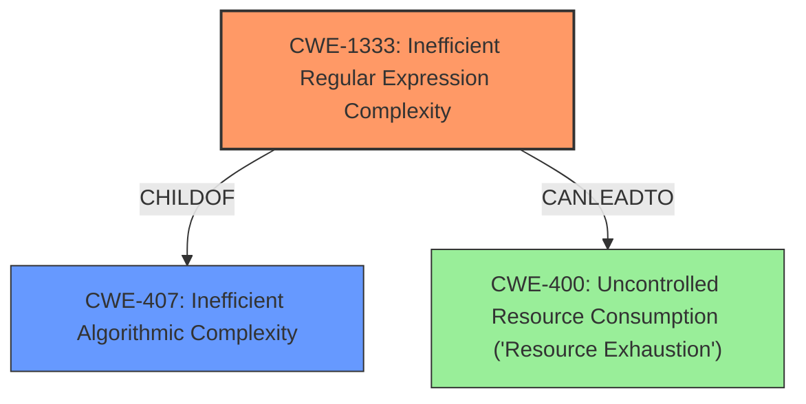

# Analysis for CVE-2022-40897

# Summary
| CWE ID  | CWE Name                                                       | Confidence | CWE Abstraction Level | CWE Vulnerability Mapping Label | CWE-Vulnerability Mapping Notes |
| :-------- | :------------------------------------------------------------- | :--------- | :---------------------- | :------------------------------ | :------------------------------ |
| CWE-1333 | Inefficient Regular Expression Complexity                      | 1          | Base                    | Primary                         | Allowed                       |
| CWE-400 | Uncontrolled Resource Consumption ('Resource Exhaustion')                      | 0.7          | Class                    | Secondary                         | Allowed                       |

## Evidence and Confidence

*   **Confidence Score:** 1
*   **Evidence Strength:** HIGH

## Relationship Analysis
The primary CWE, CWE-1333, is a Base-level CWE, providing a specific description of the vulnerability. It is a child of CWE-407, Inefficient Algorithmic Complexity, a broader class. There are no direct chain relationships (CanPrecede, CanFollow) specified for CWE-1333, but the vulnerability can lead to denial of service, aligning with resource exhaustion. The abstraction levels guided the selection toward the most specific applicable CWE.

## Vulnerability Chain
The vulnerability chain starts with a **regular expression denial of service** in the `package_index.py` file, which leads to excessive CPU consumption and ultimately a denial of service.

## Summary of Analysis
The analysis strongly supports CWE-1333 as the primary CWE. The **rootcause** is a **regular expression denial of service**. The description mentions that there is a ReDos in `package_index.py`. The CVE Reference Links Content Summary further clarifies that the **vulnerability stems from a Regular Expression Denial of Service (ReDoS) flaw**.

The relationship graph indicates that CWE-1333 is a child of CWE-407. The retriever results listed CWE-1333 as the top combined result with a score of 1.

CWE-400 is considered as a secondary weakness because the **impact** of the vulnerability is a denial of service due to **resource exhaustion**.

Relevant CWE Information:

# Enhanced Context (25 CWEs)

## CWE-625: Permissive Regular Expression
**Abstraction Level**: Base
**Similarity Score**: 0.78
**Source**: dense

**Description**:
The product uses a regular expression that does not sufficiently restrict the set of allowed values.

**Mapping Guidance**:
- Usage: Allowed
- Rationale: This CWE entry is at the Base level of abstraction, which is a preferred level of abstraction for mapping to the root causes of vulnerabilities.

## CWE-1333: Inefficient Regular Expression Complexity
**Abstraction Level**: Base
**Similarity Score**: 0.75
**Source**: dense

**Description**:
The product uses a regular expression with an inefficient, possibly exponential worst-case computational complexity that consumes excessive CPU cycles.

**Mapping Guidance**:
- Usage: Allowed
- Rationale: This CWE entry is at the Base level of abstraction, which is a preferred level of abstraction for mapping to the root causes of vulnerabilities.

## CWE-407: Inefficient Algorithmic Complexity
**Abstraction Level**: Class
**Similarity Score**: 0.75
**Source**: dense

**Description**:
An algorithm in a product has an inefficient worst-case computational complexity that may be detrimental to system performance and can be triggered by an attacker, typically using crafted manipulations that ensure that the worst case is being reached.

**Mapping Guidance**:
- Usage: Allowed-with-Review
- Rationale: This CWE entry is a Class and might have Base-level children that would be more appropriate

## CWE-1333: Inefficient Regular Expression Complexity
**Abstraction Level**: Base
**Similarity Score**: 5549.33
**Source**: sparse

**Description**:
The product uses a regular expression with an inefficient, possibly exponential worst-case computational complexity that consumes excessive CPU cycles.

**Mapping Guidance**:
- Usage: Allowed
- Rationale: This CWE entry is at the Base level of abstraction, which is a preferred level of abstraction for mapping to the root causes of vulnerabilities.

## CWE-770: Allocation of Resources Without Limits or Throttling
**Abstraction Level**: Base
**Similarity Score**: 5019.19
**Source**: sparse

**Description**:
The product allocates a reusable resource or group of resources on behalf of an actor without imposing any restrictions on the size or number of resources that can be allocated, in violation of the intended security policy for that actor.

**Mapping Guidance**:
- Usage: Allowed
- Rationale: This CWE entry is at the Base level of abstraction, which is a preferred level of abstraction for mapping to the root causes of vulnerabilities.

## CWE-789: Memory Allocation with Excessive Size Value
**Abstraction Level**: Variant
**Similarity Score**: 4985.30
**Source**: sparse

**Description**:
The product allocates memory based on an untrusted, large size value, but it does not ensure that the size is within expected limits, allowing arbitrary amounts of memory to be allocated.

**Mapping Guidance**:
- Usage: Allowed
- Rationale: This CWE entry is at the Variant level of abstraction, which is a preferred level of abstraction for mapping to the root causes of vulnerabilities.

## CWE-617: Reachable Assertion
**Abstraction Level**: Base
**Similarity Score**: 4928.69
**Source**: sparse

**Description**:
The product contains an assert() or similar statement that can be triggered by an attacker, which leads to an application exit or other behavior that is more severe than necessary.

**Mapping Guidance**:
- Usage: Allowed
- Rationale: This CWE entry is at the Base level of abstraction, which is a preferred level of abstraction for mapping to the root causes of vulnerabilities.

### CWE Selection Details

*   **CWE-1333: Inefficient Regular Expression Complexity**
    *   **Explanation:** The vulnerability description explicitly mentions "Regular Expression Denial of Service (ReDoS)" in `package_index.py`. This aligns perfectly with the description of CWE-1333, which focuses on inefficient regular expressions leading to excessive CPU consumption. The provided description in the CVE Reference Links Content Summary, "The vulnerability stems from a Regular Expression Denial of Service (ReDoS) flaw", further reinforces this mapping.
    *   **Security Implications:** An attacker can craft malicious input that causes the regular expression engine to perform excessive backtracking, consuming significant CPU resources and potentially leading to a denial of service.
    *   **Relationship:** CWE-1333 is a child of CWE-407 (Inefficient Algorithmic Complexity), indicating that it's a specific type of algorithmic inefficiency.
    *   **Mapping Guidance:** The mapping guidance for CWE-1333 states "This CWE entry is at the Base level of abstraction, which is a preferred level of abstraction for mapping to the root causes of vulnerabilities." The usage is "Allowed."
*   **CWE-400: Uncontrolled Resource Consumption ('Resource Exhaustion')**
    *   **Explanation:** While the root cause is the inefficient regular expression, the ultimate impact is a denial of service due to resource exhaustion. Therefore, CWE-400 is included as a secondary CWE to represent the impact of the vulnerability.
    *   **Security Implications:** Attackers can cause a denial-of-service condition by exploiting the inefficient algorithm, consuming excessive resources, and making the system unresponsive.
    *   **Relationship:** CWE-400 is a Class-level CWE, representing a general category of resource exhaustion vulnerabilities.
    *   **Mapping Guidance:** The retriever results suggest CWE-770 (Allocation of Resources Without Limits or Throttling), which is a child of CWE-400. However, the description of CWE-770 doesn't fit as well as CWE-400 since the issue isn't necessarily about allocation but about consumption during regex processing.

### CWEs Considered But Not Used:

*   **CWE-625: Permissive Regular Expression**: While regular expressions are involved, the primary issue isn't that the regex is *permissive*, but that its complexity leads to denial of service.
*   **CWE-617: Reachable Assertion:** This CWE relates to assertion failures, which is not mentioned or implied in the vulnerability description.
*   **CWE-770: Allocation of Resources Without Limits or Throttling**: This CWE focuses on resource allocation without limits. While resource exhaustion is the result, the **rootcause** is