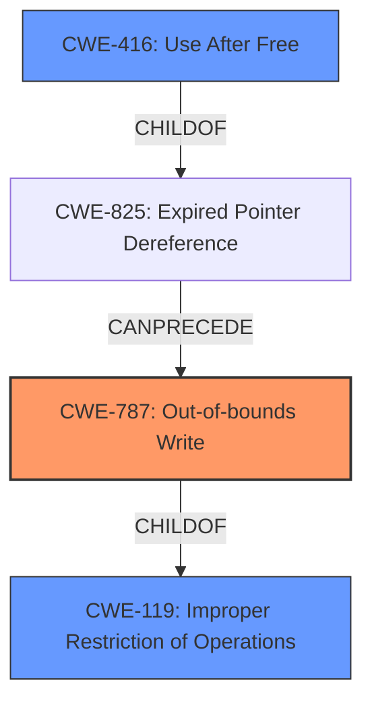

# Raw Analyzer Response for CVE-2022-40962

# Summary
| CWE ID  | CWE Name                                                                       | Confidence | CWE Abstraction Level | CWE Vulnerability Mapping Label | CWE-Vulnerability Mapping Notes |
| :-------- | :----------------------------------------------------------------------------- | :---------- | :---------------------- | :------------------------------ | :------------------------------ |
| CWE-787   | Out-of-bounds Write                                                            | 0.85        | Base                    | Primary                         | Allowed                         |
| CWE-119   | Improper Restriction of Operations within the Bounds of a Memory Buffer      | 0.70        | Class                   | Secondary                       | Discouraged                     |
| CWE-416   | Use After Free                                                                 | 0.60        | Variant                 | Secondary                       | Allowed                         |

## Evidence and Confidence

*   **Confidence Score:** 0.80
*   **Evidence Strength:** HIGH

## Relationship Analysis
The primary relationship that influenced my decision was the ChildOf relationship between CWE-787 (Out-of-bounds Write) and CWE-119 (Improper Restriction of Operations within the Bounds of a Memory Buffer). Since the description mentions **memory corruption** and the possibility of writing data outside the intended buffer, CWE-787 is a more specific and appropriate choice than its parent, CWE-119. CWE-416 (Use After Free) was also considered due to the **memory safety bugs**, but the primary indicator points towards memory corruption due to writing errors.

## Vulnerability Chain
The vulnerability chain starts with **memory safety bugs**, leading to **memory corruption**, and potentially resulting in arbitrary code execution.
  - **Root Cause:** Memory Safety Bugs (likely manifested as an out-of-bounds write or use-after-free)
  - **Weakness:** Memory Corruption (direct consequence of the memory safety issue)
  - **Impact:** Arbitrary Code Execution (potential exploitation of the corrupted memory)

## Summary of Analysis
The initial analysis focused on the **memory safety bugs** and **memory corruption** aspects of the vulnerability. The evidence from the "CVE Reference Links Content Summary" indicates memory manipulation that leads to corruption, suggesting CWE-787 (Out-of-bounds Write) as the primary candidate. While other CWEs like CWE-416 (Use After Free) were considered, the direct evidence of memory corruption leans towards a write-related issue. The relationship analysis further solidifies this decision, as CWE-787 is a specific type of memory corruption that falls under the broader category of CWE-119.

The final decision is based on the provided evidence, particularly the "CVE Reference Links Content Summary" section, which states: "The security advisory description indicates that these bugs showed 'evidence of memory corruption', suggesting that there was a direct impact on the data structures or memory management used by the affected software."

CWE-787 is chosen because it best represents the **root cause** of the vulnerability, which is writing data outside the intended buffer, leading to **memory corruption**. This is at the optimal level of specificity (Base) and aligns with the provided evidence.

Relevant CWE Information:

# Enhanced Context (25 CWEs)
The following CWEs were identified as potentially relevant to this vulnerability:

## CWE-457: Use of Uninitialized Variable
**Abstraction Level**: Variant
**Similarity Score**: 0.79
**Source**: dense

**Description**:
The code uses a variable that has not been initialized, leading to unpredictable or unintended results.

**Mapping Guidance**:
- Usage: Allowed
- Rationale: This CWE entry is at the Variant level of abstraction, which is a preferred level of abstraction for mapping to the root causes of vulnerabilities.

*Not Selected*: This CWE does not align with the description of the vulnerability, which focuses on memory corruption rather than the use of uninitialized variables.

## CWE-131: Incorrect Calculation of Buffer Size
**Abstraction Level**: Base
**Similarity Score**: 0.78
**Source**: dense

**Description**:
The product does not correctly calculate the size to be used when allocating a buffer, which could lead to a buffer overflow.

**Mapping Guidance**:
- Usage: Allowed
- Rationale: This CWE entry is at the Base level of abstraction, which is a preferred level of abstraction for mapping to the root causes of vulnerabilities.

*Not Selected*: While this could lead to a buffer overflow, there's no explicit mention of incorrect size calculation, making CWE-787 a more direct fit.

## CWE-476: NULL Pointer Dereference
**Abstraction Level**: Base
**Similarity Score**: 0.78
**Source**: dense

**Description**:
The product dereferences a pointer that it expects to be valid but is NULL.

**Mapping Guidance**:
- Usage: Allowed
- Rationale: This CWE entry is at the Base level of abstraction, which is a preferred level of abstraction for mapping to the root causes of vulnerabilities.

*Not Selected*: This CWE doesn't align with the described **memory corruption** issues.

## CWE-667: Improper Locking
**Abstraction Level**: Class
**Similarity Score**: 0.77
**Source**: dense

**Description**:
The product does not properly acquire or release a lock on a resource, leading to unexpected resource state changes and behaviors.

**Mapping Guidance**:
- Usage: Allowed-with-Review
- Rationale: This CWE entry is a Class and might have Base-level children that would be more appropriate

*Not Selected*: This doesn't align with the description of the vulnerability.

## CWE-191: Integer Underflow (Wrap or Wraparound)
**Abstraction Level**: Base
**Similarity Score**: 0.77
**Source**: dense

**Description**:
The product subtracts one value from another, such that the result is less than the minimum allowable integer value, which produces a value that is not equal to the correct result.

**Mapping Guidance**:
- Usage: Allowed
- Rationale: This CWE entry is at the Base level of abstraction, which is a preferred level of abstraction for mapping to the root causes of vulnerabilities.

*Not Selected*: This doesn't align with the description of the vulnerability.

## CWE-665: Improper Initialization
**Abstraction Level**: Class
**Similarity Score**: 0.77
**Source**: dense

**Description**:
The product does not initialize or incorrectly initializes a resource, which might leave the resource in an unexpected state when it is accessed or used.

**Mapping Guidance**:
- Usage: Discouraged
- Rationale: This CWE entry is a level-1 Class (i.e., a child of a Pillar). It might have lower-level children that would be more appropriate

*Not Selected*: This doesn't align with the description of the vulnerability.

## CWE-681: Incorrect Conversion between Numeric Types
**Abstraction Level**: Base
**Similarity Score**: 0.77
**Source**: dense

**Description**:
When converting from one data type to another, such as long to integer, data can be omitted or translated in a way that produces unexpected values. If the resulting values are used in a sensitive context, then dangerous behaviors may occur.

**Mapping Guidance**:
- Usage: Allowed
- Rationale: This CWE entry is at the Base level of abstraction, which is a preferred level of abstraction for mapping to the root causes of vulnerabilities.

*Not Selected*: This doesn't align with the description of the vulnerability.

## CWE-703: Improper Check or Handling of Exceptional Conditions
**Abstraction Level**: Pillar
**Similarity Score**: 0.77
**Source**: dense

**Description**:
The product does not properly anticipate or handle exceptional conditions that rarely occur during normal operation of the product.

**Mapping Guidance**:
- Usage: Discouraged
- Rationale: This CWE entry is extremely high-level, a Pillar.

*Not Selected*: This is too general and doesn't fit the specific issue.

## CWE-824: Access of Uninitialized Pointer
**Abstraction Level**: Base
**Similarity Score**: 0.77
**Source**: dense

**Description**:
The product accesses or uses a pointer that has not been initialized.

**Mapping Guidance**:
- Usage: Allowed
- Rationale: This CWE entry is at the Base level of abstraction, which is a preferred level of abstraction for mapping to the root causes of vulnerabilities.

*Not Selected*: This doesn't align with the description of the vulnerability.

## CWE