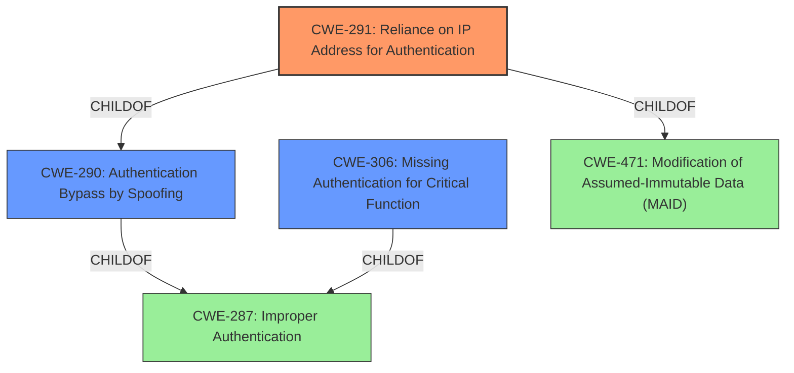

# Raw Analyzer Response for CVE-2022-4098

# Summary
| CWE ID | CWE Name | Confidence | CWE Abstraction Level | CWE Vulnerability Mapping Label | CWE-Vulnerability Mapping Notes |
|---|---|---|---|---|---|
| CWE-291 | Reliance on IP Address for Authentication | 0.9 | Variant | Allowed | Primary CWE |
| CWE-290 | Authentication Bypass by Spoofing | 0.8 | Base | Allowed | Secondary Candidate |
| CWE-306 | Missing Authentication for Critical Function | 0.7 | Base | Allowed | Secondary Candidate |

## Evidence and Confidence

*   **Confidence Score:** 0.9
*   **Evidence Strength:** HIGH

## Relationship Analysis
The primary CWE is CWE-291, which is a Variant of CWE-290 (Authentication Bypass by Spoofing). CWE-290 is also a ChildOf CWE-287 (Improper Authentication), but CWE-291 is more specific to the vulnerability. CWE-306 (Missing Authentication for Critical Function) is also a child of CWE-287 and could be a contributing factor, but the IP spoofing aspect is more prominent.

## Vulnerability Chain
The vulnerability chain starts with the **reliance on IP address for authentication** (CWE-291). This leads to **authentication bypass by spoofing** (CWE-290), allowing an attacker to **change arbitrary settings**, potentially leading to a **complete takeover of the device**.

## Summary of Analysis
The primary weakness is the **reliance on IP addresses for authentication** (CWE-291). This allows an unauthenticated attacker to spoof a legitimate user's IP address and gain access to the system. The evidence for this is strong, as indicated in both the vulnerability description and the CVE reference links content summary, which states that the "vulnerability stems from a flaw in the web interface...that doesn't properly validate or secure session IDs, making them vulnerable to hijacking" and "the attacker can then spoof the IP address of the legitimate user and use the stolen session ID to impersonate them."

CWE-291 is at the Variant level of abstraction, which is preferred. It's a child of CWE-290 (Authentication Bypass by Spoofing), which is a more general case. CWE-290 is also considered as a secondary candidate because the vulnerability is a type of authentication bypass achieved through spoofing.

CWE-306 (Missing Authentication for Critical Function) is also considered, since there is a **lack of proper authentication** that could lead to **session ID theft**, but it's less directly related to the **IP spoofing** aspect.

The other CWEs were not chosen for the following reasons:

*   CWE-807, CWE-319, CWE-312, CWE-303, CWE-1391, CWE-798, CWE-294, CWE-345, CWE-311, CWE-288: These are related to different types of authentication/authorization issues or data handling, but not directly related to the **IP spoofing** aspect of the vulnerability.
*   CWE-863, CWE-285: These are higher-level classes of authorization issues, and more specific CWEs like CWE-290/291 are more appropriate.
*   CWE-639, CWE-425: These are different types of authorization bypasses that do not involve **IP spoofing**.
*   CWE-471: Although CWE-291 is a ChildOf CWE-471, CWE-471 is too general since it refers to "Modification of Assumed-Immutable Data."
*   CWE-178, CWE-98, CWE-1289, CWE-457, CWE-41, CWE-289, CWE-322, CWE-259: These are unrelated to the vulnerability.