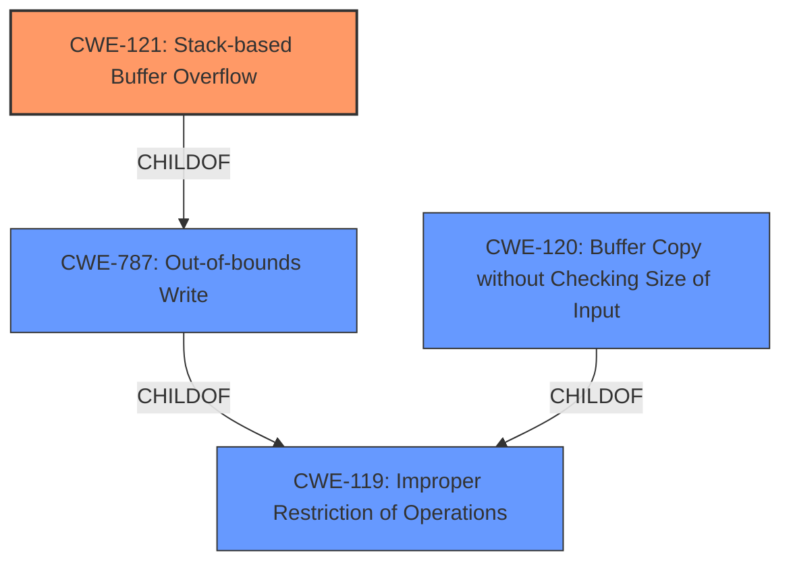

# Analysis for CVE-2022-40992

# Summary
| CWE ID  | CWE Name  | Confidence | CWE Abstraction Level | CWE Vulnerability Mapping Label | CWE-Vulnerability Mapping Notes |
|---|---|---|---|---|---|
| CWE-121 | Stack-based Buffer Overflow | 0.9 | Variant | Allowed | Primary CWE |
| CWE-120 | Buffer Copy without Checking Size of Input ('Classic Buffer Overflow') | 0.7 | Base | Allowed-with-Review | Secondary CWE |

## Evidence and Confidence

*   **Confidence Score:** 0.9
*   **Evidence Strength:** HIGH

## Relationship Analysis
The primary CWE is CWE-121 Stack-based Buffer Overflow, a variant of CWE-787 Out-of-bounds Write, indicating a more specific location for the buffer overflow. CWE-120 Buffer Copy without Checking Size of Input is a broader base CWE, representing the mechanism by which the overflow occurs. Both CWE-121 and CWE-120 are children of CWE-119 Improper Restriction of Operations within the Bounds of a Memory Buffer, indicating a general class of memory safety issues. The selection of CWE-121 provides the most precise classification.

## Vulnerability Chain
The vulnerability chain starts with the lack of input size validation when using `sprintf`, leading to a **stack-based buffer overflow**, and finally resulting in arbitrary command execution.

## Summary of Analysis
The initial assessment identified a **stack-based buffer overflow** vulnerability. The analysis focused on identifying the most accurate CWE representation, considering both the location of the buffer (stack) and the mechanism causing the overflow (**improper** buffer copy). The selection of CWE-121 is based on the **Vulnerability Description Key Phrases** identifying the **rootcause** as a "**stack-based buffer overflow**" and the CVE Reference Links Content Summary details the use of `sprintf` without input size checks, confirming the overflow's nature. The relationship analysis confirmed that CWE-121 is a specific variant of CWE-787 and CWE-119, providing a more precise classification than its parents. The mapping guidance for CWE-121 allows its use, reinforcing its suitability.

The **Root cause of vulnerability** from the CVE Reference Links Content Summary provides explicit support for the selection of CWE-121, "`DetranCLI` binary uses `sprintf` with format strings and command parameters without checking the size of the input parameters against the size of the stack buffer, leading to stack-based buffer overflows."

CWE-78 Improper Neutralization of Special Elements used in an OS Command ('OS Command Injection') was considered, but it describes command injection vulnerabilities, which is the impact and not the root cause in this case. CWE-190 Integer Overflow or Wraparound, CWE-193 Off-by-one Error, and CWE-125 Out-of-bounds Read were also considered but did not accurately represent the **stack-based buffer overflow** condition described in the vulnerability. CWE-1284 Improper Validation of Specified Quantity in Input could be a contributing factor, but the primary issue is the unchecked buffer copy leading to the overflow.

The selected CWEs are at the optimal level of specificity because CWE-121 directly reflects the **rootcause** of the vulnerability (stack-based overflow), while CWE-120 describes the mechanism (**improper** buffer copy).