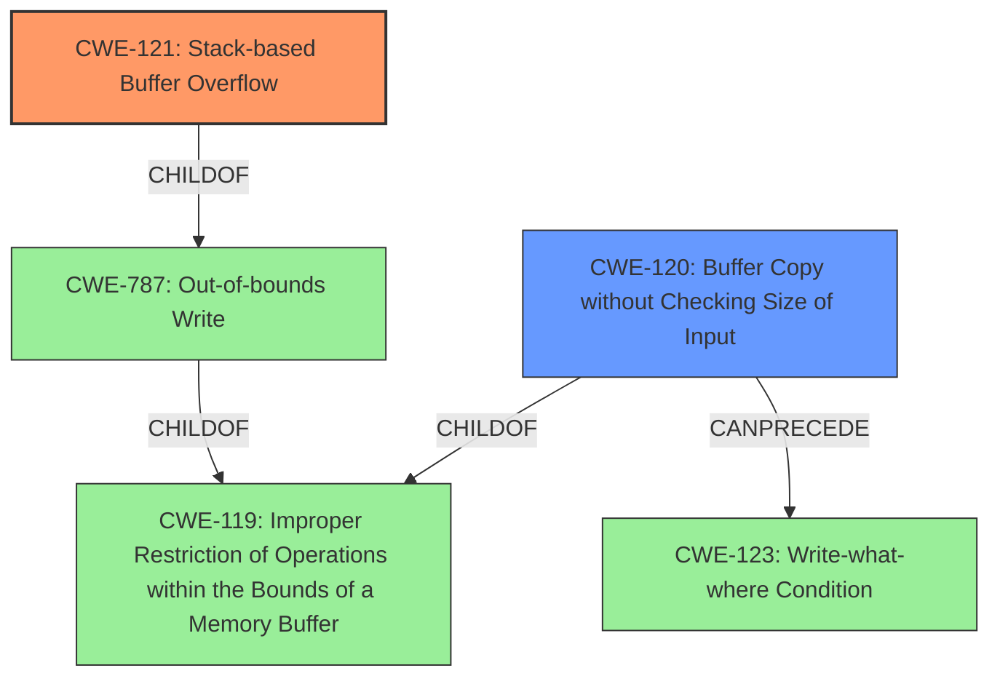

# Analysis for CVE-2022-40996

# Summary
| CWE ID  | CWE Name  | Confidence | CWE Abstraction Level | CWE Vulnerability Mapping Label | CWE-Vulnerability Mapping Notes |
|-----------------|-------------------------------------------------------------------|------------|-----------------------|------------------------------------|------------------------------------------------------------------------------------|
| CWE-121 | Stack-based Buffer Overflow | 0.9 | Variant | Allowed | Primary CWE |
| CWE-120 | Buffer Copy without Checking Size of Input ('Classic Buffer Overflow') | 0.7 | Base | Allowed-with-Review | Secondary CWE |

## Evidence and Confidence

*   **Confidence Score:** 0.8
*   **Evidence Strength:** HIGH

## Relationship Analysis
The primary CWE is CWE-121 Stack-based Buffer Overflow, which is a variant of the more general CWE-787 Out-of-bounds Write, and CWE-119 Improper Restriction of Operations within the Bounds of a Memory Buffer. CWE-120 Buffer Copy without Checking Size of Input is related to CWE-119 and can precede CWE-123 Write-what-where Condition. The relationships show a clear path from a general buffer issue to a specific stack-based overflow and its potential consequences.

## Vulnerability Chain
The vulnerability chain starts with the **improper use of `sprintf` without bounds checking** (identified as the root cause in "CVE Reference Links Content Summary"). This leads to a **stack-based buffer overflow (CWE-121)** when overly long parameters are passed. The impact is **arbitrary command execution**.
  - **Root Cause:** `sprintf` usage without size validation.
  - **Weakness:** CWE-121 Stack-based Buffer Overflow.
  - **Impact:** Arbitrary command execution.

## Summary of Analysis
The initial assessment identified CWE-121 Stack-based Buffer Overflow as the primary weakness, supported by the explicit mention of "**stack-based buffer overflow**" in the "**Vulnerability Description Key Phrases**" section and confirmed by the "**CVE Reference Links Content Summary**" section stating that the `DetranCLI` binary uses `sprintf` without size checks, leading to stack-based buffer overflows. The "**CVE Reference Links Content Summary**" section provides further evidence noting the vulnerable code snippet: `sprintf(buff_0x100,"%d<%s<%s<%s<%d<%s<%s<%d<%s",1,*argv,argv[1],argv[2],depentent_on_argv[3],argv[4],argv[5],depentent_on_argv[6],argv[7]);`.

CWE-120 Buffer Copy without Checking Size of Input was considered due to the `sprintf` usage, which copies data without checking the size. While CWE-120 is a more general case, the explicit mention of "stack-based" makes CWE-121 a more specific and appropriate fit. CWE-121 is a Variant of CWE-787 Out-of-bounds Write, which in turn is a ChildOf CWE-119 Improper Restriction of Operations within the Bounds of a Memory Buffer. The evidence strongly supports the selection of the more specific CWE-121.

The selection of CWE-121 is at the optimal level of specificity because it directly reflects the type of buffer overflow (stack-based) described in the vulnerability. This level of detail is important for understanding the exploitation techniques and mitigation strategies applicable to this vulnerability.

Relevant CWE Information:

# Enhanced Context (25 CWEs)
The following CWEs were identified as potentially relevant to this vulnerability:

## CWE-191: Integer Underflow (Wrap or Wraparound)
**Abstraction Level**: Base
**Similarity Score**: 0.79
**Source**: dense

**Description**:
The product subtracts one value from another, such that the result is less than the minimum allowable integer value, which produces a value that is not equal to the correct result.

**Mapping Guidance**:
- Usage: Allowed
- Rationale: This CWE entry is at the Base level of abstraction, which is a preferred level of abstraction for mapping to the root causes of vulnerabilities.

## CWE-805: Buffer Access with Incorrect Length Value
**Abstraction Level**: Base
**Similarity Score**: 0.79
**Source**: dense

**Description**:
The product uses a sequential operation to read or write a buffer, but it uses an incorrect length value that causes it to access memory that is outside of the bounds of the buffer.

**Mapping Guidance**:
- Usage: Allowed
- Rationale: This CWE entry is at the Base level of abstraction, which is a preferred level of abstraction for mapping to the root causes of vulnerabilities.

## CWE-131: Incorrect Calculation of Buffer Size
**Abstraction Level**: Base
**Similarity Score**: 0.78
**Source**: dense

**Description**:
The product does not correctly calculate the size to be used when allocating a buffer, which could lead to a buffer overflow.

**Mapping Guidance**:
- Usage: Allowed
- Rationale: This CWE entry is at the Base level of abstraction, which is a preferred level of abstraction for mapping to the root causes of vulnerabilities.

## CWE-126: Buffer Over-read
**Abstraction Level**: Variant
**Similarity Score**: 0.77
**Source**: dense

**Description**:
The product reads from a buffer using buffer access mechanisms such as indexes or pointers that reference memory locations after the targeted buffer.

**Mapping Guidance**:
- Usage: Allowed
- Rationale: This CWE entry is at the Variant level of abstraction, which is a preferred level of abstraction for mapping to the root causes of vulnerabilities.

## CWE-124: Buffer Underwrite ('Buffer Underflow')
**Abstraction Level**: Base
**Similarity Score**: 0.77
**Source**: dense

**Description**:
The product writes to a buffer using an index or pointer that references a memory location prior to the beginning of the buffer.

**Mapping Guidance**:
- Usage: Allowed
- Rationale: This CWE entry is at the Base level of abstraction, which is a preferred level of abstraction for mapping to the root causes of vulnerabilities.

## CWE-125: Out-of-bounds Read
**Abstraction Level**: Base
**Similarity Score**: 0.76
**Source**: dense

**Description**:
The product reads data past the end, or before the beginning, of the intended buffer.

**Mapping Guidance**:
- Usage: Allowed
- Rationale: This CWE entry is at the Base level of abstraction, which is a preferred level of abstraction for mapping to the root causes of vulnerabilities.

## CWE-193: Off-by-one Error
**Abstraction Level**: Base
**Similarity Score**: 0.76
**Source**: dense

**Description**:
A product calculates or uses an incorrect maximum or minimum value that is 1 more, or 1 less, than the correct value.

**Mapping Guidance**:
- Usage: Allowed
- Rationale: This CWE entry is at the Base level of abstraction, which is a preferred level of abstraction for mapping to the root causes of vulnerabilities.

## CWE-197: Numeric Truncation Error
**Abstraction Level**: Base
**Similarity Score**: 0.76
**Source**: dense

**Description**:
Truncation errors occur when a primitive is cast to a primitive of a smaller size and data is lost in the conversion.

**Mapping Guidance**:
- Usage: Allowed
- Rationale: This CWE entry is at the Base level of abstraction, which is a preferred level of abstraction for mapping to the root causes of vulnerabilities.

## CWE-170: Improper Null Termination
**Abstraction Level**: Base
**Similarity Score**: 0.76
**Source**: dense

**Description**:
The product does not terminate or incorrectly terminates a string or array with a null character or equivalent terminator.

**Mapping Guidance**:
- Usage: Allowed
- Rationale: This CWE entry is at the Base level of abstraction, which is a preferred level of abstraction for mapping to the root causes of vulnerabilities.

## CWE-127: Buffer Under-read
**Abstraction Level**: Variant
**