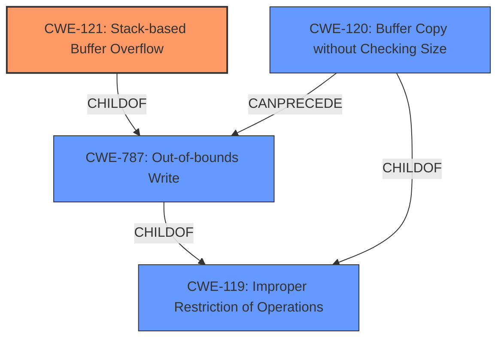

# Enhanced Analysis for CVE-2022-40997

# Summary
| CWE ID | CWE Name | Confidence | CWE Abstraction Level | CWE Vulnerability Mapping Label | CWE-Vulnerability Mapping Notes |
|---|---|---|---|---|---|
| CWE-121 | Stack-based Buffer Overflow | 1.0 | Variant | Allowed | Primary CWE |
| CWE-120 | Buffer Copy without Checking Size of Input ('Classic Buffer Overflow') | 0.75 | Base | Allowed-with-Review | Secondary Candidate |
| CWE-787 | Out-of-bounds Write | 0.50 | Base | Allowed | Secondary Candidate |

## Evidence and Confidence

*   **Confidence Score:** 0.9
*   **Evidence Strength:** HIGH

## Relationship Analysis
The primary weakness is a stack-based buffer overflow (CWE-121), which is a variant of the more general out-of-bounds write (CWE-787). CWE-121 is a child of CWE-787 and CWE-119 (Improper Restriction of Operations within the Bounds of a Memory Buffer), indicating a more specific type of buffer overflow that occurs on the stack. The `sprintf` function, by copying data without checking the size of the input, can lead to a classic buffer overflow (CWE-120), which is a base concept of writing past the buffer's boundaries, and is child of CWE-119.



## Vulnerability Chain
The vulnerability chain starts with the use of `sprintf` without proper size checks when handling user input, leading to a **stack-based buffer overflow** (CWE-121). This allows an attacker to overwrite memory on the stack, potentially leading to arbitrary command execution.

## Summary of Analysis
The initial assessment, driven by the "**stack-based buffer overflow**" phrase, strongly suggests CWE-121 as the primary candidate. The CVE description confirms this, highlighting the use of `sprintf` without size checks as the root cause.

The evidence from "CVE Reference Links Content Summary" states:
"**Root cause of vulnerability:** The root cause is a **stack-based buffer overflow** vulnerability in the `DetranCLI` command parsing functionality. Specifically, the `sprintf` function is used to format command parameters into a stack buffer without proper size checks, leading to a buffer overflow when the input parameter's length exceeds the buffer's capacity."
and
"**Weaknesses/vulnerabilities present:** The weakness is a classic buffer overflow (CWE-120). The `sprintf` function is used to construct a string on the stack, with parameters taken directly from user input. No validation on the size of the input is performed before copying it to the stack buffer."
and
"The vulnerable code snippet is:
```
sprintf(buff_0x80,"%d<%s<%s<%s>",1,*argv,argv[1],argv[2]);
```
The `argv[2]` parameter, corresponding to the `description` parameter in the command, is copied into `buff_0x80` without size checks."

CWE-121 aligns perfectly with this description. The use of `sprintf` without input size validation directly leads to the overflow on the stack. CWE-120 is a valid secondary candidate, as it describes the general case of buffer copies without size checks, but CWE-121 is more specific.

Other CWEs considered but not used:

*   **CWE-119:** While a parent of CWE-121, it is too general. The description explicitly mentions a stack-based overflow, making CWE-121 a more accurate choice. The Mapping Guidance for CWE-119 discourages its use when more specific CWEs are available.
*   **CWE-78:** Though arbitrary command execution is the impact, the root cause is the buffer overflow, not command injection.
*   **CWE-190, CWE-193, CWE-1284:** These relate to integer handling and input validation, which are not the primary issues here. The vulnerability stems directly from the unchecked buffer copy.

Therefore, CWE-121 is the most appropriate and specific CWE to represent the vulnerability, with CWE-120 as a secondary candidate, and other CWEs being less relevant.


## CWE Relationship Analysis

Current CWEs represent these abstraction levels: .


### Vulnerability Chain Analysis

**Chain starting from CWE-190:**
- 190 (Integer Overflow or Wraparound) - ROOT


**Chain starting from CWE-121:**
- 121 (Stack-based Buffer Overflow) - ROOT


### CWE Relationship Diagram

```mermaid
graph TD
    classDef primary fill:#f96,stroke:#333,stroke-width:2px
    classDef secondary fill:#69f,stroke:#333
    classDef tertiary fill:#9e9,stroke:#333
```