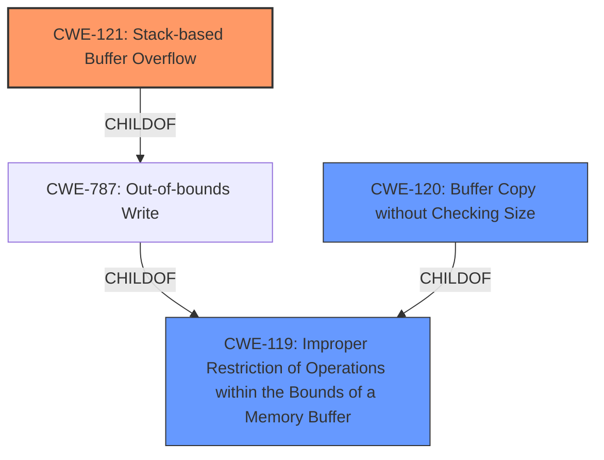

# Analysis Report for CVE-2022-41004

# Vulnerability Analysis Report: CVE-2022-41004

## Description


## Analysis (with Relationship Data)

# Summary
| CWE ID  | CWE Name                                                                   | Confidence | CWE Abstraction Level | CWE Vulnerability Mapping Label | CWE-Vulnerability Mapping Notes |
| :-------- | :------------------------------------------------------------------------- | :--------- | :---------------------- | :------------------------------ | :-------------------------------- |
| CWE-121 | Stack-based Buffer Overflow                                                | 0.95       | Variant                 | Allowed                         | Primary CWE                       |
| CWE-120 | Buffer Copy without Checking Size of Input ('Classic Buffer Overflow')    | 0.85       | Base                    | Allowed-with-Review           | Secondary Candidate               |
| CWE-119 | Improper Restriction of Operations within the Bounds of a Memory Buffer | 0.70       | Class                   | Discouraged                     | Secondary Candidate               |

## Evidence and Confidence

*   **Confidence Score:** 0.90
*   **Evidence Strength:** HIGH

## Relationship Analysis
The primary relationship influencing my decision is the hierarchical relationship. CWE-121 is a variant of CWE-787 (Out-of-bounds Write), which is a child of CWE-119 (Improper Restriction of Operations within the Bounds of a Memory Buffer). The vulnerability description specifically mentions a "stack-based buffer overflow," making CWE-121 the most specific and appropriate choice.



## Vulnerability Chain
The vulnerability chain starts with the **lack of input validation** in the DetranCLI command parsing functionality. This leads to a **stack-based buffer overflow** (CWE-121) due to the use of `sprintf` with unchecked user-supplied parameters. The overflow allows for **arbitrary command execution**.

## Summary of Analysis
My analysis is primarily based on the provided vulnerability description and the "CVE Reference Links Content Summary". The key phrase "stack-based buffer overflow" directly points to CWE-121. The summary further clarifies that the **root cause** is the **lack of input validation** and the use of `sprintf` without proper size checks, leading to the overflow.

The graph relationships helped to confirm that CWE-121 is a specific type of buffer overflow, making it more appropriate than the more general CWE-119. While CWE-120 (Buffer Copy without Checking Size of Input) is a strong candidate, the description doesn't explicitly mention a buffer copy operation, so I consider CWE-121 a slightly better fit.

The selected CWEs are at the optimal level of specificity because CWE-121 directly describes the type of buffer overflow (stack-based), while CWE-120 and CWE-119 are more general categories. The evidence supports the selection of CWE-121 as the primary weakness.

Relevant CWE Information:

# Enhanced Context (25 CWEs)

## CWE-170: Improper Null Termination
**Abstraction Level**: Base
**Similarity Score**: 0.79
**Source**: dense

**Description**:
The product does not terminate or incorrectly terminates a string or array with a null character or equivalent terminator.

**Mapping Guidance**:
- Usage: Allowed
- Rationale: This CWE entry is at the Base level of abstraction, which is a preferred level of abstraction for mapping to the root causes of vulnerabilities.

I considered CWE-170, but it doesn't directly relate to the **buffer overflow** issue described. The primary weakness is the overflow itself, not the null termination. Therefore, CWE-170 is not a suitable mapping.

## CWE-191: Integer Underflow (Wrap or Wraparound)
**Abstraction Level**: Base
**Similarity Score**: 0.76
**Source**: dense

**Description**:
The product subtracts one value from another, such that the result is less than the minimum allowable integer value, which produces a value that is not equal to the correct result.

**Mapping Guidance**:
- Usage: Allowed
- Rationale: This CWE entry is at the Base level of abstraction, which is a preferred level of abstraction for mapping to the root causes of vulnerabilities.

CWE-191 is not relevant because there is no mention of integer underflow in the vulnerability description.

## CWE-131: Incorrect Calculation of Buffer Size
**Abstraction Level**: Base
**Similarity Score**: 0.75
**Source**: dense

**Description**:
The product does not correctly calculate the size to be used when allocating a buffer, which could lead to a buffer overflow.

**Mapping Guidance**:
- Usage: Allowed
- Rationale: This CWE entry is at the Base level of abstraction, which is a preferred level of abstraction for mapping to the root causes of vulnerabilities.

CWE-131 might seem relevant, but the root cause is not an incorrect calculation, but a **lack of any size checking** before copying data into the buffer. Therefore, it is less appropriate than CWE-120 or CWE-121.

## CWE-197: Numeric Truncation Error
**Abstraction Level**: Base
**Similarity Score**: 0.75
**Source**: dense

**Description**:
Truncation errors occur when a primitive is cast to a primitive of a smaller size and data is lost in the conversion.

**Mapping Guidance**:
- Usage: Allowed
- Rationale: This CWE entry is at the Base level of abstraction, which is a preferred level of abstraction for mapping to the root causes of vulnerabilities.

CWE-197 is not applicable because there's no mention of numeric truncation in the description.

## CWE-124: Buffer Underwrite ('Buffer Underflow')
**Abstraction Level**: Base
**Similarity Score**: 0.75
**Source**: dense

**Description**:
The product writes to a buffer using an index or pointer that references a memory location prior to the beginning of the buffer.

**Mapping Guidance**:
- Usage: Allowed
- Rationale: This CWE entry is at the Base level of abstraction, which is a preferred level of abstraction for mapping to the root causes of vulnerabilities.

CWE-124 is not relevant because the vulnerability is a **buffer overflow**, not an underflow.

## CWE-805: Buffer Access with Incorrect Length Value
**Abstraction Level**: Base
**Similarity Score**: 0.74
**Source**: dense

**Description**:
The product uses a sequential operation to read or write a buffer, but it uses an incorrect length value that causes it to access memory that is outside of the bounds of the buffer.

**Mapping Guidance**:
- Usage: Allowed
- Rationale: This CWE entry is at the Base level of abstraction, which is a preferred level of abstraction for mapping to the root causes of vulnerabilities.

CWE-805 is related to buffer access issues, but the provided context focuses on the lack of checking input size before copying, which leads to the overflow, making CWE-120 a closer fit.

## CWE-193: Off-by-one Error
**Abstraction Level**: Base
**Similarity Score**: 0.74
**Source**: dense

**Description**:
A product calculates or uses an incorrect maximum or minimum value that is 1 more, or 1 less, than the correct value.

**Mapping Guidance**:
- Usage: Allowed
- Rationale: This CWE entry is at the Base level of abstraction, which is a preferred level of abstraction for mapping to the root causes of vulnerabilities.

CWE-193 is not applicable as the problem is not an off-by-one error, but the **absence of input size validation**.

## CWE-125: Out-of-bounds Read
**Abstraction Level**: Base
**Similarity Score**: 0.74
**Source**: dense

**Description**:
The product reads data past the end, or before the beginning, of the intended buffer.

**Mapping Guidance**:
- Usage: Allowed
- Rationale: This CWE entry is at the Base level of abstraction, which is a preferred level of abstraction for mapping to the root causes of vulnerabilities.

CWE-125 is not applicable since the vulnerability is a **buffer overflow (write)**, not a read.

## CWE-130: Improper Handling of Length Parameter Inconsistency
**Abstraction Level**: Base
**Similarity Score**: 0.73
**Source**: dense

**Description**:
The product parses a formatted message or structure, but it does not handle or incorrectly handles a length field that is inconsistent with the actual length of the


## CWE Relationship Analysis

Current CWEs represent these abstraction levels: .


### Vulnerability Chain Analysis

**Chain starting from CWE-131:**
- 131 (Incorrect Calculation of Buffer Size) - ROOT


**Chain starting from CWE-130:**
- 130 (Improper Handling of Length Parameter Inconsistency) - ROOT


### CWE Relationship Diagram

```mermaid
graph TD
    classDef primary fill:#f96,stroke:#333,stroke-width:2px
    classDef secondary fill:#69f,stroke:#333
    classDef tertiary fill:#9e9,stroke:#333
```


*Report generated on 2025-03-30 17:32:32*
