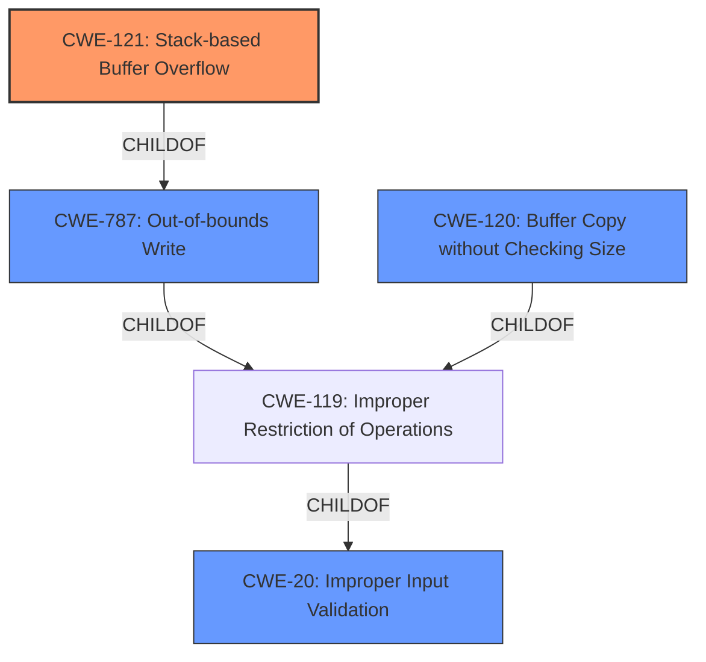

# Enhanced Analysis for CVE-2022-41006

# Summary
| CWE ID | CWE Name | Confidence | CWE Abstraction Level | CWE Vulnerability Mapping Label | CWE-Vulnerability Mapping Notes |
|---|---|---|---|---|---|
| CWE-121 | Stack-based Buffer Overflow | 1.0 | Variant | Allowed | Primary CWE |
| CWE-120 | Buffer Copy without Checking Size of Input ('Classic Buffer Overflow') | 0.7 | Base | Allowed-with-Review | Secondary Candidate |
| CWE-787 | Out-of-bounds Write | 0.6 | Base | Allowed | Secondary Candidate |
| CWE-20 | Improper Input Validation | 0.5 | Class | Discouraged | Secondary Candidate |

## Evidence and Confidence

*   **Confidence Score:** 0.8
*   **Evidence Strength:** HIGH

## Relationship Analysis
The primary relationship influencing the CWE selection is the hierarchical relationship. **CWE-121** (Stack-based Buffer Overflow) is a Variant of **CWE-787** (Out-of-bounds Write), which in turn is a ChildOf **CWE-119** (Improper Restriction of Operations within the Bounds of a Memory Buffer). **CWE-120** is also a child of **CWE-119**. The Variant level of **CWE-121** provides a more specific classification than the Base-level **CWE-120** or **CWE-787**, and the Class level of **CWE-119** is too general. The vulnerability involves a buffer overflow on the stack, making **CWE-121** the most fitting choice. **CWE-20** is a Class level that is connected to **CWE-119**, but is not specific enough to describe the vulnerability.



## Vulnerability Chain
The vulnerability chain starts with **improper input validation** which leads to a **stack-based buffer overflow** due to the **lack of size checking** when copying the input into a stack buffer, which results in **arbitrary command execution**.
  - **Root Cause:** **Lack of input validation** and **size checking**.
  - **Weakness:** **Stack-based buffer overflow** (CWE-121).
  - **Impact:** **Arbitrary command execution**.

## Summary of Analysis
The initial assessment, based on the vulnerability description and the "CWE for similar CVE Descriptions," suggested **CWE-120** (Buffer Copy without Checking Size of Input ('Classic Buffer Overflow')) as a potential candidate. However, the detailed description and the "CVE Reference Links Content Summary" provide stronger evidence for a **stack-based buffer overflow**.

The "Vulnerability Description Key Phrases" section highlights the **root cause** as "stack-based buffer overflow." The "CVE Reference Links Content Summary" confirms this, stating: "The `DetranCLI` binary uses `sprintf` to format command parameters into a stack buffer. The size of command parameters is not checked against the stack buffer size, which leads to a **stack-based buffer overflow**."

Given this evidence, **CWE-121** (Stack-based Buffer Overflow) is the most appropriate CWE. It is a Variant-level CWE, providing a more specific classification than **CWE-120**, which is a Base-level CWE. The mapping guidance for **CWE-120** also suggests considering children of **CWE-20** (Improper Input Validation) or **CWE-131** (Incorrect Calculation of Buffer Size) if there is any input validation or a calculation error for buffer sizes, respectively. While **CWE-20** could be considered as a contributing factor due to the **lack of input validation**, the primary weakness is the **stack-based buffer overflow** itself.

**CWE-78** (Improper Neutralization of Special Elements used in an OS Command ('OS Command Injection')) was considered because the vulnerability leads to arbitrary command execution. However, the root cause is the buffer overflow, not the injection of malicious commands. Therefore, **CWE-78** is not the primary weakness.

The selection of **CWE-121** is based on the direct evidence of a **stack-based buffer overflow** and the hierarchical relationship of CWEs, prioritizing the most specific Variant-level CWE.

Relevant CWE Information:

# Enhanced Context (25 CWEs)
The following CWEs were identified as potentially relevant to this vulnerability:

## CWE-1325: Improperly Controlled Sequential Memory Allocation
**Abstraction Level**: Base
**Similarity Score**: 0.76
**Source**: dense

**Description**:
The product manages a group of objects or resources and performs a separate memory allocation for each object, but it does not properly limit the total amount of memory that is consumed by all of the combined objects.

**Mapping Guidance**:
- Usage: Allowed
- Rationale: This CWE entry is at the Base level of abstraction, which is a preferred level of abstraction for mapping to the root causes of vulnerabilities.

## CWE-789: Memory Allocation with Excessive Size Value
**Abstraction Level**: Variant
**Similarity Score**: 0.76
**Source**: dense

**Description**:
The product allocates memory based on an untrusted, large size value, but it does not ensure that the size is within expected limits, allowing arbitrary amounts of memory to be allocated.

**Mapping Guidance**:
- Usage: Allowed
- Rationale: This CWE entry is at the Variant level of abstraction, which is a preferred level of abstraction for mapping to the root causes of vulnerabilities.

## CWE-131: Incorrect Calculation of Buffer Size
**Abstraction Level**: Base
**Similarity Score**: 0.75
**Source**: dense

**Description**:
The product does not correctly calculate the size to be used when allocating a buffer, which could lead to a buffer overflow.

**Mapping Guidance**:
- Usage: Allowed
- Rationale: This CWE entry is at the Base level of abstraction, which is a preferred level of abstraction for mapping to the root causes of vulnerabilities.

## CWE-404: Improper Resource Shutdown or Release
**Abstraction Level**: Class
**Similarity Score**: 0.75
**Source**: dense

**Description**:
The product does not release or incorrectly releases a resource before it is made available for re-use.

**Mapping Guidance**:
- Usage: Allowed-with-Review
- Rationale: This CWE entry is a Class and might have Base-level children that would be more appropriate

## CWE-191: Integer Underflow (Wrap or Wraparound)
**Abstraction Level**: Base
**Similarity Score**: 0.75
**Source**: dense

**Description**:
The product subtracts one value from another, such that the result is less than the minimum allowable integer value, which produces a value that is not equal to the correct result.

**Mapping Guidance**:
- Usage: Allowed
- Rationale: This CWE entry is at the Base level of abstraction, which is a preferred level of abstraction for mapping to the root causes of vulnerabilities.

## CWE-1289: Improper Validation of Unsafe Equivalence in Input
**Abstraction Level**: Base
**Similarity Score**: 0.75
**Source**: dense

**Description**:
The product receives an input value that is used as a resource identifier or other type of reference, but it does not validate or incorrectly validates that the input is equivalent to a potentially-unsafe value.

**Mapping Guidance**:
- Usage: Allowed
- Rationale: This CWE entry is at the Base level of abstraction, which is a preferred level of abstraction for mapping to the root causes of vulnerabilities.

## CWE-226: Sensitive Information in Resource Not Removed Before Reuse
**Abstraction Level**: Base
**Similarity Score**: 0.74
**Source**: dense

**Description**:
The product releases a resource such as memory or a file so that it can be made available for reuse, but it does not clear or "zeroize" the information contained in the resource before the product performs a critical state transition or makes the resource available for reuse by other entities.

**Mapping Guidance**:
- Usage: Allowed
- Rationale: This CWE entry is at the Base level of abstraction, which is a preferred level of abstraction for mapping to


## CWE Relationship Analysis

Current CWEs represent these abstraction levels: .


### Vulnerability Chain Analysis

**Chain starting from CWE-131:**
- 131 (Incorrect Calculation of Buffer Size) - ROOT


**Chain starting from CWE-1325:**
- 1325 (Improperly Controlled Sequential Memory Allocation) - ROOT


### CWE Relationship Diagram

```mermaid
graph TD
    classDef primary fill:#f96,stroke:#333,stroke-width:2px
    classDef secondary fill:#69f,stroke:#333
    classDef tertiary fill:#9e9,stroke:#333
```