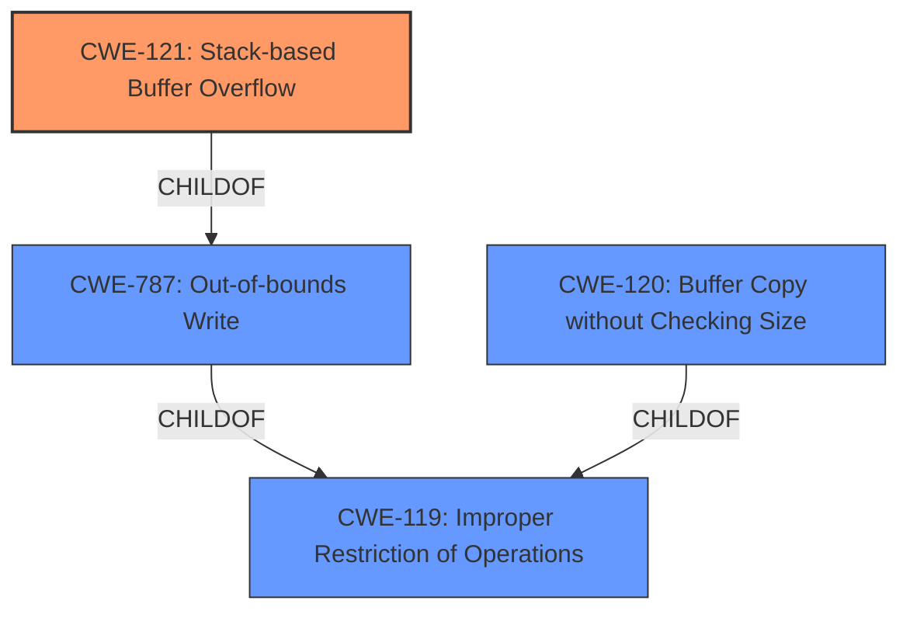

# Analysis Report for CVE-2022-41013

# Vulnerability Analysis Report: CVE-2022-41013

## Description


## Analysis (with Relationship Data)

# Summary
| CWE ID | CWE Name | Confidence | CWE Abstraction Level | CWE Vulnerability Mapping Label | CWE-Vulnerability Mapping Notes |
|---|---|---|---|---|---|
| CWE-121 | Stack-based Buffer Overflow | 1.0 | Variant | Allowed | Primary CWE |
| CWE-120 | Buffer Copy without Checking Size of Input ('Classic Buffer Overflow') | 0.8 | Base | Allowed-with-Review | Secondary Candidate |
| CWE-787 | Out-of-bounds Write | 0.7 | Base | Allowed | Secondary Candidate |

## Evidence and Confidence

*   **Confidence Score:** 0.9
*   **Evidence Strength:** HIGH

## Relationship Analysis
The primary relationship that influenced the selection was the hierarchical relationship between CWE-787 (Out-of-bounds Write) and CWE-121 (Stack-based Buffer Overflow), where CWE-121 is a specific type of CWE-787. The description clearly states a stack-based buffer overflow, making CWE-121 the more specific and appropriate choice. CWE-120 is also a child of CWE-119 (Improper Restriction of Operations within the Bounds of a Memory Buffer), indicating a more general class of buffer overflows.



## Vulnerability Chain
The vulnerability chain starts with the **stack-based buffer overflow** due to the use of `sprintf` without proper bounds checking. This leads to potential arbitrary command execution.

## Summary of Analysis
The initial analysis identified a **stack-based buffer overflow** vulnerability. The key evidence lies in the vulnerability description, which explicitly states "Several **stack-based buffer overflow** vulnerabilities exist...". The CVE Reference Links Content Summary further confirms this, stating, "The vulnerability is a classic **stack-based buffer overflow** (CWE-120)". However, the provided snippet:
```c
if (*argv[1] == '\x00'){
    format_string = "%s%s<%s<%s<%s";
}
else{
    format_string = "%s,%s<%s<%s<%s";
}
sprintf(buff_0x40,format_string,*argv,argv[1],argv[2],argv[3],argv[4]);
```
shows a potential out-of-bounds write due to the unchecked `sprintf`.

The retriever results and similar CVE descriptions pointed towards CWE-120 (Buffer Copy without Checking Size of Input). While this is a valid consideration, the specific mention of "stack-based" makes CWE-121 (Stack-based Buffer Overflow) a more precise classification. CWE-787 (Out-of-bounds Write) is also relevant as it is the parent of CWE-121 and describes the fundamental issue of writing beyond the buffer's boundaries.

The final decision is to classify this vulnerability as CWE-121 (Stack-based Buffer Overflow) as the primary CWE, with CWE-120 and CWE-787 as secondary considerations. This provides a more accurate and specific representation of the vulnerability based on the available evidence.

Relevant CWE Information:

# Enhanced Context (25 CWEs)
The following CWEs were identified as potentially relevant to this vulnerability:

## CWE-191: Integer Underflow (Wrap or Wraparound)
**Abstraction Level**: Base
**Similarity Score**: 0.78

## CWE-805: Buffer Access with Incorrect Length Value
**Abstraction Level**: Base
**Similarity Score**: 0.78

## CWE-131: Incorrect Calculation of Buffer Size
**Abstraction Level**: Base
**Similarity Score**: 0.77

## CWE-126: Buffer Over-read
**Abstraction Level**: Variant
**Similarity Score**: 0.76

## CWE-193: Off-by-one Error
**Abstraction Level**: Base
**Similarity Score**: 0.76

## CWE-124: Buffer Underwrite ('Buffer Underflow')
**Abstraction Level**: Base
**Similarity Score**: 0.76

## CWE-125: Out-of-bounds Read
**Abstraction Level**: Base
**Similarity Score**: 0.76

## CWE-197: Numeric Truncation Error
**Abstraction Level**: Base
**Similarity Score**: 0.76

## CWE-130: Improper Handling of Length Parameter Inconsistency
**Abstraction Level**: Base
**Similarity Score**: 0.76

## CWE-119: Improper Restriction of Operations within the Bounds of a Memory Buffer
**Abstraction Level**: Class
**Similarity Score**: 0.75

## CWE-190: Integer Overflow or Wraparound
**Abstraction Level**: Base
**Similarity Score**: 7877.45

## CWE-125: Out-of-bounds Read
**Abstraction Level**: Base
**Similarity Score**: 7493.58

## CWE-193: Off-by-one Error
**Abstraction Level**: Base
**Similarity Score**: 7426.42

## CWE-120: Buffer Copy without Checking Size of Input ('Classic Buffer Overflow')
**Abstraction Level**: Base
**Similarity Score**: 7413.21

## CWE-1284: Improper Validation of Specified Quantity in Input
**Abstraction Level**: Base
**Similarity Score**: 7307.32

## CWE-128: Wrap-around Error
**Abstraction Level**: base
**Similarity Score**: 5.03

## CWE-120: Buffer Copy without Checking Size of Input ('Classic Buffer Overflow')
**Abstraction Level**: base
**Similarity Score**: 4.33

## CWE-123: Write-what-where Condition
**Abstraction Level**: base
**Similarity Score**: 4.33

## CWE-1284: Improper Validation of Specified Quantity in Input
**Abstraction Level**: base
**Similarity Score**: 4.33

## CWE-617: Reachable Assertion
**Abstraction Level**: base
**Similarity Score**: 4.33

## CWE-463: Deletion of Data Structure Sentinel
**Abstraction Level**: base
**Similarity Score**: 3.64

## CWE-464: Addition of Data Structure Sentinel
**Abstraction Level**: base
**Similarity Score**: 3.64

## CWE-88: Improper Neutralization of Argument Delimiters in a Command ('Argument Injection')
**Abstraction Level**: base
**Similarity Score**: 3.64

## CWE-78: Improper Neutralization of Special Elements used in an OS Command ('OS Command Injection')
**Abstraction Level**: base
**Similarity Score**: 3.64

## CWE-1339: Insufficient Precision or Accuracy of a Real Number
**Abstraction Level**: base
**Similarity Score**: 3.57

# CWE-121
**CWE-121 (Stack-based Buffer Overflow)**: This CWE accurately describes the vulnerability because the overflow occurs in a buffer allocated on the stack. The vulnerability description explicitly states that the buffer overflow is stack-based. This can lead to arbitrary command execution as the attacker can overwrite return addresses and other critical data on the stack. This is a Variant level CWE, providing a specific classification. The use of `sprintf` without bounds checking directly contributes to this weakness.

# CWE-120
**CWE-120 (Buffer Copy without Checking Size of Input)**: This CWE is a strong candidate as it describes the core issue of copying data into a buffer without validating the size of the input. The `sprintf` function is used to copy data into a fixed-size buffer without checking if the input exceeds the buffer's capacity. While relevant, it is less specific than CWE-121 because it doesn't explicitly mention the stack. It's at the Base level, which is a good level of abstraction, but the stack context makes CWE-121 more appropriate.

# CWE-787
**CWE-787 (Out-of-bounds Write)**: This CWE describes the general condition of writing data beyond the intended boundaries of a buffer. While this is a consequence of the buffer overflow, it is a more general description than CWE-121. CWE-787 is a parent of CWE-121.

## CWEs Not Used and


## CWE Relationship Analysis

Current CWEs represent these abstraction levels: .


### Vulnerability Chain Analysis

**Chain starting from CWE-121:**
- 121 (Stack-based Buffer Overflow) - ROOT


**Chain starting from CWE-78:**
- 78 (Improper Neutralization of Special Elements used in an OS Command ('OS Command Injection')) - ROOT


### CWE Relationship Diagram

```mermaid
graph TD
    classDef primary fill:#f96,stroke:#333,stroke-width:2px
    classDef secondary fill:#69f,stroke:#333
    classDef tertiary fill:#9e9,stroke:#333
```


*Report generated on 2025-03-30 12:15:22*
