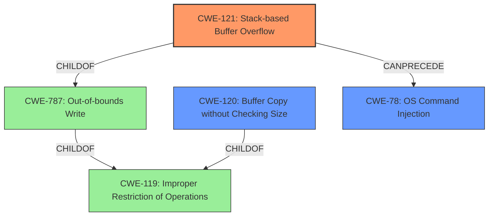

# Analysis for CVE-2022-41027

# Summary
| CWE ID  | CWE Name                                                                     | Confidence | CWE Abstraction Level | CWE Vulnerability Mapping Label | CWE-Vulnerability Mapping Notes |
| :-------- | :--------------------------------------------------------------------------- | :--------- | :---------------------- | :------------------------------ | :------------------------------ |
| CWE-121   | Stack-based Buffer Overflow                                                | 1.0        | Variant                 | Primary CWE                    | Allowed                         |
| CWE-120   | Buffer Copy without Checking Size of Input ('Classic Buffer Overflow')      | 0.7        | Base                    | Secondary CWE                    | Allowed-with-Review             |
| CWE-78 | Improper Neutralization of Special Elements used in an OS Command ('OS Command Injection') | 0.4        | Base                    | Secondary CWE                    | Allowed             |

## Evidence and Confidence

*   **Confidence Score:** 0.8
*   **Evidence Strength:** HIGH

## Relationship Analysis
The primary weakness is a stack-based buffer overflow (CWE-121), which is a variant of a more general out-of-bounds write (CWE-787) and improper restriction of operations within the bounds of a memory buffer (CWE-119). The buffer overflow is caused by copying data without checking the size of the input (CWE-120). The overflow leads to arbitrary command execution, which could be related to OS command injection (CWE-78) if attacker-controlled data is used to construct OS commands.

## Vulnerability Chain
1.  **Root Cause:** **Stack-based buffer overflow** due to the use of `sprintf` without proper bounds checking.
2.  **Weakness:** The `sprintf` function writes to a stack buffer without validating the size of the input parameters.
3.  **Impact:** Arbitrary command execution.

## Summary of Analysis
The vulnerability is a **stack-based buffer overflow** (CWE-121) in the DetranCLI command parsing functionality of Siretta QUARTZ-GOLD G5.0.1.5-210720-141020. A specially crafted network packet can lead to arbitrary command execution.

The evidence for this assessment comes from the "Vulnerability Description Key Phrases" which identifies the **rootcause** as "**stack-based buffer overflow**". Further evidence is provided in the "CVE Reference Links Content Summary" which states: "The root cause of this vulnerability is the use of `sprintf` to construct strings without properly checking the size of the input parameters, leading to a stack-based buffer overflow." The summary also states that "the `vpn schedule name1` command is vulnerable" and provides the vulnerable code: `sprintf(buff_0x100,"%d<%s<%s<%d<%s",1,*argv,argv[1],based_on_argv[2],argv[3]);`.

The primary CWE is CWE-121 (Stack-based Buffer Overflow) with a confidence of 1.0. This is because the vulnerability is explicitly described as a **stack-based buffer overflow**. CWE-121 is a Variant of CWE-787 (Out-of-bounds Write) and CWE-119 (Improper Restriction of Operations within the Bounds of a Memory Buffer).

CWE-120 (Buffer Copy without Checking Size of Input ('Classic Buffer Overflow')) is a secondary CWE because the **stack-based buffer overflow** is caused by copying data using `sprintf` without checking the size of the input. This is supported by the "CVE Reference Links Content Summary" section: "The root cause of this vulnerability is the use of `sprintf` to construct strings without properly checking the size of the input parameters, leading to a stack-based buffer overflow.". While CWE-120 is a plausible candidate, it's less specific than CWE-121, hence it's secondary. The mapping guidance for CWE-120 suggests reviewing the usage of the term "buffer overflow" and considering children of CWE-20 for root cause analysis, but the root cause is clearly identified as a **stack-based buffer overflow**.

CWE-78 (Improper Neutralization of Special Elements used in an OS Command ('OS Command Injection')) is a tertiary consideration because the **buffer overflow** leads to arbitrary command execution. It's possible that the attacker could inject OS commands via the overflow. However, this is not explicitly stated in the vulnerability description, so it is a less confident mapping.

Other CWEs considered:

*   CWE-119 (Improper Restriction of Operations within the Bounds of a Memory Buffer): This is a higher-level class that encompasses buffer overflows, but CWE-121 is more specific. The mapping guidance discourages using CWE-119 when lower-level CWEs are available.
*   CWE-190 (Integer Overflow or Wraparound): This is not relevant as there is no evidence of integer overflows in the vulnerability description.
*   CWE-1284 (Improper Validation of Specified Quantity in Input): This is not the primary issue, as the main problem is the lack of bounds checking when copying the data to the buffer.
*   CWE-125 (Out-of-bounds Read): The vulnerability involves writing beyond the bounds of the buffer, not reading.

The selection of CWE-121 is at the optimal level of specificity because it accurately describes the vulnerability as a **stack-based buffer overflow**. The evidence clearly supports this classification, and the other CWEs are either too general or not directly relevant to the **rootcause** of the vulnerability.