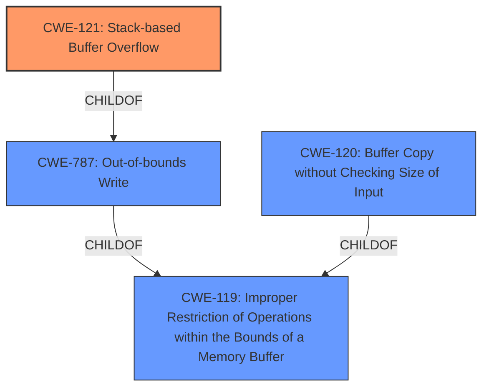

# Enhanced Analysis for CVE-2022-41029

# Summary
| CWE ID  | CWE Name | Confidence | CWE Abstraction Level | CWE Vulnerability Mapping Label | CWE-Vulnerability Mapping Notes |
|--------------|-----------------------------------------------------------------------------------------------------------------|-------------|---------------------------|-----------------------------------|---------------------------------------------------|
| CWE-121 | Stack-based Buffer Overflow  | 1.0   | Variant    | Allowed   | Primary CWE |
| CWE-120 | Buffer Copy without Checking Size of Input ('Classic Buffer Overflow') | 0.7 | Base | Allowed-with-Review | Secondary Candidate |
| CWE-787 | Out-of-bounds Write | 0.6 | Base | Allowed | Secondary Candidate |
| CWE-119 | Improper Restriction of Operations within the Bounds of a Memory Buffer | 0.5 | Class | Discouraged | Secondary Candidate |

## Evidence and Confidence

*   **Confidence Score:** 0.9
*   **Evidence Strength:** HIGH

## Relationship Analysis
The primary weakness is CWE-121, Stack-based Buffer Overflow, which is a variant of CWE-787, Out-of-bounds Write and CWE-119, Improper Restriction of Operations within the Bounds of a Memory Buffer.
CWE-120, Buffer Copy without Checking Size of Input ('Classic Buffer Overflow') is a related Base level CWE that could also apply.



## Vulnerability Chain
The vulnerability chain begins with the **improper use of `sprintf`** without checking the size of the input, leading to a **stack-based buffer overflow**, which can then lead to **arbitrary command execution**.
  - **Root Cause:** **Improper use of `sprintf`** without input size validation.
  - **Weakness:** **Stack-based buffer overflow** (CWE-121) due to the unchecked buffer copy.
  - **Impact:** **Arbitrary command execution**.

## Summary of Analysis
The initial assessment, supported by both the vulnerability description and the CVE reference, points towards a **stack-based buffer overflow** (CWE-121) due to the use of `sprintf` without proper input validation.

Key evidence includes:
- "Several **stack-based buffer overflow** vulnerabilities exist..."
- "**Root cause of vulnerability:** The `DetranCLI` binary in Siretta QUARTZ-GOLD devices uses `sprintf` to format strings based on user-provided input without checking the size of the input against the destination buffer, leading to stack-based buffer overflows."
- "A buffer of size 0x20 is filled using `sprintf` where the last argument `argv[1]` which is derived from user input is not checked for length."

CWE-121 is a Variant of CWE-787 (Out-of-bounds Write) and CWE-119 (Improper Restriction of Operations within the Bounds of a Memory Buffer). The use of `sprintf` without checking the size of the input is a clear indicator of a buffer overflow.

CWE-120 (Buffer Copy without Checking Size of Input) is a potential candidate, but CWE-121 is more specific because the vulnerability is explicitly a stack-based buffer overflow.
CWE-78 (Improper Neutralization of Special Elements used in an OS Command) was considered because the impact is arbitrary command execution, but the root cause is a buffer overflow, not command injection.
CWE-1284 (Improper Validation of Specified Quantity in Input) was considered because the input size is not validated, but the direct result is a buffer overflow, making CWE-121 a better fit.
CWE-190 (Integer Overflow or Wraparound) was considered, but there is no evidence of an integer overflow in the provided information.

The selection of CWE-121 is based on its specificity and the clear description of a **stack-based buffer overflow** stemming from the use of `sprintf` without input validation. This aligns with the CWE's description and observed examples.

Relevant CWE Information:

# Enhanced Context (25 CWEs)
The following CWEs were identified as potentially relevant to this vulnerability:

## CWE-805: Buffer Access with Incorrect Length Value
**Abstraction Level**: Base
**Similarity Score**: 0.78
**Source**: dense

**Description**:
The product uses a sequential operation to read or write a buffer, but it uses an incorrect length value that causes it to access memory that is outside of the bounds of the buffer.

**Mapping Guidance**:
- Usage: Allowed
- Rationale: This CWE entry is at the Base level of abstraction, which is a preferred level of abstraction for mapping to the root causes of vulnerabilities.

## CWE-126: Buffer Over-read
**Abstraction Level**: Variant
**Similarity Score**: 0.78
**Source**: dense

**Description**:
The product reads from a buffer using buffer access mechanisms such as indexes or pointers that reference memory locations after the targeted buffer.

**Mapping Guidance**:
- Usage: Allowed
- Rationale: This CWE entry is at the Variant level of abstraction, which is a preferred level of abstraction for mapping to the root causes of vulnerabilities.

## CWE-191: Integer Underflow (Wrap or Wraparound)
**Abstraction Level**: Base
**Similarity Score**: 0.78
**Source**: dense

**Description**:
The product subtracts one value from another, such that the result is less than the minimum allowable integer value, which produces a value that is not equal to the correct result.

**Mapping Guidance**:
- Usage: Allowed
- Rationale: This CWE entry is at the Base level of abstraction, which is a preferred level of abstraction for mapping to the root causes of vulnerabilities.

## CWE-131: Incorrect Calculation of Buffer Size
**Abstraction Level**: Base
**Similarity Score**: 0.77
**Source**: dense

**Description**:
The product does not correctly calculate the size to be used when allocating a buffer, which could lead to a buffer overflow.

**Mapping Guidance**:
- Usage: Allowed
- Rationale: This CWE entry is at the Base level of abstraction, which is a preferred level of abstraction for mapping to the root causes of vulnerabilities.

## CWE-124: Buffer Underwrite ('Buffer Underflow')
**Abstraction Level**: Base
**Similarity Score**: 0.77
**Source**: dense

**Description**:
The product writes to a buffer using an index or pointer that references a memory location prior to the beginning of the buffer.

**Mapping Guidance**:
- Usage: Allowed
- Rationale: This CWE entry is at the Base level of abstraction, which is a preferred level of abstraction for mapping to the root causes of vulnerabilities.

## CWE-125: Out-of-bounds Read
**Abstraction Level**: Base
**Similarity Score**: 0.76
**Source**: dense

**Description**:
The product reads data past the end, or before the beginning, of the intended buffer.

**Mapping Guidance**:
- Usage: Allowed
- Rationale: This CWE entry is at the Base level of abstraction, which is a preferred level of abstraction for mapping to the root causes of vulnerabilities.

## CWE-127: Buffer Under-read
**Abstraction Level**: Variant
**Similarity Score**: 0.76
**Source**: dense

**Description**:
The product reads from a buffer using buffer access mechanisms such as indexes or pointers that reference memory locations prior to the targeted buffer.

**Mapping Guidance**:
- Usage: Allowed
- Rationale: This CWE entry is at the Variant level of abstraction, which is a preferred level of abstraction for mapping to the root causes of vulnerabilities.

## CWE-193: Off-by-one Error
**Abstraction Level**: Base
**Similarity Score**: 0.75
**Source**: dense

**Description**:
A product calculates or uses an incorrect maximum or minimum value that is 1 more, or 1 less, than the correct value.

**Mapping Guidance**:
- Usage: Allowed
- Rationale: This CWE entry is at the Base level of abstraction, which is a preferred level of abstraction for mapping to the root causes of vulnerabilities.

## CWE-130: Improper Handling of Length Parameter Inconsistency
**Abstraction Level**: Base
**Similarity Score**: 0.75
**Source**: dense

**Description**:
The product parses a formatted message or structure, but it


## CWE Relationship Analysis

Current CWEs represent these abstraction levels: .


### Vulnerability Chain Analysis

**Chain starting from CWE-190:**
- 190 (Integer Overflow or Wraparound) - ROOT


**Chain starting from CWE-131:**
- 131 (Incorrect Calculation of Buffer Size) - ROOT


### CWE Relationship Diagram

```mermaid
graph TD
    classDef primary fill:#f96,stroke:#333,stroke-width:2px
    classDef secondary fill:#69f,stroke:#333
    classDef tertiary fill:#9e9,stroke:#333
```