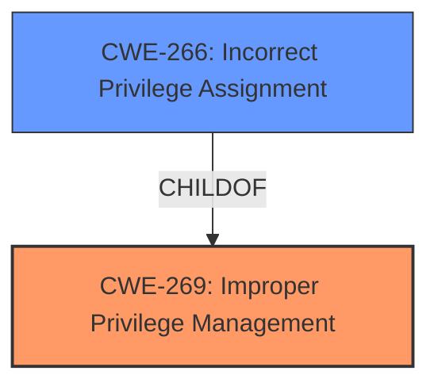

# Analysis Report for CVE-2022-41033

# Vulnerability Analysis Report: CVE-2022-41033

## Description


## Analysis (with Relationship Data)

# Summary
| CWE ID | CWE Name | Confidence | CWE Abstraction Level | CWE Vulnerability Mapping Label | CWE-Vulnerability Mapping Notes |
|---|---|---|---|---|---|
| CWE-269 | Improper Privilege Management | 0.6 | Class | Allowed-with-Review | Primary CWE |
| CWE-266 | Incorrect Privilege Assignment | 0.5 | Base | Allowed | Secondary Candidate |

## Evidence and Confidence

*   **Confidence Score:** 0.6
*   **Evidence Strength:** LOW

## Relationship Analysis
The primary relationship that influenced my decision was the parent-child relationship between CWE-269 and CWE-266. CWE-269 is a Class-level CWE, while CWE-266 is a Base-level CWE. While the description implies a privilege management issue, the lack of specifics makes it difficult to pinpoint the exact nature of the **improper privilege management**, leading to a higher-level classification.



## Vulnerability Chain
The vulnerability chain, based on the limited information, is:

1.  **ROOT CAUSE:** **Improper Privilege Management** (CWE-269). The system does not correctly manage privileges.
2.  **IMPACT:** Elevation of Privilege. An attacker gains higher privileges than intended.

The lack of technical details limits the ability to expand this chain.

## Summary of Analysis
The initial analysis focused on identifying a CWE that describes the **root cause** of the "Elevation of Privilege" vulnerability in the Windows COM+ Event System Service. The provided evidence is weak, primarily consisting of the vulnerability description and the term "Elevation of Privilege."

The Retriever results suggested several CWEs related to file access, privilege management, and insecure operations. However, most of these CWEs are too specific given the general nature of the vulnerability description. The focus on file access (CWE-59, CWE-1386) seems misplaced given the lack of any mention of file system operations. Integer issues (CWE-191, CWE-1285) also appear irrelevant.

CWE-269 (Improper Privilege Management) and its child CWE-266 (Incorrect Privilege Assignment) appear the most relevant. The vulnerability description explicitly states "Elevation of Privilege," which implies a problem with how privileges are managed.

CWE-269 is a Class-level CWE and is discouraged due to its broad nature and potential for misuse. However, without more specific information, it is difficult to pinpoint a more precise Base-level CWE. CWE-266 is a Base-level CWE and more specific.

The final decision leans towards CWE-269 as the primary mapping, acknowledging its generality, with CWE-266 as a secondary candidate. This is based on the limited evidence and the high-level description of the vulnerability. I am overriding the general mapping guidance to use a higher-level class CWE, but with the caveat that the evidence is lacking.

Relevant CWE Information:

# Enhanced Context (25 CWEs)

## CWE-59: Improper Link Resolution Before File Access ('Link Following')
**Abstraction Level**: Base
**Similarity Score**: 0.81
**Source**: dense

**Description**:
The product attempts to access a file based on the filename, but it does not properly prevent that filename from identifying a link or shortcut that resolves to an unintended resource.
**NOT USED:** Irrelevant. The vulnerability description does not mention file access or symbolic links.

## CWE-41: Improper Resolution of Path Equivalence
**Abstraction Level**: Base
**Similarity Score**: 0.81
**Source**: dense

**Description**:
The product is vulnerable to file system contents disclosure through path equivalence. Path equivalence involves the use of special characters in file and directory names. The associated manipulations are intended to generate multiple names for the same object.
**NOT USED:** Irrelevant. The vulnerability description does not mention path equivalence.

## CWE-668: Exposure of Resource to Wrong Sphere
**Abstraction Level**: Class
**Similarity Score**: 0.79
**Source**: dense

**Description**:
The product exposes a resource to the wrong control sphere, providing unintended actors with inappropriate access to the resource.
**NOT USED:** Irrelevant. While privilege escalation *could* be considered a resource exposure, this CWE is too general and discouraged.

## CWE-23: Relative Path Traversal
**Abstraction Level**: Base
**Similarity Score**: 0.79
**Source**: dense

**Description**:
The product uses external input to construct a pathname that should be within a restricted directory, but it does not properly neutralize sequences such as ".." that can resolve to a location that is outside of that directory.
**NOT USED:** Irrelevant. The vulnerability description does not mention path traversal.

## CWE-274: Improper Handling of Insufficient Privileges
**Abstraction Level**: Base
**Similarity Score**: 0.78
**Source**: dense

**Description**:
The product does not handle or incorrectly handles when it has insufficient privileges to perform an operation, leading to resultant weaknesses.
**NOT USED:** Irrelevant. The vulnerability description describes *elevation* of privileges, not insufficient privileges.

## CWE-73: External Control of File Name or Path
**Abstraction Level**: Base
**Similarity Score**: 0.78
**Source**: dense

**Description**:
The product allows user input to control or influence paths or file names that are used in filesystem operations.
**NOT USED:** Irrelevant. The vulnerability description does not mention file names or paths.

## CWE-1289: Improper Validation of Unsafe Equivalence in Input
**Abstraction Level**: Base
**Similarity Score**: 0.78
**Source**: dense

**Description**:
The product receives an input value that is used as a resource identifier or other type of reference, but it does not validate or incorrectly validates that the input is equivalent to a potentially-unsafe value.
**NOT USED:** Irrelevant. The vulnerability description does not mention validation of input.

## CWE-754: Improper Check for Unusual or Exceptional Conditions
**Abstraction Level**: Class
**Similarity Score**: 0.78
**Source**: dense

**Description**:
The product does not check or incorrectly checks for unusual or exceptional conditions that are not expected to occur frequently during day to day operation of the product.
**NOT USED:** Irrelevant. The vulnerability description does not indicate a failure to check for exceptional conditions.

## CWE-667: Improper Locking
**Abstraction Level**: Class
**Similarity Score**: 0.78
**Source**: dense

**Description**:
The product does not properly acquire or release a lock on a resource, leading to unexpected resource state changes and behaviors.
**NOT USED:** Irrelevant. The vulnerability description does not mention locking or resource contention.

## CWE-755: Improper Handling of Exceptional Conditions
**Abstraction Level**: Class
**Similarity Score**: 0.78
**Source**: dense

**Description**:
The product does not handle or incorrectly handles an exceptional condition.
**NOT USED:** Irrelevant. The vulnerability description does not indicate a failure to handle exceptional conditions.

## CWE-59: Improper Link Resolution Before File Access ('Link Following')
**Abstraction Level**: Base
**Similarity Score**: 4840.13
**Source**: sparse

**Description**:
The product attempts to access a file based on the filename, but it does not properly prevent that filename from identifying a link or shortcut that resolves to an unintended resource.
**NOT USED:** Irrelevant. The vulnerability description does not mention file access or symbolic links.

## CWE-1386: Insecure Operation on Windows Junction / Mount Point
**Abstraction Level**: Base
**Similarity Score**: 4665.24
**Source**: sparse

**Description**:
The product opens a file or directory, but it does not properly prevent the name from being associated with a junction or mount point to a destination that is outside of the intended control sphere.
**NOT USED:** Irrelevant. The vulnerability description does not mention file access, junctions, or mount points.

## CWE-427: Uncontrolled Search Path Element
**Abstraction Level**: Base
**Similarity Score**: 4424.68
**Source**: sparse

**Description**:
The product uses a fixed or controlled search path to find resources, but one or more locations in that path can be under the control of unintended actors.
**NOT USED:** Irrelevant. The vulnerability description does not mention search paths.

## CWE-367: Time-of-check Time-of-use (TOCTOU) Race Condition
**Abstraction Level**: Base
**Similarity Score**: 4413.25
**Source**: sparse

**Description**:
The product checks the state of a resource before using that resource, but the resource's state can change between the check and the use in a way that invalidates the results of the check. This can cause the product to perform invalid actions


## CWE Relationship Analysis

Current CWEs represent these abstraction levels: .


### Vulnerability Chain Analysis

**Chain starting from CWE-367:**
- 367 (Time-of-check Time-of-use (TOCTOU) Race Condition) - ROOT


**Chain starting from CWE-266:**
- 266 (Incorrect Privilege Assignment) - ROOT


### CWE Relationship Diagram

```mermaid
graph TD
    classDef primary fill:#f96,stroke:#333,stroke-width:2px
    classDef secondary fill:#69f,stroke:#333
    classDef tertiary fill:#9e9,stroke:#333
```


*Report generated on 2025-03-30 13:51:19*
