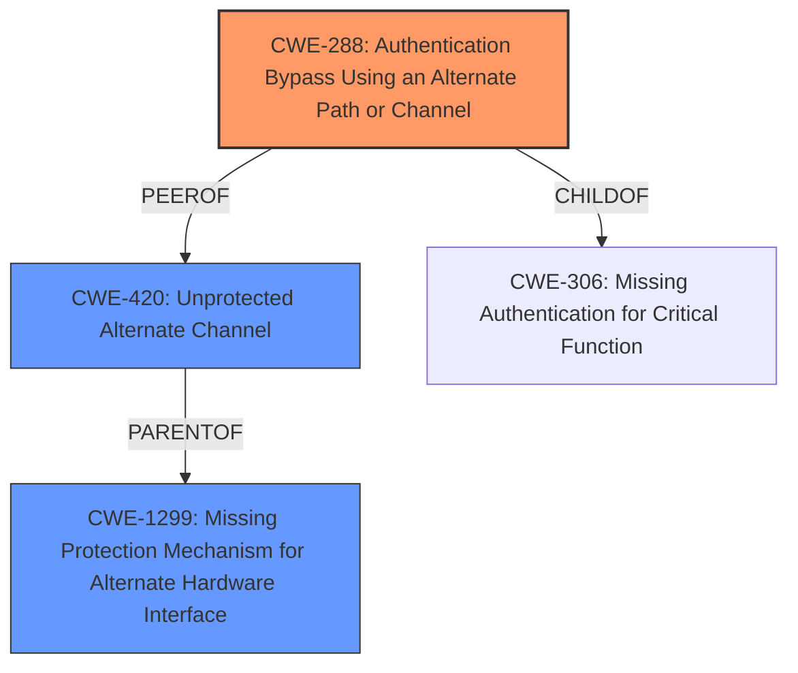

# Raw Analyzer Response for CVE-2022-41049

# Summary
| CWE ID        | CWE Name                                                                    | Confidence | CWE Abstraction Level | CWE Vulnerability Mapping Label | CWE-Vulnerability Mapping Notes |
|---------------|-----------------------------------------------------------------------------|------------|-----------------------|---------------------------------|------------------------------------|
| CWE-288       | Authentication Bypass Using an Alternate Path or Channel                    | 0.7        | Base                  | Primary                           | Allowed                            |
| CWE-420       | Unprotected Alternate Channel                                              | 0.5        | Base                  | Secondary                         | Allowed                            |
| CWE-1299       | Missing Protection Mechanism for Alternate Hardware Interface                                              | 0.5        | Base                  | Secondary                         | Allowed                            |

## Evidence and Confidence

*   **Confidence Score:** 0.7
*   **Evidence Strength:** MEDIUM

## Relationship Analysis
The primary CWE is CWE-288 Authentication Bypass Using an Alternate Path or Channel, which has peer relationships to CWE-420 Unprotected Alternate Channel. CWE-288 also has a child relationship to CWE-306 Missing Authentication for Critical Function. Both the peer and child relationships influenced consideration of these alternate classifications.

## Vulnerability Chain
The vulnerability chain begins with the **security feature bypass** due to a **missing** or **improper** protection mechanism on an alternate path. This allows an attacker to bypass the intended security controls and potentially execute malicious code or gain unauthorized access.
  - Root Cause: **Security Feature Bypass**
  - Weakness: **Missing** or **Improper** Protection on Alternate Path/Channel
  - Impact: Potential execution of malicious code or unauthorized access

## Summary of Analysis
The primary CWE is CWE-288 Authentication Bypass Using an Alternate Path or Channel because the vulnerability involves bypassing a security feature through an alternate path. The description mentions a **security feature bypass** in Windows Mark of the Web, which aligns with the concept of bypassing authentication or security controls via an alternate channel. The presence of an alternate path is implied by the **security feature bypass**, suggesting a lack of protection on this path.

The vulnerability description key phrases highlight "**Security Feature Bypass**" which directly supports the selection of CWE-288 because the primary weakness being exploited is the ability to circumvent the intended security mechanisms.

The retriever results also suggest considering CWE-288, further reinforcing its relevance.

CWE-420 Unprotected Alternate Channel was considered because it is a peer of CWE-288 and describes a situation where an alternate communication channel lacks sufficient protection mechanisms. CWE-1299 Missing Protection Mechanism for Alternate Hardware Interface was considered because it is a parent of CWE-420.

The selection of CWE-288 is at the optimal level of specificity as it directly addresses the **security feature bypass** through an alternate path, which is the core of the vulnerability.

Relevant CWE Information:

# Enhanced Context (25 CWEs)
The following CWEs were identified as potentially relevant to this vulnerability:

## CWE-1263: Improper Physical Access Control
**Abstraction Level**: Class
**Similarity Score**: 0.76
**Source**: dense

**Description**:
The product is designed with access restricted to certain information, but it does not sufficiently protect against an unauthorized actor with physical access to these areas.

**Mapping Guidance**:
- Usage: Allowed-with-Review
- Rationale: This CWE entry is a Class and might have Base-level children that would be more appropriate

## CWE-807: Reliance on Untrusted Inputs in a Security Decision
**Abstraction Level**: Base
**Similarity Score**: 0.75
**Source**: dense

**Description**:
The product uses a protection mechanism that relies on the existence or values of an input, but the input can be modified by an untrusted actor in a way that bypasses the protection mechanism.

**Mapping Guidance**:
- Usage: Allowed
- Rationale: This CWE entry is at the Base level of abstraction, which is a preferred level of abstraction for mapping to the root causes of vulnerabilities.

## CWE-274: Improper Handling of Insufficient Privileges
**Abstraction Level**: Base
**Similarity Score**: 0.75
**Source**: dense

**Description**:
The product does not handle or incorrectly handles when it has insufficient privileges to perform an operation, leading to resultant weaknesses.

**Mapping Guidance**:
- Usage: Discouraged
- Rationale: This CWE entry could be deprecated in a future version of CWE.

## CWE-451: User Interface (UI) Misrepresentation of Critical Information
**Abstraction Level**: Class
**Similarity Score**: 0.75
**Source**: dense

**Description**:
The user interface (UI) does not properly represent critical information to the user, allowing the information - or its source - to be obscured or spoofed. This is often a component in phishing attacks.

**Mapping Guidance**:
- Usage: Allowed-with-Review
- Rationale: This CWE entry is a Class and might have Base-level children that would be more appropriate

## CWE-657: Violation of Secure Design Principles
**Abstraction Level**: Class
**Similarity Score**: 0.75
**Source**: dense

**Description**:
The product violates well-established principles for secure design.

**Mapping Guidance**:
- Usage: Discouraged
- Rationale: This CWE entry is a level-1 Class (i.e., a child of a Pillar). It might have lower-level children that would be more appropriate

## CWE-424: Improper Protection of Alternate Path
**Abstraction Level**: Class
**Similarity Score**: 0.74
**Source**: dense

**Description**:
The product does not sufficiently protect all possible paths that a user can take to access restricted functionality or resources.

**Mapping Guidance**:
- Usage: Allowed-with-Review
- Rationale: This CWE entry is a Class and might have Base-level children that would be more appropriate

## CWE-653: Improper Isolation or Compartmentalization
**Abstraction Level**: Class
**Similarity Score**: 0.74
**Source**: dense

**Description**:
The product does not properly compartmentalize or isolate functionality, processes, or resources that require different privilege levels, rights, or permissions.

**Mapping Guidance**:
- Usage: Allowed
- Rationale: This CWE entry is at the Base level of abstraction, which is a preferred level of abstraction for mapping to the root causes of vulnerabilities.

## CWE-356: Product UI does not Warn User of Unsafe Actions
**Abstraction Level**: Base
**Similarity Score**: 0.74
**Source**: dense

**Description**:
The product's user interface does not warn the user before undertaking an unsafe action on behalf of that user. This makes it easier for attackers to trick users into inflicting damage to their system.

**Mapping Guidance**:
- Usage: Allowed
- Rationale: This CWE entry is at the Base level of abstraction, which is a preferred level of abstraction for mapping to the root causes of vulnerabilities.

## CWE-668: Exposure of Resource to Wrong Sphere
**Abstraction Level**: Class
**Similarity Score**: 0.74
**Source**: dense

**Description**:
The product exposes a resource to the wrong control sphere, providing unintended actors with inappropriate access to the resource.

**Mapping Guidance**:
- Usage: Discouraged
- Rationale: CWE-668 is high-level and is often misused as a catch-all when lower-level CWE IDs might be applicable. It is sometimes used for low-information vulnerability reports [REF-1287]. It is a level-1 Class (i.e., a child of a Pillar). It is not useful for trend analysis.

## CWE-1299: Missing Protection Mechanism for Alternate Hardware Interface
**Abstraction Level**: Base
**Similarity Score**: 0.74
**Source**: dense

**Description**:
The lack of protections on alternate paths to access
                control-protected assets (such as unprotected shadow registers
                and other external facing unguarded interfaces) allows an
                attacker to bypass existing protections to the asset that are
		only performed against the primary path.

**Mapping Guidance**:
- Usage: Allowed
- Rationale: This CWE entry is at the Base level of abstraction, which is a preferred level of abstraction for mapping to the root causes of vulnerabilities.

## CWE-451: User Interface (UI) Misrepresentation of Critical Information
**Abstraction Level**: Class
**Similarity Score**: 5750.25