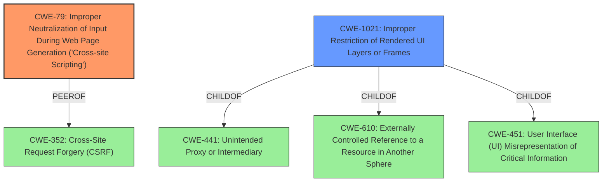

# Enhanced Analysis for CVE-2022-4105

# Summary
| CWE ID | CWE Name | Confidence | CWE Abstraction Level | CWE Vulnerability Mapping Label | CWE-Vulnerability Mapping Notes |
|---|---|---|---|---|---|
| CWE-79 | Improper Neutralization of Input During Web Page Generation ('Cross-site Scripting') | 1.0 | Base | Allowed | Primary CWE |
| CWE-1021 | Improper Restriction of Rendered UI Layers or Frames | 0.8 | Base | Allowed | Secondary Candidate |

## Evidence and Confidence

*   **Confidence Score:** 0.9
*   **Evidence Strength:** HIGH

## Relationship Analysis
The primary CWE is CWE-79, which describes the **improper neutralization** of input leading to Cross-Site Scripting. CWE-79 can lead to other vulnerabilities. CWE-1021, Improper Restriction of Rendered UI Layers or Frames, is a base-level CWE related to clickjacking, which is a UI redressing attack. CWE-1021 is related to CWE-441, CWE-610, and CWE-451 via ChildOf relationships. CWE-79 and CWE-352 have a PeerOf relationship.



## Vulnerability Chain
The vulnerability chain starts with the **improper neutralization** of input, leading to XSS (CWE-79). This XSS is then chained with HTML injection to perform UI redressing/clickjacking (CWE-1021). Another HTML injection disables the history page.

## Summary of Analysis
The vulnerability is a stored XSS in a Kiwi Test Plan that can run malicious JavaScript, which can be chained with an HTML injection to perform a UI redressing attack (clickjacking). The **root cause** is **cross-site scripting**.

The vulnerability description states: "A stored XSS in a kiwi Test Plan can run malicious javascript which could be chained with an HTML injection to perform a UI redressing attack (clickjacking) and an HTML injection which disables the use of the history page." The CVE reference links content summary states: "The commit message "Clean HTML input when generating history diff helps us prevent XSS attacks" strongly suggests this commit addresses a potential Cross-Site Scripting (XSS) vulnerability". It also mentions the root cause of the vulnerability stemming from the lack of proper sanitization of HTML input.

Based on the evidence, CWE-79 (Improper Neutralization of Input During Web Page Generation ('Cross-site Scripting')) is the primary CWE because the **root cause** is the **improper neutralization** of user-controllable input before it's placed in the output. This aligns perfectly with the CWE-79 description. The **impact** includes the ability to run malicious JavaScript, indicating successful exploitation of the XSS vulnerability. CWE-79 is a Base level CWE and the mapping guidance allows this usage.

CWE-1021 (Improper Restriction of Rendered UI Layers or Frames) is a secondary CWE since the XSS can be chained with HTML injection to perform clickjacking. This aligns with the CWE-1021 description, which includes "clickjacking" as an alternative term.

CWE-20 (Improper Input Validation) was considered, but it is too high-level. The evidence clearly points to XSS due to **improper neutralization**, making CWE-79 a more specific and appropriate choice.
CWE-352 (Cross-Site Request Forgery (CSRF)) was considered, but it doesn't directly fit the vulnerability description. While XSS can sometimes be related to CSRF, the description doesn't provide sufficient evidence to support CSRF as a contributing factor in this case.

The selected CWEs are at the optimal level of specificity because they accurately represent the **root cause** (CWE-79) and a significant secondary impact (CWE-1021) of the vulnerability based on the available evidence.


## CWE Relationship Analysis

Current CWEs represent these abstraction levels: .


### Vulnerability Chain Analysis

**Chain starting from CWE-451:**
- 451 (User Interface (UI) Misrepresentation of Critical Information) - ROOT


**Chain starting from CWE-20:**
- 20 (Improper Input Validation) - ROOT


### CWE Relationship Diagram

```mermaid
graph TD
    classDef primary fill:#f96,stroke:#333,stroke-width:2px
    classDef secondary fill:#69f,stroke:#333
    classDef tertiary fill:#9e9,stroke:#333
```