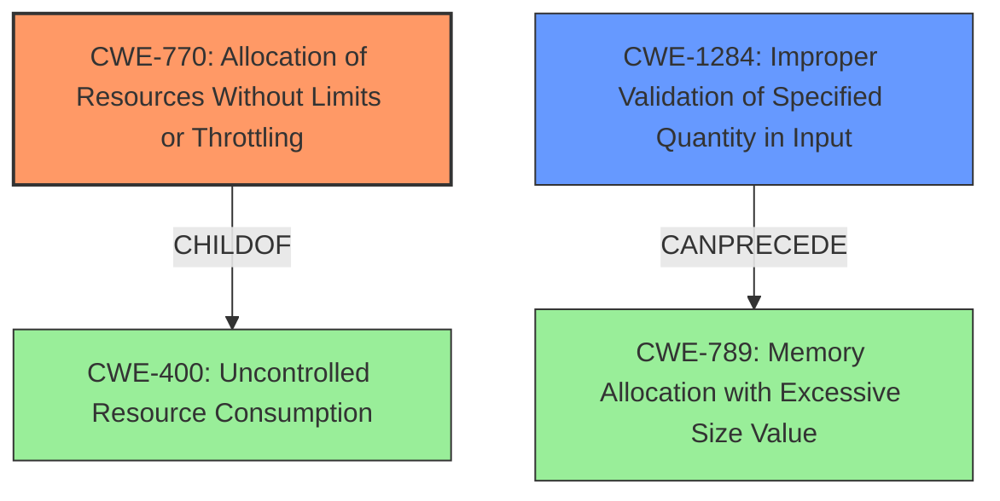

# Analysis Report for CVE-2022-4111

# Vulnerability Analysis Report: CVE-2022-4111

## Description


## Analysis (with Relationship Data)

# Summary
| CWE ID | CWE Name | Confidence | CWE Abstraction Level | CWE Vulnerability Mapping Label | CWE-Vulnerability Mapping Notes |
|---|---|---|---|---|---|
| CWE-770 | Allocation of Resources Without Limits or Throttling | 0.9 | Base | Allowed | Primary CWE |
| CWE-1284 | Improper Validation of Specified Quantity in Input | 0.8 | Base | Allowed | Secondary CWE |

## Evidence and Confidence

*   **Confidence Score:** 0.9
*   **Evidence Strength:** HIGH

## Relationship Analysis
The primary CWE is CWE-770, which falls under CWE-400 (Uncontrolled Resource Consumption). CWE-1284 can precede CWE-789 (Memory Allocation with Excessive Size Value), indicating a potential chain where improper input validation leads to excessive memory allocation. CWE-770 is a child of CWE-400, representing a more specific case of uncontrolled resource consumption, making it a more appropriate choice.



## Vulnerability Chain
The vulnerability chain starts with the **unrestricted file size limit**, leading to excessive resource allocation and ultimately resulting in a denial-of-service (DoS) condition.
  - **Root Cause:** **Unrestricted file size limit** (CWE-770)
  - **Weakness:** Improper Input Validation (CWE-1284)
  - **Impact:** Denial of Service

## Summary of Analysis
The initial assessment identified the **unrestricted file size limit** as a key factor. The analysis strongly relies on the vulnerability description key phrases and the CVE reference link content summary, both of which directly point to the **lack of file size validation** as the root cause. The CVE reference section provides evidence: "The code previously lacked a check on the size of uploaded avatar files. Without this check, users could potentially upload extremely large files, leading to denial of service or other issues."

CWE-770 (Allocation of Resources Without Limits or Throttling) is the primary CWE because it accurately describes the **root cause** of the vulnerability where there are no restrictions on the size of uploaded files. It is a base level CWE which is also desirable.

CWE-1284 (Improper Validation of Specified Quantity in Input) is a secondary CWE because it points to **missing file size validation**.

The graph relationships influenced the selection by highlighting the connection between CWE-770 and CWE-400, reinforcing the resource consumption aspect. Additionally, the chain relationship between CWE-1284 and CWE-789 suggests that improper input validation can lead to excessive memory allocation, further contributing to the denial-of-service condition.

The selected CWEs are at the optimal level of specificity because they directly address the root cause and contributing factors of the vulnerability, as supported by the evidence.

Relevant CWE Information:

# Enhanced Context (25 CWEs)

## CWE-770: Allocation of Resources Without Limits or Throttling
**Technical Explanation:** CWE-770 applies because the application fails to impose any restrictions on the size of uploaded files. An attacker can upload arbitrarily large files, consuming excessive server resources such as disk space or memory, leading to a denial of service.
**Security Implications:** This can lead to a denial of service, preventing legitimate users from accessing the application.
**Relationship:** CWE-770 is a child of CWE-400 (Uncontrolled Resource Consumption), providing a more specific categorization of the resource consumption issue.
**Mapping Guidance Influence:** The MITRE mapping guidance recommends using Base-level CWEs, which supports the selection of CWE-770.
**Confidence:** 0.9

## CWE-1284: Improper Validation of Specified Quantity in Input
**Technical Explanation:** CWE-1284 applies because the application does not validate the size of the uploaded file. An attacker can specify an excessively large file size, leading to resource exhaustion or other issues.
**Security Implications:** This can lead to resource exhaustion and denial of service.
**Relationship:** CWE-1284 can precede CWE-789 (Memory Allocation with Excessive Size Value), where the lack of validation leads to allocating excessive memory.
**Mapping Guidance Influence:** The MITRE mapping guidance recommends using Base-level CWEs, which supports the selection of CWE-1284.
**Confidence:** 0.8

## Considered but not used:
- CWE-400: While relevant, CWE-400 is a Class-level CWE and less specific than CWE-770.
- CWE-434: This CWE is related to dangerous file types, which is not the primary issue here. The focus is on file size, not the type of file.
- CWE-789: While memory allocation is related, CWE-770 better captures the **root cause**, which is the **lack of limits or throttling**.
- CWE-1325: This CWE is related to sequential memory allocation, which is not the primary issue. The focus is on not limiting resource allocation.
- CWE-799: This CWE is about frequency of interactions, and is not as relevant as the lack of file size limits.


## CWE Relationship Analysis

Current CWEs represent these abstraction levels: .


### Vulnerability Chain Analysis

**Chain starting from CWE-1325:**
- 1325 (Improperly Controlled Sequential Memory Allocation) - ROOT


**Chain starting from CWE-400:**
- 400 (Uncontrolled Resource Consumption) - ROOT


### CWE Relationship Diagram

```mermaid
graph TD
    classDef primary fill:#f96,stroke:#333,stroke-width:2px
    classDef secondary fill:#69f,stroke:#333
    classDef tertiary fill:#9e9,stroke:#333
```


*Report generated on 2025-03-30 16:16:58*
