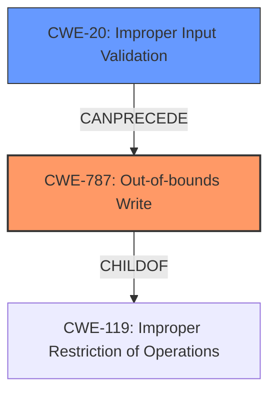

# Analysis for CVE-2022-41128

# Summary
| CWE ID  | CWE Name  | Confidence | CWE Abstraction Level | CWE Vulnerability Mapping Label | CWE-Vulnerability Mapping Notes |
|-----------------|---------------------------------------------------------------------------------------------------------------------|------------|-------------------------|---------------------------------|----------------------------------------------------------------------|
| CWE-787 | Out-of-bounds Write | 0.75 | Base  | Allowed  | Primary CWE. The **lack of bounds checking** leads to an out-of-bounds write. |
| CWE-20 | Improper Input Validation | 0.5 | Class | Discouraged | Secondary CWE. The **improper input validation** contributes to the vulnerability. |

## Evidence and Confidence

*   **Confidence Score:** 0.7
*   **Evidence Strength:** MEDIUM

## Relationship Analysis
The primary relationship is that CWE-787 [CWE-787: Out-of-bounds Write] is a child of CWE-119 [CWE-119: Improper Restriction of Operations within the Bounds of a Memory Buffer]. CWE-20 [CWE-20: Improper Input Validation] can precede CWE-787, as **improper input validation** can lead to an out-of-bounds write if the input is not properly checked for size or boundaries before being written to a buffer. The abstraction levels influenced the selection, choosing the more specific base-level CWE-787 over the class-level CWE-20 when the root cause is clearly a memory safety issue due to **lack of bounds checking**.

## Vulnerability Chain
The vulnerability chain starts with **improper input validation** (CWE-20), which leads to a **lack of bounds checking** and ultimately results in an out-of-bounds write (CWE-787).

## Summary of Analysis
The initial analysis focused on the provided vulnerability description, particularly the key phrases related to the root cause and weakness. The description highlights "**improper input validation** and **lack of bounds checking** in Windows Scripting Languages," which allows for the execution of arbitrary code.

The retriever results suggested several candidate CWEs, including CWE-79 [CWE-79: Improper Neutralization of Input During Web Page Generation ('Cross-site Scripting')], CWE-138 [CWE-138: Improper Neutralization of Special Elements], CWE-787 [CWE-787: Out-of-bounds Write], and CWE-20 [CWE-20: Improper Input Validation].

Given the description's emphasis on **lack of bounds checking** and the possibility of arbitrary code execution, CWE-787 [CWE-787: Out-of-bounds Write] was selected as the primary CWE. The vulnerability description states: "**The vulnerability is due to a flaw in how Windows Scripting Languages handle certain input, which allows for the execution of arbitrary code.**" This aligns with the characteristics of an out-of-bounds write, where writing data past the end of a buffer can overwrite critical system memory, potentially leading to code execution.

CWE-20 [CWE-20: Improper Input Validation] was considered as a contributing factor, as the vulnerability description also mentions "**improper input validation**." However, CWE-20 is a broad class, and the more specific CWE-787 [CWE-787: Out-of-bounds Write] better captures the root cause of the vulnerability.

The choice of CWE-787 [CWE-787: Out-of-bounds Write] is further supported by its base-level abstraction, which is preferred for root cause analysis.

Other CWEs were considered but not selected because they did not directly address the root cause of the vulnerability. For example, CWE-79 [CWE-79: Improper Neutralization of Input During Web Page Generation ('Cross-site Scripting')] is more relevant to web application vulnerabilities, while this vulnerability is specific to Windows Scripting Languages. CWE-427 [CWE-427: Uncontrolled Search Path Element] relates to the use of a fixed or controlled search path, which is not mentioned in the description.

Relevant CWE Information:

# Enhanced Context (25 CWEs)

## CWE-1289: Improper Validation of Unsafe Equivalence in Input
**Abstraction Level**: Base
**Similarity Score**: 0.74
**Source**: dense

**Description**:
The product receives an input value that is used as a resource identifier or other type of reference, but it does not validate or incorrectly validates that the input is equivalent to a potentially-unsafe value.

**Mapping Guidance**:
- Usage: Allowed
- Rationale: This CWE entry is at the Base level of abstraction, which is a preferred level of abstraction for mapping to the root causes of vulnerabilities.

## CWE-799: Improper Control of Interaction Frequency
**Abstraction Level**: Class
**Similarity Score**: 0.74
**Source**: dense

**Description**:
The product does not properly limit the number or frequency of interactions that it has with an actor, such as the number of incoming requests.

**Mapping Guidance**:
- Usage: Allowed-with-Review
- Rationale: This CWE entry is a Class and might have Base-level children that would be more appropriate

## CWE-444: Inconsistent Interpretation of HTTP Requests ('HTTP Request/Response Smuggling')
**Abstraction Level**: Base
**Similarity Score**: 0.74
**Source**: dense

**Description**:
The product acts as an intermediary HTTP agent
         (such as a proxy or firewall) in the data flow between two
         entities such as a client and server, but it does not
         interpret malformed HTTP requests or responses in ways that
         are consistent with how the messages will be processed by
         those entities that are at the ultimate destination.

**Mapping Guidance**:
- Usage: Allowed
- Rationale: This CWE entry is at the Base level of abstraction, which is a preferred level of abstraction for mapping to the root causes of vulnerabilities.

## CWE-41: Improper Resolution of Path Equivalence
**Abstraction Level**: Base
**Similarity Score**: 0.73
**Source**: dense

**Description**:
The product is vulnerable to file system contents disclosure through path equivalence. Path equivalence involves the use of special characters in file and directory names. The associated manipulations are intended to generate multiple names for the same object.

**Mapping Guidance**:
- Usage: Allowed
- Rationale: This CWE entry is at the Base level of abstraction, which is a preferred level of abstraction for mapping to the root causes of vulnerabilities.

## CWE-405: Asymmetric Resource Consumption (Amplification)
**Abstraction Level**: Class
**Similarity Score**: 0.73
**Source**: dense

**Description**:
The product does not properly control situations in which an adversary can cause the product to consume or produce excessive resources without requiring the adversary to invest equivalent work or otherwise prove authorization, i.e., the adversary's influence is "asymmetric."

**Mapping Guidance**:
- Usage: Allowed-with-Review
- Rationale: This CWE entry is a Class and might have Base-level children that would be more appropriate

## CWE-113: Improper Neutralization of CRLF Sequences in HTTP Headers ('HTTP Request/Response Splitting')
**Abstraction Level**: Variant
**Similarity Score**: 0.73
**Source**: dense

**Description**:
The product receives data from an HTTP agent/component (e.g., web server, proxy, browser, etc.), but it does not neutralize or incorrectly neutralizes CR and LF characters before the data is included in outgoing HTTP headers.

**Mapping Guidance**:
- Usage: Allowed
- Rationale: This CWE entry is at the Variant level of abstraction, which is a preferred level of abstraction for mapping to the root causes of vulnerabilities.

## CWE-74: Improper Neutralization of Special Elements in Output Used by a Downstream Component ('Injection')
**Abstraction Level**: Class
**Similarity Score**: 0.73
**Source**: dense

**Description**:
The product constructs all or part of a command, data structure, or record using externally-influenced input from an upstream component, but it does not neutralize or incorrectly neutralizes special elements that could modify how it is parsed or interpreted when it is sent to a downstream component.

**Mapping Guidance**:
- Usage: Discouraged
- Rationale: CWE-74 is high-level and often misused when lower-level weaknesses are more appropriate.

## CWE-807: Reliance on Untrusted Inputs in a Security Decision
**Abstraction Level**: Base
**Similarity Score**: 0.72
**Source**: dense

**Description**:
The product