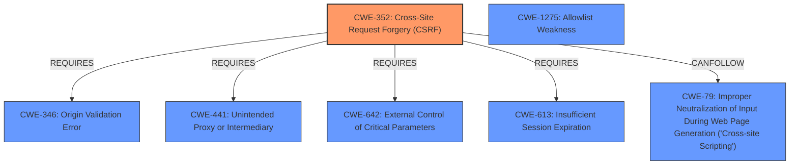

# Enhanced Analysis for CVE-2022-41136

# Summary
| CWE ID | CWE Name | Confidence | CWE Abstraction Level | CWE Vulnerability Mapping Label | CWE-Vulnerability Mapping Notes |
|---|---|---|---|---|---|
| CWE-352 | Cross-Site Request Forgery (CSRF) | 1.0 | Compound | Primary | Allowed |
| CWE-79 | Improper Neutralization of Input During Web Page Generation ('Cross-site Scripting') | 1.0 | Base | Secondary | Allowed |

## Evidence and Confidence

*   **Confidence Score:** 1.0
*   **Evidence Strength:** HIGH

## Relationship Analysis
The primary weakness is CWE-352 (**Cross-Site Request Forgery (CSRF)**), which is a compound weakness. The attack can lead to Stored Cross-Site Scripting (XSS), which is represented by CWE-79 (**Improper Neutralization of Input During Web Page Generation ('Cross-site Scripting')**). CWE-352 requires certain conditions (CWE-346, CWE-441, CWE-642, CWE-613) to be met for the attack to be successful, and it can lead to other vulnerabilities like CWE-1275.



## Vulnerability Chain
The vulnerability chain starts with a **Cross-Site Request Forgery (CSRF)** vulnerability (CWE-352). An attacker exploits this by tricking a user into performing actions they didn't intend to, due to **insufficient verification** of the request's origin. This leads to the injection of malicious code/input. If the injected content is not properly neutralized, it results in Stored Cross-Site Scripting (XSS) (CWE-79) when the page is generated for other users.

CSRF (CWE-352) -> Improper Input Handling -> Stored XSS (CWE-79)

## Summary of Analysis
The analysis is based on the provided vulnerability description and CVE reference summary. The key evidence is the explicit mention of **Cross-Site Request Forgery (CSRF)** as the root cause and Stored Cross-Site Scripting (XSS) as the impact.

> **Vulnerability Description Key Phrases**
> - **rootcause:** **Cross-Site Request Forgery (CSRF)**
> - **impact:** Stored Cross-Site Scripting (XSS)

The graph relationships confirm that CWE-352 is a compound weakness and can lead to CWE-79. The selection of CWE-352 as the primary weakness is based on its identification as the root cause, while CWE-79 is selected as the secondary weakness due to its role as the impact. Both CWEs are at the appropriate level of specificity, with CWE-352 being a compound weakness and CWE-79 being a base weakness.

Relevant CWE Information:

# Enhanced Context (25 CWEs)
The following CWEs were identified as potentially relevant to this vulnerability:

## CWE-74: Improper Neutralization of Special Elements in Output Used by a Downstream Component ('Injection')
**Abstraction Level**: Class
**Similarity Score**: 0.77
**Source**: dense

**Description**:
The product constructs all or part of a command, data structure, or record using externally-influenced input from an upstream component, but it does not neutralize or incorrectly neutralizes special elements that could modify how it is parsed or interpreted when it is sent to a downstream component.

**Mapping Guidance**:
- Usage: Discouraged
- Rationale: CWE-74 is high-level and often misused when lower-level weaknesses are more appropriate.
**Conclusion:** Not used because CWE-74 is too high-level and other, more specific CWEs like CWE-79 are present.

## CWE-1004: Sensitive Cookie Without 'HttpOnly' Flag
**Abstraction Level**: Variant
**Similarity Score**: 0.76
**Source**: dense

**Description**:
The product uses a cookie to store sensitive information, but the cookie is not marked with the HttpOnly flag.

**Mapping Guidance**:
- Usage: Allowed
- Rationale: This CWE entry is at the Variant level of abstraction, which is a preferred level of abstraction for mapping to the root causes of vulnerabilities.
**Conclusion:** Not used because this is not relevant to the CSRF or XSS vulnerability described.

## CWE-113: Improper Neutralization of CRLF Sequences in HTTP Headers ('HTTP Request/Response Splitting')
**Abstraction Level**: Variant
**Similarity Score**: 0.76
**Source**: dense

**Description**:
The product receives data from an HTTP agent/component (e.g., web server, proxy, browser, etc.), but it does not neutralize or incorrectly neutralizes CR and LF characters before the data is included in outgoing HTTP headers.

**Mapping Guidance**:
- Usage: Allowed
- Rationale: This CWE entry is at the Variant level of abstraction, which is a preferred level of abstraction for mapping to the root causes of vulnerabilities.
**Conclusion:** Not used because this is not relevant to the CSRF or XSS vulnerability described.

## CWE-80: Improper Neutralization of Script-Related HTML Tags in a Web Page (Basic XSS)
**Abstraction Level**: Variant
**Similarity Score**: 0.76
**Source**: dense

**Description**:
The product receives input from an upstream component, but it does not neutralize or incorrectly neutralizes special characters such as "<", ">", and "&" that could be interpreted as web-scripting elements when they are sent to a downstream component that processes web pages.

**Mapping Guidance**:
- Usage: Allowed
- Rationale: This CWE entry is at the Variant level of abstraction, which is a preferred level of abstraction for mapping to the root causes of vulnerabilities.
**Conclusion:** While related to the XSS aspect, CWE-79 is a better fit.

## CWE-807: Reliance on Untrusted Inputs in a Security Decision
**Abstraction Level**: Base
**Similarity Score**: 0.75
**Source**: dense

**Description**:
The product uses a protection mechanism that relies on the existence or values of an input, but the input can be modified by an untrusted actor in a way that bypasses the protection mechanism.

**Mapping Guidance**:
- Usage: Allowed
- Rationale: This CWE entry is at the Base level of abstraction, which is a preferred level of abstraction for mapping to the root causes of vulnerabilities.
**Conclusion:** Not used as CWE-352 and CWE-79 capture the vulnerability more accurately.

## CWE-1289: Improper Validation of Unsafe Equivalence in Input
**Abstraction Level**: Base
**Similarity Score**: 0.75
**Source**: dense

**Description**:
The product receives an input value that is used as a resource identifier or other type of reference, but it does not validate or incorrectly validates that the input is equivalent to a potentially-unsafe value.

**Mapping Guidance**:
- Usage: Allowed
- Rationale: This CWE entry is at the Base level of abstraction, which is a preferred level of abstraction for mapping to the root causes of vulnerabilities.
**Conclusion:** Not used as CWE-352 and CWE-79 capture the vulnerability more accurately.

## CWE-41: Improper Resolution of Path Equivalence
**Abstraction Level**: Base
**Similarity Score**: 0.75
**Source**: dense

**Description**:
The product is vulnerable to file system contents disclosure through path equivalence. Path equivalence involves the use of special characters in file and directory names. The associated manipulations are intended to generate multiple names for the same object.

**Mapping Guidance**:
- Usage: Allowed
- Rationale: This CWE entry is at the Base level of abstraction, which is a preferred level of abstraction for mapping to the root causes of vulnerabilities.
**Conclusion:** Not relevant to this vulnerability.

## CWE-472: External Control of Assumed-Immutable Web Parameter


## CWE Relationship Analysis

Current CWEs represent these abstraction levels: .


### Vulnerability Chain Analysis

**Chain starting from CWE-1275:**
- 1275 (Sensitive Cookie with Improper SameSite Attribute) - ROOT


**Chain starting from CWE-80:**
- 80 (Improper Neutralization of Script-Related HTML Tags in a Web Page (Basic XSS)) - ROOT


### CWE Relationship Diagram

```mermaid
graph TD
    classDef primary fill:#f96,stroke:#333,stroke-width:2px
    classDef secondary fill:#69f,stroke:#333
    classDef tertiary fill:#9e9,stroke:#333
```