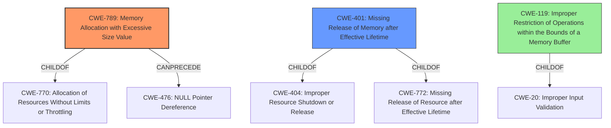

# Analysis for CVE-2022-41166

# Summary
| CWE ID | CWE Name | Confidence | CWE Abstraction Level | CWE Vulnerability Mapping Label | CWE-Vulnerability Mapping Notes |
|---|---|---|---|---|---|
| CWE-789 | Memory Allocation with Excessive Size Value | 0.75 | Variant | Allowed | Primary CWE |
| CWE-401 | Missing Release of Memory after Effective Lifetime | 0.5 | Variant | Allowed | Secondary CWE |
| CWE-119 | Improper Restriction of Operations within the Bounds of a Memory Buffer | 0.3 | Class | Discouraged | Secondary CWE |

## Evidence and Confidence

*   **Confidence Score:** 0.7
*   **Evidence Strength:** MEDIUM

## Relationship Analysis
The primary weakness, **CWE-789 (Memory Allocation with Excessive Size Value)**, is a variant of **CWE-770 (Allocation of Resources Without Limits or Throttling)**, indicating a lack of proper resource management. A secondary contributing factor may be **CWE-401 (Missing Release of Memory after Effective Lifetime)**, a variant of **CWE-404 (Improper Resource Shutdown or Release)** and **CWE-772 (Missing Release of Resource after Effective Lifetime)**, suggesting memory is not being released after use. **CWE-119 (Improper Restriction of Operations within the Bounds of a Memory Buffer)** is a higher-level class that is too general and not as descriptive as **CWE-789**.

## Vulnerability Chain
The vulnerability chain starts with **lack of proper memory management**, potentially including allocating excessive memory (CWE-789). This **lack of proper memory management** may also lead to memory not being released after use (CWE-401). This condition leads to a crash, which is the impact described. The root cause is triggered by opening a manipulated Wavefront Object (.obj) file.

## Summary of Analysis
The initial assessment pointed to **CWE-119 (Improper Restriction of Operations within the Bounds of a Memory Buffer)** due to the reported crash and memory issues. However, the more specific root cause, **lack of proper memory management**, suggests **CWE-789 (Memory Allocation with Excessive Size Value)** as a more precise classification. This is further supported by the retriever results, which includes **CWE-789 (Memory Allocation with Excessive Size Value)** and **CWE-401 (Missing Release of Memory after Effective Lifetime)**.

The vulnerability description states, "Due to **lack of proper memory management**, when a victim opens manipulated Wavefront Object (.obj, ObjTranslator.exe) file received from untrusted sources in SAP 3D Visual Enterprise Author - version 9, it is possible for the application to crash and becomes temporarily unavailable to the user until restart of the application." This statement is direct evidence of the root cause.

**CWE-789 (Memory Allocation with Excessive Size Value)** is chosen because the **lack of proper memory management** likely involves allocating an excessive amount of memory based on the manipulated file, leading to the crash. **CWE-401 (Missing Release of Memory after Effective Lifetime)** may be a contributing factor if the allocated memory isn't released properly. **CWE-119 (Improper Restriction of Operations within the Bounds of a Memory Buffer)** is too general and is discouraged by MITRE when more specific CWEs are available.

The selected CWEs are at the optimal level of specificity because they directly address the root cause (**CWE-789**) and a likely contributing factor (**CWE-401**) of the vulnerability, rather than just the general symptom of a crash.