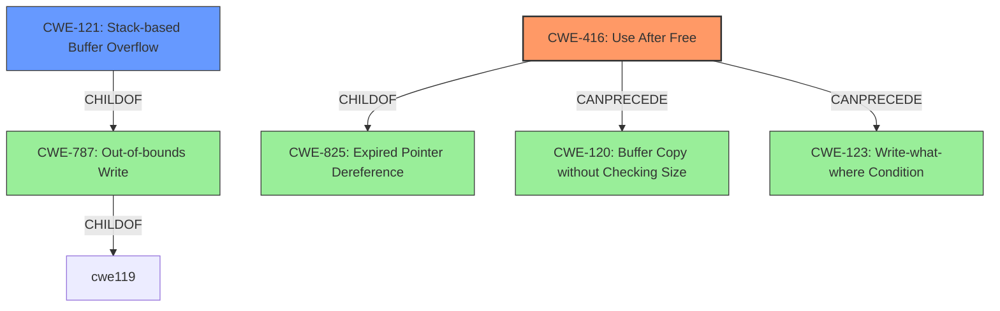

# Analysis Report for CVE-2022-41167

# Vulnerability Analysis Report: CVE-2022-41167

## Description


## Analysis (with Relationship Data)

# Summary
| CWE ID  | CWE Name | Confidence | CWE Abstraction Level | CWE Vulnerability Mapping Label | CWE-Vulnerability Mapping Notes |
|-----------------|------------------------------------------------------------------------------------------------------------------------------------|------------|-------------------------|------------------------------------|---------------------------------|
| CWE-416 | Use After Free | 0.7 | Variant | Primary | Allowed |
| CWE-121 | Stack-based Buffer Overflow | 0.6 | Variant | Secondary | Allowed |

## Evidence and Confidence

*   **Confidence Score:** 0.7
*   **Evidence Strength:** MEDIUM

## Relationship Analysis
The primary CWE is CWE-416, a **Variant** of CWE-825 (Expired Pointer Dereference). CWE-121 (Stack-based Buffer Overflow) is also considered due to the mention of stack-based overflow. CWE-416 can precede CWE-120 (Buffer Copy without Checking Size of Input ('Classic Buffer Overflow')) and CWE-123 (Write-what-where Condition). CWE-121 is a child of CWE-787 (Out-of-bounds Write), indicating a more specific type of out-of-bounds write. These relationships helped narrow down the selection to the most relevant and specific CWEs.



## Vulnerability Chain
The vulnerability chain begins with a **lack of proper memory management**. This leads to either a **stack-based overflow or a re-use of a dangling pointer**. The re-use of a dangling pointer is a Use-After-Free vulnerability. The stack-based overflow leads to an out-of-bounds write. The final impact is Remote Code Execution.

## Summary of Analysis
The vulnerability description indicates two potential weaknesses: a **stack-based overflow** and a **re-use of a dangling pointer**. The description states: "Due to **lack of proper memory management**, when a victim opens a manipulated AutoCAD (.dwg, TeighaTranslator.exe) file received from untrusted sources in SAP 3D Visual Enterprise Author - version 9, it is possible that a Remote Code Execution can be triggered when payload forces a **stack-based overflow or a re-use of dangling pointer** which refers to overwritten space in memory."

Based on this description, I've identified two CWEs:

*   **CWE-416: Use After Free:** This CWE is applicable because the vulnerability description explicitly mentions "re-use of dangling pointer," which is a direct indicator of a Use-After-Free condition. This occurs due to the **lack of proper memory management**. The confidence is 0.7 because the description is clear.
*   **CWE-121: Stack-based Buffer Overflow:** This CWE is applicable because the vulnerability description also mentions "stack-based overflow." This indicates that a buffer on the stack is being overwritten. The confidence is 0.6 because, while mentioned, the primary issue appears to be the use-after-free.

CWE-119 was considered as a general case of buffer issues, but the specific nature of the **stack-based overflow** and **dangling pointer** made CWE-121 and CWE-416 more appropriate. The retriever results listed CWE-190 (Integer Overflow), CWE-825 (Expired Pointer Dereference), and CWE-787 (Out-of-bounds Write), but those were less specific than CWE-416 and CWE-121.

Relevant CWE Information:

# Enhanced Context (25 CWEs)
The following CWEs were identified as potentially relevant to this vulnerability:

## CWE-131: Incorrect Calculation of Buffer Size
**Abstraction Level**: Base
**Similarity Score**: 0.77
**Source**: dense

**Description**:
The product does not correctly calculate the size to be used when allocating a buffer, which could lead to a buffer overflow.

**Mapping Guidance**:
- Usage: Allowed
- Rationale: This CWE entry is at the Base level of abstraction, which is a preferred level of abstraction for mapping to the root causes of vulnerabilities.

## CWE-191: Integer Underflow (Wrap or Wraparound)
**Abstraction Level**: Base
**Similarity Score**: 0.76
**Source**: dense

**Description**:
The product subtracts one value from another, such that the result is less than the minimum allowable integer value, which produces a value that is not equal to the correct result.

**Mapping Guidance**:
- Usage: Allowed
- Rationale: This CWE entry is at the Base level of abstraction, which is a preferred level of abstraction for mapping to the root causes of vulnerabilities.

## CWE-805: Buffer Access with Incorrect Length Value
**Abstraction Level**: Base
**Similarity Score**: 0.76
**Source**: dense

**Description**:
The product uses a sequential operation to read or write a buffer, but it uses an incorrect length value that causes it to access memory that is outside of the bounds of the buffer.

**Mapping Guidance**:
- Usage: Allowed
- Rationale: This CWE entry is at the Base level of abstraction, which is a preferred level of abstraction for mapping to the root causes of vulnerabilities.

## CWE-125: Out-of-bounds Read
**Abstraction Level**: Base
**Similarity Score**: 0.76
**Source**: dense

**Description**:
The product reads data past the end, or before the beginning, of the intended buffer.

**Mapping Guidance**:
- Usage: Allowed
- Rationale: This CWE entry is at the Base level of abstraction, which is a preferred level of abstraction for mapping to the root causes of vulnerabilities.

## CWE-126: Buffer Over-read
**Abstraction Level**: Variant
**Similarity Score**: 0.76
**Source**: dense

**Description**:
The product reads from a buffer using buffer access mechanisms such as indexes or pointers that reference memory locations after the targeted buffer.

**Mapping Guidance**:
- Usage: Allowed
- Rationale: This CWE entry is at the Variant level of abstraction, which is a preferred level of abstraction for mapping to the root causes of vulnerabilities.

## CWE-124: Buffer Underwrite ('Buffer Underflow')
**Abstraction Level**: Base
**Similarity Score**: 0.76
**Source**: dense

**Description**:
The product writes to a buffer using an index or pointer that references a memory location prior to the beginning of the buffer.

**Mapping Guidance**:
- Usage: Allowed
- Rationale: This CWE entry is at the Base level of abstraction, which is a preferred level of abstraction for mapping to the root causes of vulnerabilities.

## CWE-1289: Improper Validation of Unsafe Equivalence in Input
**Abstraction Level**: Base
**Similarity Score**: 0.76
**Source**: dense

**Description**:
The product receives an input value that is used as a resource identifier or other type of reference, but it does not validate or incorrectly validates that the input is equivalent to a potentially-unsafe value.

**Mapping Guidance**:
- Usage: Allowed
- Rationale: This CWE entry is at the Base level of abstraction, which is a preferred level of abstraction for mapping to the root causes of vulnerabilities.

## CWE-788: Access of Memory Location After End of Buffer
**Abstraction Level**: Base
**Similarity Score**: 0.75
**Source**: dense

**Description**:
The product reads or writes to a buffer using an index or pointer that references a memory location after the end of the buffer.

**Mapping Guidance**:
- Usage: Discouraged
- Rationale: The CWE entry might be misused when lower-level CWE entries might be available. It also overlaps existing CWE entries and might be deprecated in the future.

## CWE-127: Buffer Under-read
**Abstraction Level**: Variant
**Similarity Score**: 0.75
**Source**: dense

**Description**:
The product reads from a buffer using buffer access mechanisms such as indexes or pointers that reference memory locations prior to the targeted buffer.


## CWE Relationship Analysis

Current CWEs represent these abstraction levels: .


### Vulnerability Chain Analysis

**Chain starting from CWE-190:**
- 190 (Integer Overflow or Wraparound) - ROOT


**Chain starting from CWE-131:**
- 131 (Incorrect Calculation of Buffer Size) - ROOT


### CWE Relationship Diagram

```mermaid
graph TD
    classDef primary fill:#f96,stroke:#333,stroke-width:2px
    classDef secondary fill:#69f,stroke:#333
    classDef tertiary fill:#9e9,stroke:#333
```


*Report generated on 2025-03-31 07:53:55*
