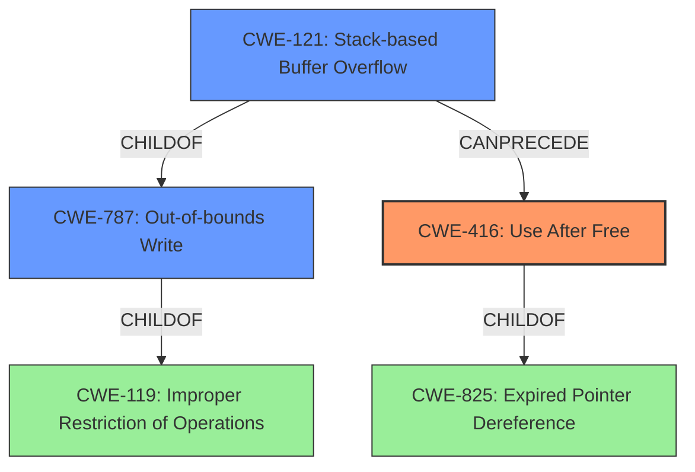

# Raw Analyzer Response for CVE-2022-41168

# Summary
| CWE ID | CWE Name | Confidence | CWE Abstraction Level | CWE Vulnerability Mapping Label | CWE-Vulnerability Mapping Notes |
|---|---|---|---|---|---|
| CWE-416 | Use After Free | 0.9 | Variant | Allowed | Primary CWE |
| CWE-787 | Out-of-bounds Write | 0.7 | Base | Allowed | Secondary CWE Candidate |
| CWE-121 | Stack-based Buffer Overflow | 0.6 | Variant | Allowed | Secondary CWE Candidate |

## Evidence and Confidence

*   **Confidence Score:** 0.8
*   **Evidence Strength:** HIGH

## Relationship Analysis
The primary CWE is CWE-416, representing a use-after-free vulnerability. CWE-416 is a variant of CWE-825 (Expired Pointer Dereference). The description also hints at a stack-based overflow, which would be represented by CWE-121, a variant of CWE-787 (Out-of-bounds Write). CWE-787 is also a child of CWE-119 (Improper Restriction of Operations within the Bounds of a Memory Buffer), a more general class of buffer errors. The use-after-free (CWE-416) can be triggered by a stack-based overflow (CWE-121/787).

## Vulnerability Chain
The vulnerability chain begins with a **lack of proper memory management**. This leads to either a **stack-based overflow** or a **re-use of a dangling pointer**. The stack-based overflow (CWE-121/787) can overwrite memory, potentially leading to the creation of a dangling pointer. If a dangling pointer is then dereferenced, it results in a use-after-free (CWE-416). Both scenarios lead to the **impact** of Remote Code Execution.

## Summary of Analysis
The initial analysis focused on the **lack of proper memory management** as the root cause, leading to either a **stack-based overflow or a re-use of a dangling pointer**.

The vulnerability description clearly states: "Due to **lack of proper memory management**, when a victim opens a manipulated CATIA5 Part (.catpart, CatiaTranslator.exe) file received from untrusted sources in SAP 3D Visual Enterprise Author - version 9, it is possible that a Remote Code Execution can be triggered when payload forces a **stack-based overflow or a re-use of dangling pointer** which refers to overwritten space in memory."

The Retriever Results suggested several potential CWEs, including Integer Overflow (CWE-190), Use After Free (CWE-416), and Stack-based Buffer Overflow (CWE-121). Given the explicit mention of "re-use of dangling pointer", CWE-416 (Use After Free) is the most appropriate primary CWE. The mention of "stack-based overflow" also makes CWE-121 (Stack-based Buffer Overflow) and its parent CWE-787 (Out-of-bounds Write) relevant secondary CWEs.

CWE-119 (Improper Restriction of Operations within the Bounds of a Memory Buffer) was considered but deemed too general, as more specific CWEs like CWE-416, CWE-121, and CWE-787 are available.

The selected CWEs are at the optimal level of specificity. CWE-416 is a Variant, and CWE-787 is a Base, aligning with the preference for lower-level CWEs when the evidence supports it.

Relevant CWE Information:

# Enhanced Context (25 CWEs)

## CWE-1325: Improperly Controlled Sequential Memory Allocation
**Abstraction Level**: Base
**Similarity Score**: 0.78
**Source**: dense

**Description**:
The product manages a group of objects or resources and performs a separate memory allocation for each object, but it does not properly limit the total amount of memory that is consumed by all of the combined objects.

**Mapping Guidance**:
- Usage: Allowed
- Rationale: This CWE entry is at the Base level of abstraction, which is a preferred level of abstraction for mapping to the root causes of vulnerabilities.

## CWE-789: Memory Allocation with Excessive Size Value
**Abstraction Level**: Variant
**Similarity Score**: 0.78
**Source**: dense

**Description**:
The product allocates memory based on an untrusted, large size value, but it does not ensure that the size is within expected limits, allowing arbitrary amounts of memory to be allocated.

**Mapping Guidance**:
- Usage: Allowed
- Rationale: This CWE entry is at the Variant level of abstraction, which is a preferred level of abstraction for mapping to the root causes of vulnerabilities.

## CWE-404: Improper Resource Shutdown or Release
**Abstraction Level**: Class
**Similarity Score**: 0.78
**Source**: dense

**Description**:
The product does not release or incorrectly releases a resource before it is made available for re-use.

**Mapping Guidance**:
- Usage: Allowed-with-Review
- Rationale: This CWE entry is a Class and might have Base-level children that would be more appropriate

## CWE-226: Sensitive Information in Resource Not Removed Before Reuse
**Abstraction Level**: Base
**Similarity Score**: 0.77
**Source**: dense

**Description**:
The product releases a resource such as memory or a file so that it can be made available for reuse, but it does not clear or "zeroize" the information contained in the resource before the product performs a critical state transition or makes the resource available for reuse by other entities.

**Mapping Guidance**:
- Usage: Allowed
- Rationale: This CWE entry is at the Base level of abstraction, which is a preferred level of abstraction for mapping to the root causes of vulnerabilities.

## CWE-131: Incorrect Calculation of Buffer Size
**Abstraction Level**: Base
**Similarity Score**: 0.76
**Source**: dense

**Description**:
The product does not correctly calculate the size to be used when allocating a buffer, which could lead to a buffer overflow.

**Mapping Guidance**:
- Usage: Allowed
- Rationale: This CWE entry is at the Base level of abstraction, which is a preferred level of abstraction for mapping to the root causes of vulnerabilities.

## CWE-667: Improper Locking
**Abstraction Level**: Class
**Similarity Score**: 0.76
**Source**: dense

**Description**:
The product does not properly acquire or release a lock on a resource, leading to unexpected resource state changes and behaviors.

**Mapping Guidance**:
- Usage: Allowed-with-Review
- Rationale: This CWE entry is a Class and might have Base-level children that would be more appropriate

## CWE-191: Integer Underflow (Wrap or Wraparound)
**Abstraction Level**: Base
**Similarity Score**: 0.76
**Source**: dense

**Description**:
The product subtracts one value from another, such that the result is less than the minimum allowable integer value, which produces a value that is not equal to the correct result.

**Mapping Guidance**:
- Usage: Allowed
- Rationale: This CWE entry is at the Base level of abstraction, which is a preferred level of abstraction for mapping to the root causes of vulnerabilities.

## CWE-1289: Improper Validation of Unsafe Equivalence in Input
**Abstraction Level**: Base
**Similarity Score**: 0.76
**Source**: dense

**Description**:
The product receives an input value that is used as a resource identifier or other type of reference, but it does not validate or incorrectly validates that the input is equivalent to a potentially-unsafe value.

**Mapping Guidance**:
- Usage: Allowed
- Rationale: This CWE entry is at the Base level of abstraction, which is a preferred level of abstraction for mapping to the root causes of vulnerabilities.

## CWE-125: Out-of-bounds Read
**Abstraction Level**: Base
**Similarity Score**: 0.76
**Source**: dense

**Description**:
The product reads data past the end, or before the beginning, of the intended buffer.

**Mapping Guidance**:
-