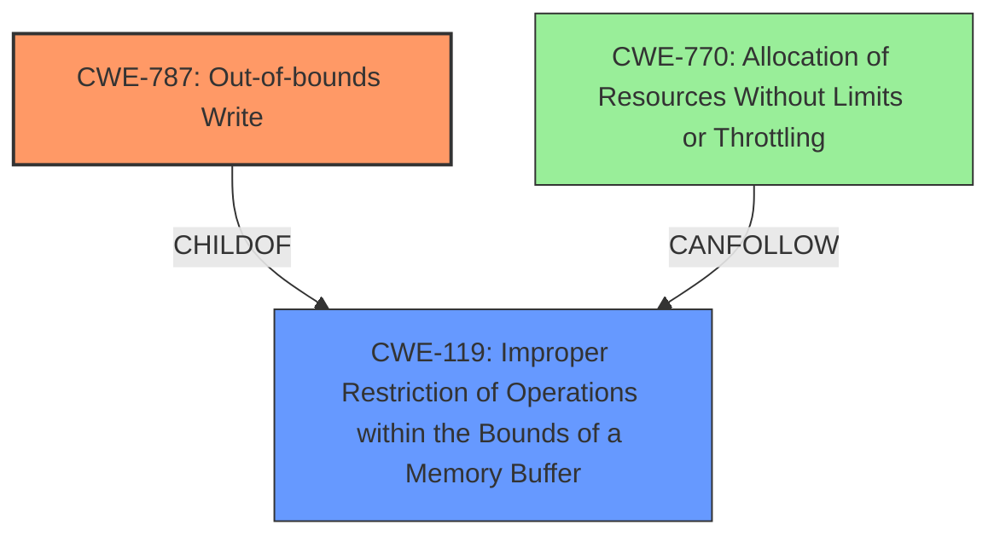

# Analysis for CVE-2022-41169

# Summary
| CWE ID | CWE Name | Confidence | CWE Abstraction Level | CWE Vulnerability Mapping Label | CWE-Vulnerability Mapping Notes |
|---|---|---|---|---|---|
| CWE-787 | Out-of-bounds Write | 0.75 | Base | Allowed | Primary CWE |
| CWE-119 | Improper Restriction of Operations within the Bounds of a Memory Buffer | 0.5 | Class | Discouraged | Secondary Candidate |
| CWE-770 | Allocation of Resources Without Limits or Throttling | 0.4 | Base | Allowed | Secondary Candidate |

## Evidence and Confidence

*   **Confidence Score:** 0.7
*   **Evidence Strength:** MEDIUM

## Relationship Analysis
The primary relationship influencing the CWE selection is the parent-child relationship between CWE-119 and CWE-787. While CWE-119 is a broader class, CWE-787 represents a more specific type of memory corruption. Additionally, the suggested alternative of CWE-787 from the mapping guidance of CWE-119 further supports this decision.

## Vulnerability Chain
The vulnerability chain starts with the **lack of proper memory management**, which leads to a potential out-of-bounds write when processing a manipulated CATIA5 Part file. The final impact is a crash of the application.
  - Root Cause: **Lack of Proper Memory Management**
  - Weakness: Potential Out-of-Bounds Write (CWE-787)
  - Impact: Application Crash

## Summary of Analysis
The initial assessment considered CWE-119 as the primary candidate due to its high ranking in the retriever results and its appearance as the primary CWE match for similar CVE descriptions. However, the description of the vulnerability points towards a more specific weakness: writing data outside the intended buffer. The phrase "**lack of proper memory management**" combined with the crash impact indicates memory corruption due to an out-of-bounds write.

CWE-787 (Out-of-bounds Write) is selected as the primary CWE because it accurately describes the root cause of the vulnerability. This decision is further supported by the mapping guidance for CWE-119, which suggests considering more specific children like CWE-787.
CWE-770 (Allocation of Resources Without Limits or Throttling) is considered as a secondary candidate due to the "**lack of proper memory management**" which can cause excessive memory allocation.

The final selection prioritizes the most specific and accurate representation of the vulnerability's root cause based on the available evidence.

Relevant CWE Information:

# Enhanced Context (25 CWEs)
The following CWEs were identified as potentially relevant to this vulnerability:

## CWE-131: Incorrect Calculation of Buffer Size
**Abstraction Level**: Base
**Similarity Score**: 0.78
**Source**: dense

**Description**:
The product does not correctly calculate the size to be used when allocating a buffer, which could lead to a buffer overflow.

**Mapping Guidance**:
- Usage: Allowed
- Rationale: This CWE entry is at the Base level of abstraction, which is a preferred level of abstraction for mapping to the root causes of vulnerabilities.

## CWE-787: Out-of-bounds Write
**Abstraction Level**: Base
**Similarity Score**: 4.33
**Source**: graph

**Description**:
CWE-787: Out-of-bounds Write

**Mapping Guidance**:
- Usage: Allowed
- Rationale: This CWE entry is at the Base level of abstraction, which is a preferred level of abstraction for mapping to the root causes of vulnerabilities.

**Relationships**:
- CANFOLLOW -> CWE-825
- CANFOLLOW -> CWE-824
- CANFOLLOW -> CWE-823
- CANFOLLOW -> CWE-822
- PARENTOF -> CWE-124

## CWE Technical Explanation for Selected CWEs:

### CWE-787: Out-of-bounds Write
*   **Match:** The vulnerability description indicates that the **lack of proper memory management** could lead to writing data outside the intended buffer when processing a manipulated file, aligning with CWE-787's description.
*   **Implication:** An out-of-bounds write can cause memory corruption, leading to unpredictable behavior, including application crashes, which is the described impact.
*   **Relationship:** CWE-787 is a child of CWE-119, providing a more specific classification.
*   **Guidance:** The Allowed usage and Base abstraction level align with best practices.

### CWE-119: Improper Restriction of Operations within the Bounds of a Memory Buffer
*   **Match:** The vulnerability involves memory operations outside the intended buffer, fitting the general description of CWE-119.
*   **Implication:** This can lead to read or write operations on unexpected memory locations, potentially causing a crash.
*   **Relationship:** CWE-119 is a parent of CWE-787.
*   **Guidance:** While CWE-119 is a Class, its mapping guidance suggests considering more specific children, such as CWE-787.

### CWE-770: Allocation of Resources Without Limits or Throttling
*   **Match:** The "**lack of proper memory management**" could cause unlimited memory allocation, fitting the description of CWE-770.
*   **Implication:** Excessive memory allocation can lead to denial of service, or an application crash due to exhaustion of resources.
*   **Relationship:** CWE-770 is related to CWE-789 (Memory Allocation with Excessive Size Value)
*   **Guidance:** The Allowed usage and Base abstraction level align with best practices.

### Other CWEs Considered:
*   CWE-20, CWE-1284, CWE-789: These CWEs relate to input validation and memory allocation with excessive size value. However, the vulnerability description primarily focuses on the consequences of the "**lack of proper memory management**" after the input is processed, rather than the input validation itself.
*   CWE-125, CWE-825: These CWEs focus on out-of-bounds reads and expired pointer dereferences, respectively, which are not explicitly mentioned in the vulnerability description.