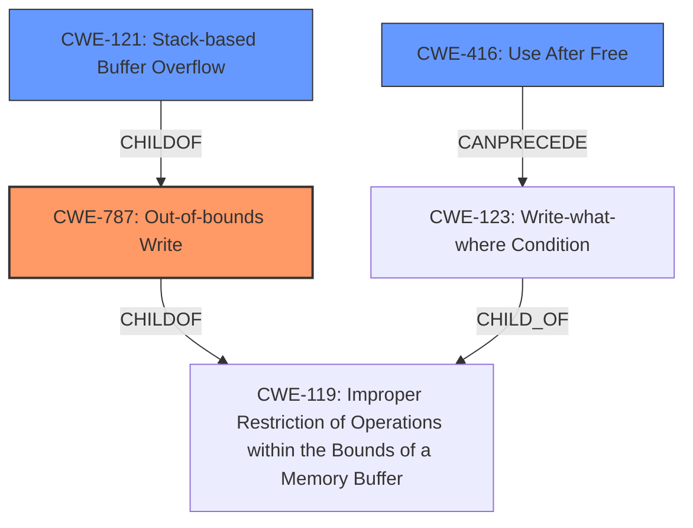

# Analysis Report for CVE-2022-41172

# Vulnerability Analysis Report: CVE-2022-41172

## Description


## Analysis (with Relationship Data)

# Summary

| CWE ID    | CWE Name                                                                        | Confidence | CWE Abstraction Level | CWE Vulnerability Mapping Label | CWE-Vulnerability Mapping Notes |
| :-------- | :------------------------------------------------------------------------------ | :--------- | :---------------------- | :------------------------------ | :------------------------------ |
| CWE-787   | Out-of-bounds Write                                                             | 0.9        | Base                    | Primary                         | Allowed                       |
| CWE-416   | Use After Free                                                                  | 0.8        | Variant                 | Secondary                       | Allowed                       |
| CWE-121   | Stack-based Buffer Overflow                                                     | 0.7        | Variant                 | Secondary                       | Allowed                       |

## Evidence and Confidence

*   **Confidence Score:** 0.9
*   **Evidence Strength:** HIGH

## Relationship Analysis

The primary weakness is identified as CWE-787 (Out-of-bounds Write), which aligns with the **stack-based overflow** mentioned in the vulnerability description. CWE-416 (Use After Free) is a secondary consideration due to the mention of a **re-use of dangling pointer**. The relationship between CWE-787 and its parent CWE-119 (Improper Restriction of Operations within the Bounds of a Memory Buffer) helps to generalize the out-of-bounds write condition. Similarly, CWE-121 (Stack-based Buffer Overflow) is related to CWE-787, providing a more specific context.



## Vulnerability Chain

The vulnerability chain starts with the **lack of proper memory management**, leading to either a **stack-based overflow** (CWE-787, CWE-121) or a **re-use of a dangling pointer** (CWE-416), ultimately resulting in Remote Code Execution.

## Summary of Analysis

The analysis is primarily based on the vulnerability description, which highlights the **lack of proper memory management** as a root cause. The mention of a **stack-based overflow** and **re-use of a dangling pointer** strongly suggests CWE-787 (Out-of-bounds Write) and CWE-416 (Use After Free) respectively. The relationships between these CWEs and CWE-119 provide context and help in generalizing the weakness.

The selected CWEs are at the optimal level of specificity. CWE-787 accurately describes the out-of-bounds write condition. CWE-416 captures the issue of reusing freed memory. CWE-121 specifies that the overflow occurs on the stack. These mappings are supported by the evidence and the CWE specifications.

Relevant CWE Information:

# Enhanced Context (25 CWEs)

## CWE-131: Incorrect Calculation of Buffer Size
**Abstraction Level**: Base
**Similarity Score**: 0.77
**Source**: dense

**Description**:
The product does not correctly calculate the size to be used when allocating a buffer, which could lead to a buffer overflow.

**Mapping Guidance**:
- Usage: Allowed
- Rationale: This CWE entry is at the Base level of abstraction, which is a preferred level of abstraction for mapping to the root causes of vulnerabilities.

*Not Selected:* Although related to buffer overflows, it's less directly relevant than CWE-787 since the description doesn't specifically mention incorrect calculation of buffer size, only a lack of proper memory management leading to stack based overflow.

## CWE-125: Out-of-bounds Read
**Abstraction Level**: Base
**Similarity Score**: 0.76
**Source**: dense

**Description**:
The product reads data past the end, or before the beginning, of the intended buffer.

**Mapping Guidance**:
- Usage: Allowed
- Rationale: This CWE entry is at the Base level of abstraction, which is a preferred level of abstraction for mapping to the root causes of vulnerabilities.

*Not Selected:* The vulnerability description focuses on writing past the end of a buffer (overflow) or reusing dangling pointers rather than reading out of bounds.

## CWE-805: Buffer Access with Incorrect Length Value
**Abstraction Level**: Base
**Similarity Score**: 0.76
**Source**: dense

**Description**:
The product uses a sequential operation to read or write a buffer, but it uses an incorrect length value that causes it to access memory that is outside of the bounds of the buffer.

**Mapping Guidance**:
- Usage: Allowed
- Rationale: This CWE entry is at the Base level of abstraction, which is a preferred level of abstraction for mapping to the root causes of vulnerabilities.

*Not Selected:* Similar to CWE-131, the description is more general about **lack of proper memory management**, the description does not explicitly mention incorrect length value.

## CWE-191: Integer Underflow (Wrap or Wraparound)
**Abstraction Level**: Base
**Similarity Score**: 0.76
**Source**: dense

**Description**:
The product subtracts one value from another, such that the result is less than the minimum allowable integer value, which produces a value that is not equal to the correct result.

**Mapping Guidance**:
- Usage: Allowed
- Rationale: This CWE entry is at the Base level of abstraction, which is a preferred level of abstraction for mapping to the root causes of vulnerabilities.

*Not Selected:* Integer underflow is not directly mentioned or implied in the vulnerability description.

## CWE-126: Buffer Over-read
**Abstraction Level**: Variant
**Similarity Score**: 0.76
**Source**: dense

**Description**:
The product reads from a buffer using buffer access mechanisms such as indexes or pointers that reference memory locations after the targeted buffer.

**Mapping Guidance**:
- Usage: Allowed
- Rationale: This CWE entry is at the Variant level of abstraction, which is a preferred level of abstraction for mapping to the root causes of vulnerabilities.

*Not Selected:* This CWE focuses on reading past the end of the buffer which is not the primary issue described.

## CWE-124: Buffer Underwrite ('Buffer Underflow')
**Abstraction Level**: Base
**Similarity Score**: 0.76
**Source**: dense

**Description**:
The product writes to a buffer using an index or pointer that references a memory location prior to the beginning of the buffer.

**Mapping Guidance**:
- Usage: Allowed
- Rationale: This CWE entry is at the Base level of abstraction, which is a preferred level of abstraction for mapping to the root causes of vulnerabilities.

*Not Selected:* The vulnerability description points towards writing past the end of a buffer (overflow), not before the beginning (underflow).

## CWE-1289: Improper Validation of Unsafe Equivalence in Input
**Abstraction Level**: Base
**Similarity Score**: 0.76
**Source**: dense

**Description**:
The product receives an input value that is used as a resource identifier or other type of reference, but it does not validate or incorrectly validates that the input is equivalent to a potentially-unsafe value.

**Mapping Guidance**:
- Usage: Allowed
- Rationale: This CWE entry is at the Base level of abstraction, which is a preferred level of abstraction for mapping to the root causes of vulnerabilities.

*Not Selected:* This CWE is not directly related to the memory management issues described in the vulnerability.

## CWE-788: Access of Memory Location After End of Buffer
**Abstraction Level**: Base
**Similarity Score**: 0.75
**Source**: dense

**Description**:
The product reads or writes to a buffer using an index or pointer that references a memory location after the end of the buffer.

**Mapping Guidance**:
- Usage: Discouraged
- Rationale: The CWE entry might be misused when lower-level CWE entries might be available. It also overlaps existing CWE entries and might be deprecated in the future.

*Not Selected:* While relevant, CWE-787 (Out-of-bounds Write) is a more appropriate and specific choice.

## CWE-127: Buffer Under-read
**Abstraction Level**: Variant
**Similarity Score**: 0.75
**Source**: dense

**Description**:
The product reads from a buffer using buffer access mechanisms such as indexes or pointers that reference memory locations prior to the targeted buffer.

**Mapping Guidance**:
- Usage: Allowed
- Rationale: This CWE entry is at the Variant level of abstraction


## CWE Relationship Analysis

Current CWEs represent these abstraction levels: .


### Vulnerability Chain Analysis

**Chain starting from CWE-131:**
- 131 (Incorrect Calculation of Buffer Size) - ROOT


**Chain starting from CWE-788:**
- 788 (Access of Memory Location After End of Buffer) - ROOT


### CWE Relationship Diagram

```mermaid
graph TD
    classDef primary fill:#f96,stroke:#333,stroke-width:2px
    classDef secondary fill:#69f,stroke:#333
    classDef tertiary fill:#9e9,stroke:#333
```


*Report generated on 2025-03-31 10:29:33*
