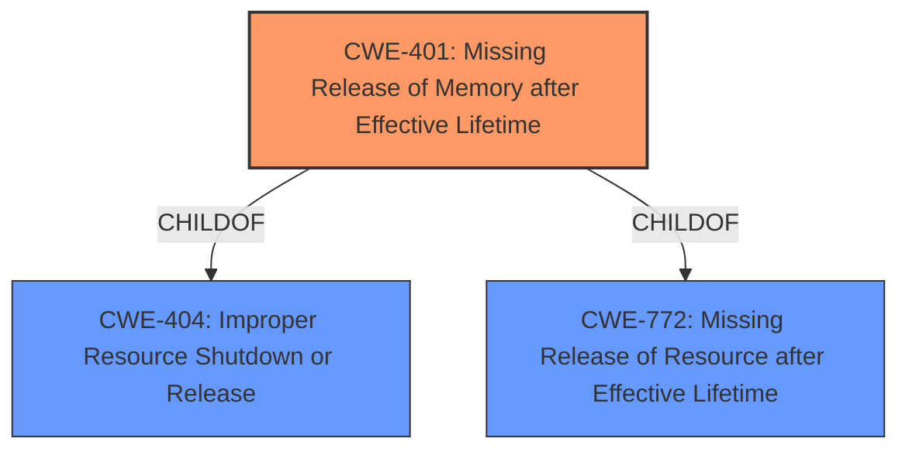

# Enhanced Analysis for CVE-2022-41174

# Summary
| CWE ID | CWE Name | Confidence | CWE Abstraction Level | CWE Vulnerability Mapping Label | CWE-Vulnerability Mapping Notes |
|---|---|---|---|---|---|
| CWE-401 | Missing Release of Memory after Effective Lifetime | 0.75 | Variant | Allowed | Primary CWE |

## Evidence and Confidence

*   **Confidence Score:** 0.75
*   **Evidence Strength:** MEDIUM

## Relationship Analysis
The primary relationship that influenced my decision was the child-of relationship between CWE-401 and CWE-404 (Improper Resource Shutdown or Release) and CWE-772 (Missing Release of Resource after Effective Lifetime). CWE-401 is a variant of these more general classes, indicating that the memory resource is not released after its intended use.



## Vulnerability Chain
The vulnerability chain starts with a **lack of proper memory management**, leading to a missing release of memory, which ultimately causes the application to crash.

## Summary of Analysis
The initial assessment, based on the description of a "**lack of proper memory management**" leading to a crash, points towards issues with resource handling.

The vulnerability description states: "Due to **lack of proper memory management**, when a victim opens manipulated Right Hemisphere Material (.rhm, rh.x3d) file received from untrusted sources in SAP 3D Visual Enterprise Author - version 9, it is possible for the application to crash".

Given the description and the retriever results, CWE-401 (Missing Release of Memory after Effective Lifetime) is the most appropriate. The description explicitly mentions a **lack of proper memory management**, and the crash is consistent with the consequences of a memory leak.

CWE-119 (Improper Restriction of Operations within the Bounds of a Memory Buffer) and CWE-787 (Out-of-bounds Write) were considered but deemed less appropriate because the description doesn't explicitly mention buffer overflows or out-of-bounds writes. While these could be related, the primary issue appears to be a failure to release memory, which aligns directly with CWE-401.

CWE-789 (Memory Allocation with Excessive Size Value) was also considered, but the provided description does not specify that the memory allocation size is untrusted.

The final selection of CWE-401 is based on the direct evidence of a **lack of proper memory management** leading to a crash, which aligns well with the description of a missing memory release. The decision is further supported by the MITRE mapping guidance, which allows CWE-401 and designates it as a Variant level, which is a preferred level.


## CWE Relationship Analysis

Current CWEs represent these abstraction levels: .


### Vulnerability Chain Analysis

**Chain starting from CWE-401:**
- 401 (Missing Release of Memory after Effective Lifetime) - ROOT


**Chain starting from CWE-119:**
- 119 (Improper Restriction of Operations within the Bounds of a Memory Buffer) - ROOT


### CWE Relationship Diagram

```mermaid
graph TD
    classDef primary fill:#f96,stroke:#333,stroke-width:2px
    classDef secondary fill:#69f,stroke:#333
    classDef tertiary fill:#9e9,stroke:#333
```