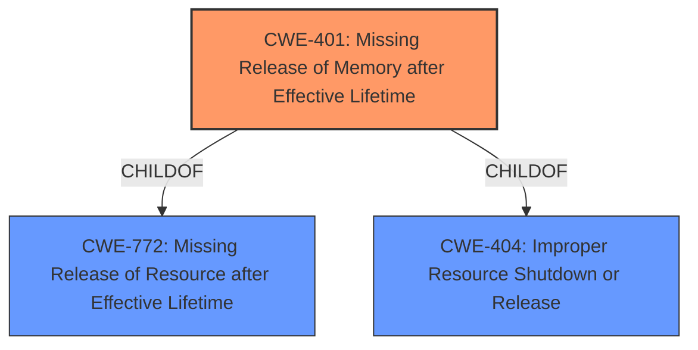

# Analysis for CVE-2022-41176

# Summary
| CWE ID | CWE Name | Confidence | CWE Abstraction Level | CWE Vulnerability Mapping Label | CWE-Vulnerability Mapping Notes |
|---|---|---|---|---|---|
| CWE-401 | Missing Release of Memory after Effective Lifetime | 0.8 | Variant | Allowed | Primary CWE |

## Evidence and Confidence

*   **Confidence Score:** 0.8
*   **Evidence Strength:** MEDIUM

## Relationship Analysis
The primary relationship influencing the choice of CWE-401 is its position as a variant of CWE-772 (Missing Release of Resource after Effective Lifetime) and CWE-404 (Improper Resource Shutdown or Release). The description focuses on **lack of proper memory management** which indicates a failure to release allocated memory.

## Vulnerability Chain
The vulnerability chain consists of the **lack of proper memory management**, leading to a crash when a manipulated file is opened, resulting in temporary unavailability of the application. The root cause is the missing release of memory, and the impact is a crash and denial of service.

## Summary of Analysis
The initial assessment focused on the **lack of proper memory management**, which strongly suggests a failure to release allocated memory. The provided description supports the classification of CWE-401 (Missing Release of Memory after Effective Lifetime).

The selection of CWE-401 is based on the following evidence:
*   The **Vulnerability Description Key Phrases** includes the **weakness** as "**lack of proper memory management**".
*   The vulnerability results in a crash and temporary unavailability of the application, which aligns with the potential impacts of CWE-401.

The graph relationships show that CWE-401 is a variant of CWE-772 and CWE-404. The retriever results also listed CWE-401 as a candidate. CWE-401 is the most specific and appropriate CWE given the available information, indicating a memory leak situation.

Other CWEs Considered but Not Used:

*   CWE-119 (Improper Restriction of Operations within the Bounds of a Memory Buffer) and CWE-787 (Out-of-bounds Write): These CWEs were considered but deemed less appropriate as the description does not explicitly mention buffer overflows or out-of-bounds writes, but rather a general **lack of proper memory management**.
*   CWE-789 (Memory Allocation with Excessive Size Value) and CWE-1284 (Improper Validation of Specified Quantity in Input): While related to memory management, these CWEs focus on excessive memory allocation due to untrusted size values, which is not explicitly mentioned in the vulnerability description.
*   CWE-825 (Expired Pointer Dereference): This CWE was also considered but the description doesn't suggest the use of expired pointers, but rather the **lack of proper memory management**.
*   CWE-20 (Improper Input Validation): Although the vulnerability involves a manipulated file, the core issue is the **lack of proper memory management** rather than input validation.