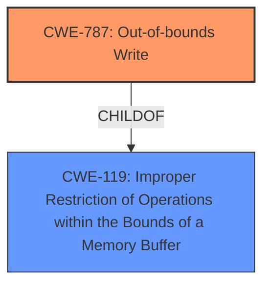

# Analysis Report for CVE-2022-41182

# Vulnerability Analysis Report: CVE-2022-41182

## Description


## Analysis (with Relationship Data)

# Summary
| CWE ID | CWE Name | Confidence | CWE Abstraction Level | CWE Vulnerability Mapping Label | CWE-Vulnerability Mapping Notes |
|---|---|---|---|---|---|
| CWE-787 | Out-of-bounds Write | 0.75 | Base | Allowed | Primary CWE |
| CWE-119 | Improper Restriction of Operations within the Bounds of a Memory Buffer | 0.5 | Class | Discouraged | Secondary Candidate |

## Evidence and Confidence

*   **Confidence Score:** 0.7
*   **Evidence Strength:** MEDIUM

## Relationship Analysis
The primary relationship influencing the CWE selection is the ChildOf relationship between CWE-787 and CWE-119, where CWE-787 is a more specific case of the more general CWE-119. The vulnerability involves writing data beyond the intended buffer, which aligns with CWE-787. While CWE-119 is a broader category, CWE-787 is a base-level CWE that provides a more precise characterization of the flaw.



## Vulnerability Chain
The vulnerability chain begins with a **lack of proper memory management**, leading to a condition where a manipulated Parasolid Part and Assembly file can cause an out-of-bounds write when opened in SAP 3D Visual Enterprise Author. This out-of-bounds write results in a crash and temporary unavailability of the application.

## Summary of Analysis
Initially, the description points to a **lack of proper memory management** which could be interpreted in several ways. The primary clue is the resulting crash from a manipulated file. The analysis focused on identifying the most specific CWE that describes the root cause of the crash.

The vulnerability description indicates a **lack of proper memory management** leading to a crash, which suggests a memory corruption issue. The provided information points towards a buffer overflow scenario when processing a manipulated file. The key phrase from the description is "**lack of proper memory management**" which can lead to memory corruption when a manipulated file is opened, causing a crash.

The retriever results suggested CWE-119 (Improper Restriction of Operations within the Bounds of a Memory Buffer) as the top candidate. However, CWE-119 is a class-level CWE and is discouraged for use when more specific CWEs are available. The retriever results also listed CWE-787 (Out-of-bounds Write), which is a base-level CWE and a child of CWE-119. Given that the vulnerability involves writing data beyond the intended buffer, CWE-787 is a more accurate and specific classification.

Based on the evidence and the relationship analysis, CWE-787 is selected as the primary CWE. CWE-119 is considered a secondary candidate due to its broader nature. The selection of CWE-787 is at the optimal level of specificity, as it accurately reflects the root cause of the vulnerability based on the provided evidence.

Relevant CWE Information:

# Enhanced Context (25 CWEs)

## CWE-131: Incorrect Calculation of Buffer Size
**Abstraction Level**: Base
The product does not correctly calculate the size to be used when allocating a buffer, which could lead to a buffer overflow. The vulnerability description only mentions "**lack of proper memory management**" and a crash and the evidence is insufficient to indicate whether the buffer size calculation is incorrect.

## CWE-789: Memory Allocation with Excessive Size Value
**Abstraction Level**: Variant
The product allocates memory based on an untrusted, large size value, but it does not ensure that the size is within expected limits, allowing arbitrary amounts of memory to be allocated. The vulnerability description doesn't specify that the memory allocation is based on an untrusted size value.

## CWE-125: Out-of-bounds Read
**Abstraction Level**: Base
The product reads data past the end, or before the beginning, of the intended buffer. The vulnerability description only mentions "**lack of proper memory management**" and a crash and the evidence is insufficient to indicate whether the buffer is read out-of-bounds.

## CWE-1289: Improper Validation of Unsafe Equivalence in Input
**Abstraction Level**: Base
The product receives an input value that is used as a resource identifier or other type of reference, but it does not validate or incorrectly validates that the input is equivalent to a potentially-unsafe value. The vulnerability description does not indicate that input validation is the issue.

## CWE-404: Improper Resource Shutdown or Release
**Abstraction Level**: Class
The product does not release or incorrectly releases a resource before it is made available for re-use. The vulnerability description doesn't specify an improper resource shutdown.

## CWE-226: Sensitive Information in Resource Not Removed Before Reuse
**Abstraction Level**: Base
The product releases a resource such as memory or a file so that it can be made available for reuse, but it does not clear or "zeroize" the information contained in the resource before the product performs a critical state transition or makes the resource available for reuse by other entities. The vulnerability description doesn't specify that sensitive information is in the memory.

## CWE-667: Improper Locking
**Abstraction Level**: Class
The product does not properly acquire or release a lock on a resource, leading to unexpected resource state changes and behaviors. The vulnerability description doesn't specify an improper locking issue.

## CWE-681: Incorrect Conversion between Numeric Types
**Abstraction Level**: Base
When converting from one data type to another, such as long to integer, data can be omitted or translated in a way that produces unexpected values. If the resulting values are used in a sensitive context, then dangerous behaviors may occur. The vulnerability description doesn't specify an incorrect conversion.

## CWE-119: Improper Restriction of Operations within the Bounds of a Memory Buffer
**Abstraction Level**: Class
The product performs operations on a memory buffer, but it reads from or writes to a memory location outside the buffer's intended boundary. While this CWE is related, CWE-787 is more specific.

## CWE-805: Buffer Access with Incorrect Length Value
**Abstraction Level**: Base
The product uses a sequential operation to read or write a buffer, but it uses an incorrect length value that causes it to access memory that is outside of the bounds of the buffer. The vulnerability description only mentions "**lack of proper memory management**" and a crash and the evidence is insufficient to indicate whether the buffer access uses an incorrect length value.

## CWE-190: Integer Overflow or Wraparound
**Abstraction Level**: Base
The product performs a calculation that can produce an integer overflow or wraparound when the logic assumes that the resulting value will always be larger than the original value. The vulnerability description only mentions "**lack of proper memory management**" and a crash and the evidence is insufficient to indicate an integer overflow.

## CWE-1284: Improper Validation of Specified Quantity in Input
**Abstraction Level**: Base
The product receives input that is expected to specify a quantity (such as size or length), but it does not validate or incorrectly validates that the quantity has the required properties. The vulnerability description does not indicate that the quantity is validated or not.

## CWE-41: Improper Resolution of Path Equivalence
**Abstraction Level**: base
The vulnerability description does not indicate a path equivalence issue.

## CWE-825: Expired Pointer Dereference
**Abstraction Level**: base
The vulnerability description doesn't specify an expired pointer.

## CWE-22: Improper Limitation of a Pathname to a Restricted Directory ('Path Traversal')
**Abstraction Level**: base
The vulnerability description does not indicate a path traversal issue.

## CWE-770: Allocation of Resources Without Limits or Throttling
**Abstraction Level**: base
The vulnerability description only mentions "**lack of proper memory management**" and a crash and the evidence is insufficient to indicate whether resources are allocated without limits or throttling.

## CWE-73: External Control of File Name or Path
**Abstraction Level**: base
The vulnerability description does not indicate external control of a file name or path.

## CWE-476: NULL Pointer Dereference
**Abstraction Level**: base
The vulnerability description doesn't specify a null pointer dereference.

## CWE-170: Improper Null Termination
**Abstraction Level**: base
The vulnerability description doesn't specify an improper null termination.


## CWE Relationship Analysis

Current CWEs represent these abstraction levels: .


### Vulnerability Chain Analysis

**Chain starting from CWE-41:**
- 41 (Improper Resolution of Path Equivalence) - ROOT


**Chain starting from CWE-119:**
- 119 (Improper Restriction of Operations within the Bounds of a Memory Buffer) - ROOT


### CWE Relationship Diagram

```mermaid
graph TD
    classDef primary fill:#f96,stroke:#333,stroke-width:2px
    classDef secondary fill:#69f,stroke:#333
    classDef tertiary fill:#9e9,stroke:#333
```


*Report generated on 2025-03-31 04:11:54*
