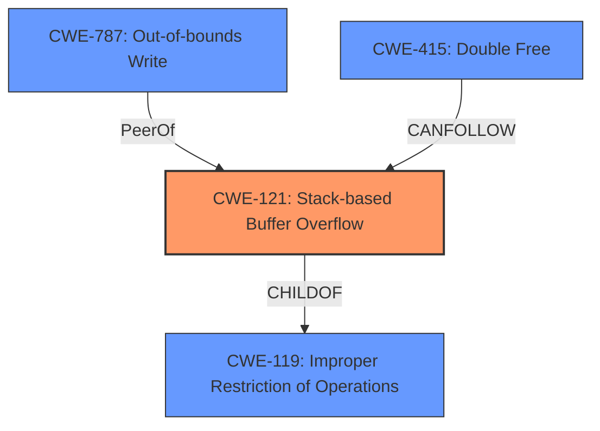

# Analysis Report for CVE-2022-41185

# Vulnerability Analysis Report: CVE-2022-41185

## Description


## Analysis (with Relationship Data)

# Summary
| CWE ID    | CWE Name                                                                      | Confidence | CWE Abstraction Level | CWE Vulnerability Mapping Label | CWE-Vulnerability Mapping Notes |
| --------- | ----------------------------------------------------------------------------- | ---------- | --------------------- | ------------------------------- | ------------------------------- |
| CWE-121   | Stack-based Buffer Overflow                                                     | 0.9        | Variant               | Primary                         | Allowed                         |
| CWE-415   | Double Free                                                                   | 0.8        | Base                  | Secondary                       | Allowed                         |
| CWE-787   | Out-of-bounds Write                                                           | 0.7        | Base                  | Secondary                       | Allowed                         |
| CWE-119   | Improper Restriction of Operations within the Bounds of a Memory Buffer      | 0.6        | Class                 | Secondary                       | Discouraged                     |

## Evidence and Confidence

*   **Confidence Score:** 0.8
*   **Evidence Strength:** HIGH

## Relationship Analysis
The primary weakness is a stack-based buffer overflow (CWE-121), a variant of the more general buffer overflow class (CWE-119). The vulnerability description also mentions the potential for a re-use of a dangling pointer, which can lead to a double-free condition (CWE-415). Out-of-bounds write (CWE-787) is also a possible outcome of a buffer overflow.



## Vulnerability Chain
The chain of events starts with **lack of proper memory management**, leading to either a **stack-based buffer overflow** or a **use-after-free** condition. The buffer overflow can then lead to an **out-of-bounds write**. Both the buffer overflow and the use-after-free condition can lead to **remote code execution**.

## Summary of Analysis
The primary vulnerability is a stack-based buffer overflow (CWE-121). The vulnerability description explicitly mentions the possibility of a stack-based overflow. The description also suggests a potential use-after-free condition, leading to a double-free (CWE-415). Finally, an out-of-bounds write (CWE-787) may occur as a result of the overflow.

The evidence supporting this classification is found in the vulnerability description: "Due to **lack of proper memory management**, when a victim opens a manipulated Visual Design Stream (.vds, MataiPersistence.dll) file received from untrusted sources in SAP 3D Visual Enterprise Author - version 9, it is possible that a Remote Code Execution can be triggered when payload forces a **stack-based overflow** or a **re-use of dangling pointer** which refers to overwritten space in memory."

CWE-119 is also a possibility but the description is more descriptive of CWE-121 and so CWE-119 is not as good a fit.

Relevant CWE Information:
# Enhanced Context (25 CWEs)
The following CWEs were identified as potentially relevant to this vulnerability:

## CWE-668: Exposure of Resource to Wrong Sphere
**Abstraction Level**: Class
**Similarity Score**: 0.74
**Source**: dense

**Description**:
The product exposes a resource to the wrong control sphere, providing unintended actors with inappropriate access to the resource.

**Mapping Guidance**:
- Usage: Discouraged
- Rationale: CWE-668 is high-level and is often misused as a catch-all when lower-level CWE IDs might be applicable. It is sometimes used for low-information vulnerability reports [REF-1287]. It is a level-1 Class (i.e., a child of a Pillar). It is not useful for trend analysis.

*CWE-668 was not selected because the vulnerability is related to memory management and buffer overflows, not resource exposure.*

## CWE-657: Violation of Secure Design Principles
**Abstraction Level**: Class
**Similarity Score**: 0.74
**Source**: dense

**Description**:
The product violates well-established principles for secure design.

**Mapping Guidance**:
- Usage: Discouraged
- Rationale: This CWE entry is a level-1 Class (i.e., a child of a Pillar). It might have lower-level children that would be more appropriate

*CWE-657 was not selected because it is too general. A more specific CWE related to memory management is more appropriate.*

## CWE-824: Access of Uninitialized Pointer
**Abstraction Level**: Base
**Similarity Score**: 0.74
**Source**: dense

**Description**:
The product accesses or uses a pointer that has not been initialized.

**Mapping Guidance**:
- Usage: Allowed
- Rationale: This CWE entry is at the Base level of abstraction, which is a preferred level of abstraction for mapping to the root causes of vulnerabilities.

*CWE-824 was not selected. Although the description mentions a dangling pointer, leading to a use-after-free, the primary issue appears to be the stack-based overflow.*

## CWE-497: Exposure of Sensitive System Information to an Unauthorized Control Sphere
**Abstraction Level**: Base
**Similarity Score**: 0.73
**Source**: dense

**Description**:
The product does not properly prevent sensitive system-level information from being accessed by unauthorized actors who do not have the same level of access to the underlying system as the product does.

**Mapping Guidance**:
- Usage: Allowed
- Rationale: This CWE entry is at the Base level of abstraction, which is a preferred level of abstraction for mapping to the root causes of vulnerabilities.

*CWE-497 was not selected because the vulnerability is not about information exposure.*

## CWE-74: Improper Neutralization of Special Elements in Output Used by a Downstream Component ('Injection')
**Abstraction Level**: Class
**Similarity Score**: 0.72
**Source**: dense

**Description**:
The product constructs all or part of a command, data structure, or record using externally-influenced input from an upstream component, but it does not neutralize or incorrectly neutralizes special elements that could modify how it is parsed or interpreted when it is sent to a downstream component.

**Mapping Guidance**:
- Usage: Discouraged
- Rationale: CWE-74 is high-level and often misused when lower-level weaknesses are more appropriate.

*CWE-74 was not selected as this vulnerability is not related to injection.*

## CWE-131: Incorrect Calculation of Buffer Size
**Abstraction Level**: Base
**Similarity Score**: 0.72
**Source**: dense

**Description**:
The product does not correctly calculate the size to be used when allocating a buffer, which could lead to a buffer overflow.

**Mapping Guidance**:
- Usage: Allowed
- Rationale: This CWE entry is at the Base level of abstraction, which is a preferred level of abstraction for mapping to the root causes of vulnerabilities.

*CWE-131 was not selected because the vulnerability description doesn't explicitly state that the buffer size calculation is incorrect. Instead, the description refers to a general "**lack of proper memory management**".*

## CWE-129: Improper Validation of Array Index
**Abstraction Level**: Variant
**Similarity Score**: 0.72
**Source**: dense

**Description**:
The product uses untrusted input when calculating or using an array index, but the product does not validate or incorrectly validates the index to ensure the index references a valid position within the array.

**Mapping Guidance**:
- Usage: Allowed
- Rationale: This CWE entry is at the Variant level of abstraction, which is a preferred level of abstraction for mapping to the root causes of vulnerabilities.

*CWE-129 was not selected because it is related to array index validation, which is not mentioned in the vulnerability description.*

## CWE-788: Access of Memory Location After End of Buffer
**Abstraction Level**: Base
**Similarity Score**: 0.72
**Source**: dense

**Description**:
The product reads or writes to a buffer using an index or pointer that references a memory location after the end of the buffer.

**Mapping Guidance**:
- Usage: Discouraged
- Rationale: The CWE entry might be misused when lower-level CWE entries might be available. It also overlaps existing CWE entries and might be deprecated in the future.

*CWE-788 was not selected because it is a more specific case of


## CWE Relationship Analysis

Current CWEs represent these abstraction levels: .


### Vulnerability Chain Analysis

**Chain starting from CWE-131:**
- 131 (Incorrect Calculation of Buffer Size) - ROOT


**Chain starting from CWE-668:**
- 668 (Exposure of Resource to Wrong Sphere) - ROOT


### CWE Relationship Diagram

```mermaid
graph TD
    classDef primary fill:#f96,stroke:#333,stroke-width:2px
    classDef secondary fill:#69f,stroke:#333
    classDef tertiary fill:#9e9,stroke:#333
```


*Report generated on 2025-03-30 13:54:52*
