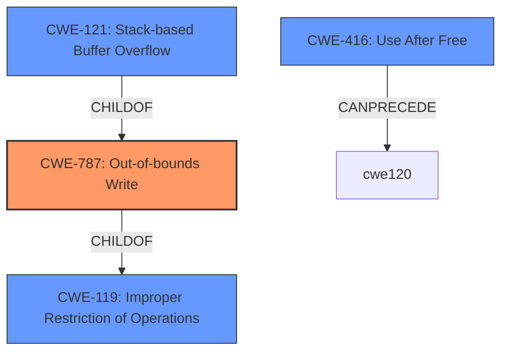

# Analysis Report for CVE-2022-41187

# Vulnerability Analysis Report: CVE-2022-41187

## Description


## Analysis (with Relationship Data)

# Summary
| CWE ID | CWE Name | Confidence | CWE Abstraction Level | CWE Vulnerability Mapping Label | CWE-Vulnerability Mapping Notes |
|---|---|---|---|---|---|
| CWE-787 | Out-of-bounds Write | 0.8 | Base | Allowed | Primary CWE |
| CWE-416 | Use After Free | 0.7 | Variant | Allowed | Secondary Candidate |
| CWE-121 | Stack-based Buffer Overflow | 0.7 | Variant | Allowed | Secondary Candidate |

## Evidence and Confidence

*   **Confidence Score:** 0.8
*   **Evidence Strength:** MEDIUM

## Relationship Analysis
The primary CWE is CWE-787 which is a base class of CWE-119. CWE-121 is a variant of CWE-787. CWE-416 can be related to the vulnerability via a dangling pointer.



## Vulnerability Chain
The vulnerability chain involves a **lack of proper memory management** leading to a **stack-based overflow** (out-of-bounds write on the stack) or a **re-use of a dangling pointer** (use-after-free).

## Summary of Analysis
The initial analysis points to a memory corruption issue due to a **lack of proper memory management**. The description mentions a **stack-based overflow** or a **re-use of dangling pointer**.

The evidence from the "Vulnerability Description Key Phrases" supports the selection of either stack-based buffer overflow or use-after-free.

The "CWE for similar CVE Descriptions" section suggests CWE-119. However, CWE-119 is a class-level CWE and the description contains more specific information.

The Retriever Results suggests:
- CWE-190 Integer Overflow or Wraparound, Abstraction: Base, Usage: Allowed
- CWE-416 Use After Free, Abstraction: Variant, Usage: Allowed
- CWE-825 Expired Pointer Dereference, Abstraction: Base, Usage: Allowed
- CWE-121 Stack-based Buffer Overflow, Abstraction: Variant, Usage: Allowed
- CWE-119 Improper Restriction of Operations within the Bounds of a Memory Buffer, Abstraction: Class, Usage: Discouraged
- CWE-787 Out-of-bounds Write, Abstraction: Base, Usage: Allowed

Considering the provided information, the following CWEs are selected:

- CWE-787 Out-of-bounds Write: This is the primary CWE because the stack-based buffer overflow explicitly involves writing beyond the intended buffer boundaries. The "**stack-based overflow**" condition directly implies that data is being written outside the allocated buffer on the stack.
- CWE-416 Use After Free: This is a secondary CWE because the description mentions "a **re-use of dangling pointer** which refers to overwritten space in memory." This aligns with the definition of Use After Free, where memory is accessed after it has been freed.
- CWE-121 Stack-based Buffer Overflow: This is a more specific variant of CWE-787, indicating the location of the out-of-bounds write is on the stack. It's included as a secondary candidate since the primary issue is the out-of-bounds write itself.

CWE-119 is not selected because it is a Class-level CWE and the description provides sufficient information to map to more specific Base/Variant CWEs.

CWE-190 and CWE-825 are not selected because there is no evidence in the description to support them.

The selected CWEs are at the optimal level of specificity because they accurately represent the specific weakness described in the vulnerability.

Relevant CWE Information:

# Enhanced Context (25 CWEs)
The following CWEs were identified as potentially relevant to this vulnerability:

## CWE-131: Incorrect Calculation of Buffer Size
**Abstraction Level**: Base
**Similarity Score**: 0.77
**Source**: dense

**Description**:
The product does not correctly calculate the size to be used when allocating a buffer, which could lead to a buffer overflow.

**Mapping Guidance**:
- Usage: Allowed
- Rationale: This CWE entry is at the Base level of abstraction, which is a preferred level of abstraction for mapping to the root causes of vulnerabilities.

## CWE-191: Integer Underflow (Wrap or Wraparound)
**Abstraction Level**: Base
**Similarity Score**: 0.77
**Source**: dense

**Description**:
The product subtracts one value from another, such that the result is less than the minimum allowable integer value, which produces a value that is not equal to the correct result.

**Mapping Guidance**:
- Usage: Allowed
- Rationale: This CWE entry is at the Base level of abstraction, which is a preferred level of abstraction for mapping to the root causes of vulnerabilities.

## CWE-125: Out-of-bounds Read
**Abstraction Level**: Base
**Similarity Score**: 0.77
**Source**: dense

**Description**:
The product reads data past the end, or before the beginning, of the intended buffer.

**Mapping Guidance**:
- Usage: Allowed
- Rationale: This CWE entry is at the Base level of abstraction, which is a preferred level of abstraction for mapping to the root causes of vulnerabilities.

## CWE-805: Buffer Access with Incorrect Length Value
**Abstraction Level**: Base
**Similarity Score**: 0.77
**Source**: dense

**Description**:
The product uses a sequential operation to read or write a buffer, but it uses an incorrect length value that causes it to access memory that is outside of the bounds of the buffer.

**Mapping Guidance**:
- Usage: Allowed
- Rationale: This CWE entry is at the Base level of abstraction, which is a preferred level of abstraction for mapping to the root causes of vulnerabilities.

## CWE-126: Buffer Over-read
**Abstraction Level**: Variant
**Similarity Score**: 0.77
**Source**: dense

**Description**:
The product reads from a buffer using buffer access mechanisms such as indexes or pointers that reference memory locations after the targeted buffer.

**Mapping Guidance**:
- Usage: Allowed
- Rationale: This CWE entry is at the Variant level of abstraction, which is a preferred level of abstraction for mapping to the root causes of vulnerabilities.

## CWE-124: Buffer Underwrite ('Buffer Underflow')
**Abstraction Level**: Base
**Similarity Score**: 0.76
**Source**: dense

**Description**:
The product writes to a buffer using an index or pointer that references a memory location prior to the beginning of the buffer.

**Mapping Guidance**:
- Usage: Allowed
- Rationale: This CWE entry is at the Base level of abstraction, which is a preferred level of abstraction for mapping to the root causes of vulnerabilities.

## CWE-788: Access of Memory Location After End of Buffer
**Abstraction Level**: Base
**Similarity Score**: 0.76
**Source**: dense

**Description**:
The product reads or writes to a buffer using an index or pointer that references a memory location after the end of the buffer.

**Mapping Guidance**:
- Usage: Discouraged
- Rationale: The CWE entry might be misused when lower-level CWE entries might be available. It also overlaps existing CWE entries and might be deprecated in the future.

## CWE-681: Incorrect Conversion between Numeric Types
**Abstraction Level**: Base
**Similarity Score**: 0.76
**Source**: dense

**Description**:
When converting from one data type to another, such as long to integer, data can be omitted or translated in a way that produces unexpected values. If the resulting values are used in a sensitive context, then dangerous behaviors may occur.

**Mapping Guidance**:
- Usage: Allowed
- Rationale: This CWE entry is at the Base level of abstraction, which is a preferred level of abstraction for mapping to the root causes of vulnerabilities.

## CWE-197: Numeric Truncation Error
**Abstraction Level**: Base
**Similarity Score**: 0.76
**Source**: dense

**Description**:
Truncation errors occur when a primitive is cast to a primitive of a smaller size and data is lost in the conversion.

**Mapping Guidance**:
- Usage: Allowed
- Rationale: This CWE entry is at the Base level of abstraction, which is a preferred level of abstraction for mapping to the root causes of vulnerabilities.


## CWE Relationship Analysis

Current CWEs represent these abstraction levels: .


### Vulnerability Chain Analysis

**Chain starting from CWE-190:**
- 190 (Integer Overflow or Wraparound) - ROOT


**Chain starting from CWE-131:**
- 131 (Incorrect Calculation of Buffer Size) - ROOT


### CWE Relationship Diagram

```mermaid
graph TD
    classDef primary fill:#f96,stroke:#333,stroke-width:2px
    classDef secondary fill:#69f,stroke:#333
    classDef tertiary fill:#9e9,stroke:#333
```


*Report generated on 2025-03-31 05:05:01*
