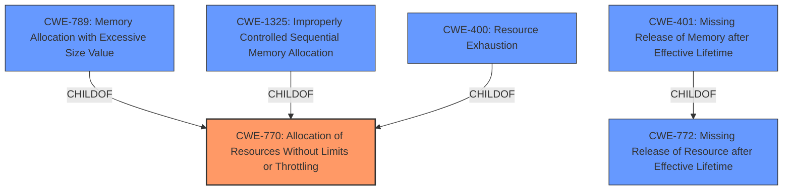

# Enhanced Analysis for CVE-2022-41188

# Summary
| CWE ID    | CWE Name                                                                                                                                                              | Confidence | CWE Abstraction Level | CWE Vulnerability Mapping Label | CWE-Vulnerability Mapping Notes |
| :-------- | :-------------------------------------------------------------------------------------------------------------------------------------------------------------------- | :--------- | :---------------------- | :------------------------------ | :------------------------------ |
| CWE-770     | Allocation of Resources Without Limits or Throttling                                                                                                                | 0.75       | Base                    | Allowed                       | Primary CWE                     |
| CWE-401     | Missing Release of Memory after Effective Lifetime                                                                                                                  | 0.60       | Variant                 | Allowed                       | Secondary Candidate             |
| CWE-789     | Memory Allocation with Excessive Size Value                                                                                                                           | 0.60       | Variant                 | Allowed                       | Secondary Candidate             |

## Evidence and Confidence

*   **Confidence Score:** 0.70
*   **Evidence Strength:** MEDIUM

## Relationship Analysis
The primary CWE selected is CWE-770, Allocation of Resources Without Limits or Throttling, which has child CWEs like CWE-789 (Memory Allocation with Excessive Size Value) and CWE-1325 (Improperly Controlled Sequential Memory Allocation). CWE-400 (Resource Exhaustion) is a child of CWE-770, representing a potential impact. CWE-772 (Missing Release of Resource after Effective Lifetime) is related and has child CWE-401 (Missing Release of Memory after Effective Lifetime).



## Vulnerability Chain
The vulnerability chain starts with a **lack of proper memory management** (CWE-770), potentially leading to resource exhaustion (CWE-400), memory leaks (CWE-401) or allocation of memory with excessive size (CWE-789), ultimately causing the application to crash.

## Summary of Analysis
The analysis is primarily based on the vulnerability description indicating a **lack of proper memory management**.

The key phrase from the Vulnerability Description is: "Due to **lack of proper memory management**, when a victim opens manipulated Wavefront Object (.obj, ObjTranslator.exe) file received from untrusted sources in SAP 3D Visual Enterprise Viewer - version 9, it is possible for the application to crash and becomes temporarily unavailable to the user until restart of the application."

The initial assessment considered CWE-119 (Improper Restriction of Operations within the Bounds of a Memory Buffer) and its variants like CWE-787 (Out-of-bounds Write). However, the root cause is more related to resource management than buffer overflows. The retriever results also pointed to CWE-789 (Memory Allocation with Excessive Size Value) and CWE-401 (Missing Release of Memory after Effective Lifetime), which are related to resource management.

CWE-770 (Allocation of Resources Without Limits or Throttling) is selected as the primary CWE because the vulnerability involves a **lack of proper memory management** when handling manipulated files, potentially leading to resource exhaustion and application crash. CWE-770 captures the essence of allocating resources without proper limits, which aligns with the described weakness. CWE-401 and CWE-789 are secondary candidates because they describe more specific memory management issues that could contribute to the crash.

The selected CWEs are at the appropriate level of specificity, with CWE-770 being a Base CWE and CWE-401, CWE-789 are Variant CWEs.

Relevant CWE Information:

# Enhanced Context (25 CWEs)
The following CWEs were identified as potentially relevant to this vulnerability:

## CWE-789: Memory Allocation with Excessive Size Value
**Abstraction Level**: Variant
**Similarity Score**: 0.78
**Source**: dense

**Description**:
The product allocates memory based on an untrusted, large size value, but it does not ensure that the size is within expected limits, allowing arbitrary amounts of memory to be allocated.

**Mapping Guidance**:
- Usage: Allowed
- Rationale: This CWE entry is at the Variant level of abstraction, which is a preferred level of abstraction for mapping to the root causes of vulnerabilities.

**Why CWE-789 was considered:** The vulnerability description indicates that manipulated files cause the application to crash, suggesting excessive memory allocation as a potential contributing factor.

## CWE-131: Incorrect Calculation of Buffer Size
**Abstraction Level**: Base
**Similarity Score**: 0.77
**Source**: dense

**Description**:
The product does not correctly calculate the size to be used when allocating a buffer, which could lead to a buffer overflow.

**Mapping Guidance**:
- Usage: Allowed
- Rationale: This CWE entry is at the Base level of abstraction, which is a preferred level of abstraction for mapping to the root causes of vulnerabilities.

**Why CWE-131 was NOT selected:** While buffer overflows can occur, the root cause is more related to overall memory management than incorrect buffer size calculations.

## CWE-226: Sensitive Information in Resource Not Removed Before Reuse
**Abstraction Level**: Base
**Similarity Score**: 0.77
**Source**: dense

**Description**:
The product releases a resource such as memory or a file so that it can be made available for reuse, but it does not clear or "zeroize" the information contained in the resource before the product performs a critical state transition or makes the resource available for reuse by other entities.

**Mapping Guidance**:
- Usage: Allowed
- Rationale: This CWE entry is at the Base level of abstraction, which is a preferred level of abstraction for mapping to the root causes of vulnerabilities.

**Why CWE-226 was NOT selected:** This CWE is specific to sensitive information, which is not mentioned in the vulnerability description.

## CWE-1325: Improperly Controlled Sequential Memory Allocation
**Abstraction Level**: Base
**Similarity Score**: 0.76
**Source**: dense

**Description**:
The product manages a group of objects or resources and performs a separate memory allocation for each object, but it does not properly limit the total amount of memory that is consumed by all of the combined objects.

**Mapping Guidance**:
- Usage: Allowed
- Rationale: This CWE entry is at the Base level of abstraction, which is a preferred level of abstraction for mapping to the root causes of vulnerabilities.

**Why CWE-1325 was considered:** This could be a more specific variant of CWE-770, but the evidence is insufficient to determine if sequential memory allocation is the primary issue.

## CWE-404: Improper Resource Shutdown or Release
**Abstraction Level**: Class
**Similarity Score**: 0.76
**Source**: dense

**Description**:
The product does not release or incorrectly releases a resource before it is made available for re-use.

**Mapping Guidance**:
- Usage: Allowed-with-Review
- Rationale: This CWE entry is a Class and might have Base-level children that would be more appropriate

**Why CWE-404 was NOT selected:** CWE-404 is a class-level CWE. CWE-401 is more specific.

## CWE-125: Out-of-bounds Read
**Abstraction Level**: Base
**Similarity Score**: 0.76
**Source**: dense

**Description**:
The product reads data past the end, or before the beginning, of the intended buffer.

**Mapping Guidance**:
- Usage: Allowed
- Rationale: This CWE entry is at the Base level of abstraction, which is a preferred level of abstraction for mapping to the root causes of vulnerabilities.

**Why CWE-125 was NOT selected:** The description focuses on memory management and crashes, not out-of-bounds reads.

## CWE-805: Buffer Access with Incorrect Length Value
**Abstraction Level**: Base
**Similarity Score**: 0.75
**Source**: dense

**Description**:
The product uses a sequential operation to read or write a buffer, but it uses an incorrect length value that causes it to access memory that is outside of the bounds of the buffer.

**Mapping


## CWE Relationship Analysis

Current CWEs represent these abstraction levels: .


### Vulnerability Chain Analysis

**Chain starting from CWE-131:**
- 131 (Incorrect Calculation of Buffer Size) - ROOT


**Chain starting from CWE-1325:**
- 1325 (Improperly Controlled Sequential Memory Allocation) - ROOT


### CWE Relationship Diagram

```mermaid
graph TD
    classDef primary fill:#f96,stroke:#333,stroke-width:2px
    classDef secondary fill:#69f,stroke:#333
    classDef tertiary fill:#9e9,stroke:#333
```