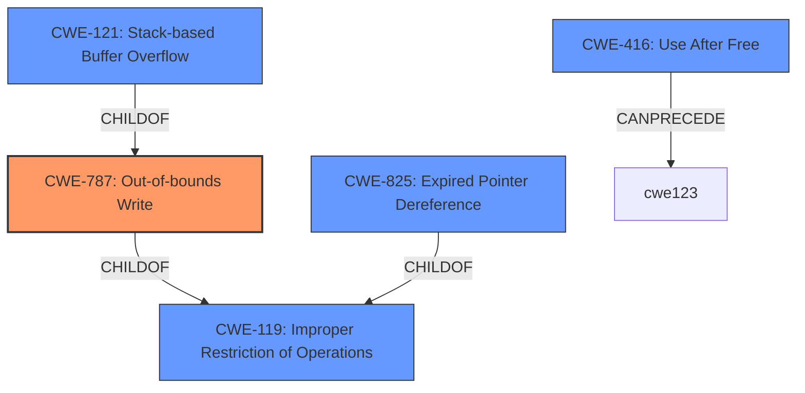

# Analysis for CVE-2022-41189

# Summary
| CWE ID    | CWE Name                                                                                                                                    | Confidence | CWE Abstraction Level | CWE Vulnerability Mapping Label | CWE-Vulnerability Mapping Notes |
| --------- | ------------------------------------------------------------------------------------------------------------------------------------------- | ---------- | ----------------------- | ------------------------------- | --------------------------------- |
| CWE-787   | Out-of-bounds Write                                                                                                                         | 0.8        | Base                    | Allowed                         | Primary CWE                       |
| CWE-416   | Use After Free                                                                                                                              | 0.7        | Variant                 | Allowed                         | Secondary Candidate               |
| CWE-121   | Stack-based Buffer Overflow                                                                                                                 | 0.6        | Variant                 | Allowed                         | Secondary Candidate               |
| CWE-825   | Expired Pointer Dereference                                                                                                                 | 0.6        | Base                    | Allowed                         | Secondary Candidate               |

## Evidence and Confidence

*   **Confidence Score:** 0.7
*   **Evidence Strength:** MEDIUM

## Relationship Analysis
The primary weakness is an out-of-bounds write (CWE-787), stemming from a **lack of proper memory management**. The vulnerability description mentions both a **stack-based overflow** and a **re-use of a dangling pointer**, indicating potential memory corruption issues. The relationships between CWE-787 and other CWEs, such as its parent CWE-119 (Improper Restriction of Operations within the Bounds of a Memory Buffer) and related weaknesses like CWE-416 (Use After Free) and CWE-121 (Stack-based Buffer Overflow), help clarify the specific type of memory corruption involved.

## Vulnerability Chain
The vulnerability chain starts with a **lack of proper memory management**, leading to a manipulated AutoCAD file triggering either a **stack-based overflow** (CWE-121), a **re-use of a dangling pointer** (CWE-416), or ultimately an **out-of-bounds write** (CWE-787) that results in remote code execution.

## Summary of Analysis
Initially, CWE-119 (Improper Restriction of Operations within the Bounds of a Memory Buffer) was considered due to the **stack-based overflow** mentioned in the vulnerability description. However, CWE-119 is a Class-level CWE and the guidance discourages its use when more specific CWEs are available. The description mentions a "**stack-based overflow or a re-use of dangling pointer**," suggesting memory corruption due to "**lack of proper memory management**". The most accurate base CWE to describe this issue is CWE-787 (Out-of-bounds Write). This is further supported by the vulnerability description which states that a "Remote Code Execution can be triggered when payload forces a **stack-based overflow or a re-use of dangling pointer** which refers to overwritten space in memory."

CWE-416 (Use After Free) is included as a secondary candidate since the description explicitly mentions "re-use of dangling pointer". CWE-121 (Stack-based Buffer Overflow) is included as a secondary candidate since the description explicity mentions "**stack-based overflow**". CWE-825 (Expired Pointer Dereference) is included as a secondary candidate because it is the parent of CWE-416, and deals with pointers to memory that is no longer valid.

The final selection is based on the provided evidence, prioritizing the most specific CWE that describes the root cause of the vulnerability. The relationships between the selected CWEs helped refine the understanding of the vulnerability and ensured that the most appropriate level of specificity was chosen.

Relevant CWE Information:

# Enhanced Context (25 CWEs)
The following CWEs were identified as potentially relevant to this vulnerability:

## CWE-131: Incorrect Calculation of Buffer Size
**Abstraction Level**: Base
**Similarity Score**: 0.77

**Description**:
The product does not correctly calculate the size to be used when allocating a buffer, which could lead to a buffer overflow.

**Mapping Guidance**:
- Usage: Allowed
- Rationale: This CWE entry is at the Base level of abstraction, which is a preferred level of abstraction for mapping to the root causes of vulnerabilities.

## CWE-191: Integer Underflow (Wrap or Wraparound)
**Abstraction Level**: Base
**Similarity Score**: 0.76

**Description**:
The product subtracts one value from another, such that the result is less than the minimum allowable integer value, which produces a value that is not equal to the correct result.

**Mapping Guidance**:
- Usage: Allowed
- Rationale: This CWE entry is at the Base level of abstraction, which is a preferred level of abstraction for mapping to the root causes of vulnerabilities.

## CWE-805: Buffer Access with Incorrect Length Value
**Abstraction Level**: Base
**Similarity Score**: 0.76

**Description**:
The product uses a sequential operation to read or write a buffer, but it uses an incorrect length value that causes it to access memory that is outside of the bounds of the buffer.

**Mapping Guidance**:
- Usage: Allowed
- Rationale: This CWE entry is at the Base level of abstraction, which is a preferred level of abstraction for mapping to the root causes of vulnerabilities.

## CWE-125: Out-of-bounds Read
**Abstraction Level**: Base
**Similarity Score**: 0.76

**Description**:
The product reads data past the end, or before the beginning, of the intended buffer.

**Mapping Guidance**:
- Usage: Allowed
- Rationale: This CWE entry is at the Base level of abstraction, which is a preferred level of abstraction for mapping to the root causes of vulnerabilities.

## CWE-124: Buffer Underwrite ('Buffer Underflow')
**Abstraction Level**: Base
**Similarity Score**: 0.76

**Description**:
The product writes to a buffer using an index or pointer that references a memory location prior to the beginning of the buffer.

**Mapping Guidance**:
- Usage: Allowed
- Rationale: This CWE entry is at the Base level of abstraction, which is a preferred level of abstraction for mapping to the root causes of vulnerabilities.

## CWE-126: Buffer Over-read
**Abstraction Level**: Variant
**Similarity Score**: 0.76

**Description**:
The product reads from a buffer using buffer access mechanisms such as indexes or pointers that reference memory locations after the targeted buffer.

**Mapping Guidance**:
- Usage: Allowed
- Rationale: This CWE entry is at the Variant level of abstraction, which is a preferred level of abstraction for mapping to the root causes of vulnerabilities.

## CWE-1289: Improper Validation of Unsafe Equivalence in Input
**Abstraction Level**: Base
**Similarity Score**: 0.76

**Description**:
The product receives an input value that is used as a resource identifier or other type of reference, but it does not validate or incorrectly validates that the input is equivalent to a potentially-unsafe value.

**Mapping Guidance**:
- Usage: Allowed
- Rationale: This CWE entry is at the Base level of abstraction, which is a preferred level of abstraction for mapping to the root causes of vulnerabilities.

## CWE-127: Buffer Under-read
**Abstraction Level**: Variant
**Similarity Score**: 0.75

**Description**:
The product reads from a buffer using buffer access mechanisms such as indexes or pointers that reference memory locations prior to the targeted buffer.

**Mapping Guidance**:
- Usage: Allowed
- Rationale: This CWE entry is at the Variant level of abstraction, which is a preferred level of abstraction for mapping to the root causes of vulnerabilities.

## CWE-788: Access of Memory Location After End of Buffer
**Abstraction Level**: Base
**Similarity Score**: 0.75

**Description**:
The product reads or writes to a buffer using an index or pointer that references a memory location after the end of the buffer.

**Mapping Guidance**:
- Usage: Discouraged
- Rationale: The CWE entry might be misused when lower-level CWE entries might be available. It also overlaps existing CWE entries and might be deprecated in the future.

## CWE-606: Un