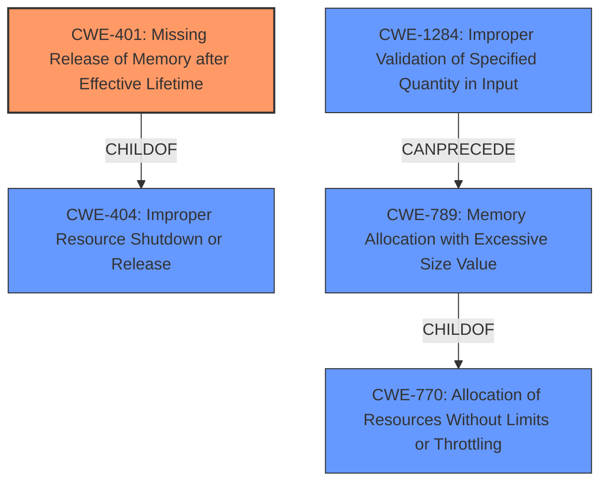

# Analysis Report for CVE-2022-41192

# Vulnerability Analysis Report: CVE-2022-41192

## Description


## Analysis (with Relationship Data)

# Summary
| CWE ID | CWE Name | Confidence | CWE Abstraction Level | CWE Vulnerability Mapping Label | CWE-Vulnerability Mapping Notes |
|---|---|---|---|---|---|
| CWE-401 | Missing Release of Memory after Effective Lifetime | 0.8 | Variant | Allowed | Primary CWE |
| CWE-770 | Allocation of Resources Without Limits or Throttling | 0.6 | Base | Allowed | Secondary Candidate |
| CWE-789 | Memory Allocation with Excessive Size Value | 0.6 | Variant | Allowed | Secondary Candidate |
| CWE-1284 | Improper Validation of Specified Quantity in Input | 0.5 | Base | Allowed | Secondary Candidate |

## Evidence and Confidence

*   **Confidence Score:** 0.8
*   **Evidence Strength:** MEDIUM

## Relationship Analysis
The primary CWE selected is CWE-401, which focuses on the failure to release memory after its effective lifetime, aligning directly with the **lack of proper memory management** described in the vulnerability.

CWE-401 is related to CWE-404 (Improper Resource Shutdown or Release) as its parent. CWE-770 (Allocation of Resources Without Limits or Throttling) can lead to excessive memory allocation. CWE-789 (Memory Allocation with Excessive Size Value) is a variant of CWE-770. CWE-1284 (Improper Validation of Specified Quantity in Input) can precede CWE-789 if input size isn't validated.



## Vulnerability Chain
The vulnerability chain begins with **lack of proper memory management**, leading to missing memory release (CWE-401). If the application allocates resources without limits (CWE-770) or with an excessive size value (CWE-789), this can exacerbate the memory management problem, eventually resulting in a crash.

## Summary of Analysis
The initial assessment identified several potential CWEs based on the description of a **lack of proper memory management** leading to a crash. The primary focus was on CWE-401 (Missing Release of Memory after Effective Lifetime) because it directly reflects the **root cause** as stated in the "Vulnerability Description Key Phrases".

The analysis considered other CWEs such as CWE-770 (Allocation of Resources Without Limits or Throttling), CWE-789 (Memory Allocation with Excessive Size Value), and CWE-1284 (Improper Validation of Specified Quantity in Input) as secondary candidates due to their relevance to memory management issues.

The final decision emphasizes CWE-401 as the primary weakness because the vulnerability description specifically mentions **lack of proper memory management** that causes the application to crash. This aligns closely with the description of CWE-401, which involves the failure to release allocated memory, leading to resource exhaustion and potential application failure. The supporting evidence from the "Vulnerability Description Key Phrases" section explicitly states the **root cause** as **lack of proper memory management**, reinforcing this choice.

Relevant CWE Information:

# Enhanced Context (25 CWEs)

## CWE-226: Sensitive Information in Resource Not Removed Before Reuse
**Abstraction Level**: Base
**Similarity Score**: 0.78
Not Selected: Irrelevant, as the vulnerability does not discuss sensitive information.

## CWE-789: Memory Allocation with Excessive Size Value
**Abstraction Level**: Variant
**Similarity Score**: 0.77
**Source**: dense
Not Selected as Primary: While memory allocation is likely part of the vulnerability, the primary issue is the **lack of proper memory management**, specifically the failure to release memory. Selected as a secondary candidate because the manipulated .jt file could cause the allocation of excessive memory.

## CWE-404: Improper Resource Shutdown or Release
**Abstraction Level**: Class
**Similarity Score**: 0.77
Not Selected: Although related to memory management, it is more general than CWE-401.

## CWE-1325: Improperly Controlled Sequential Memory Allocation
**Abstraction Level**: Base
**Similarity Score**: 0.76
Not Selected: The vulnerability description does not mention sequential memory allocation.

## CWE-131: Incorrect Calculation of Buffer Size
**Abstraction Level**: Base
**Similarity Score**: 0.75
Not Selected: There's no evidence of incorrect buffer size calculation.

## CWE-667: Improper Locking
**Abstraction Level**: Class
**Similarity Score**: 0.75
Not Selected: Locking is not mentioned in the description.

## CWE-909: Missing Initialization of Resource
**Abstraction Level**: Class
**Similarity Score**: 0.75
Not Selected: Resource initialization is not mentioned.

## CWE-125: Out-of-bounds Read
**Abstraction Level**: Base
**Similarity Score**: 0.75
Not Selected: Out-of-bounds read is not mentioned in the description.

## CWE-665: Improper Initialization
**Abstraction Level**: Class
**Similarity Score**: 0.75
Not Selected: Initialization is not mentioned.

## CWE-252: Unchecked Return Value
**Abstraction Level**: Base
**Similarity Score**: 0.74
Not Selected: Return value checking is not mentioned.

## CWE-190: Integer Overflow or Wraparound
**Abstraction Level**: Base
**Similarity Score**: 6473.51
Not Selected: Integer overflows are not mentioned.

## CWE-1284: Improper Validation of Specified Quantity in Input
**Abstraction Level**: Base
**Similarity Score**: 6463.29
**Source**: sparse
Not Selected as Primary: While input validation could be a contributing factor, the main issue is the failure to release memory. Selected as a secondary candidate because the manipulated .jt file could contain a quantity that is not validated.

## CWE-125: Out-of-bounds Read
**Abstraction Level**: Base
**Similarity Score**: 6425.34
Not Selected: Not mentioned in the description.

## CWE-119: Improper Restriction of Operations within the Bounds of a Memory Buffer
**Abstraction Level**: Class
**Similarity Score**: 6386.30
Not Selected: This is a general class, and more specific CWEs are more appropriate.

## CWE-789: Memory Allocation with Excessive Size Value
**Abstraction Level**: Variant
**Similarity Score**: 6275.76
**Source**: sparse
Not Selected as Primary: See rationale above. Selected as a secondary candidate because the manipulated .jt file could cause the allocation of excessive memory.

## CWE-41: Improper Resolution of Path Equivalence
**Abstraction Level**: base
**Similarity Score**: 5.03
Not Selected: Path equivalence is not relevant to this vulnerability.

## CWE-787: Out-of-bounds Write
**Abstraction Level**: base
**Similarity Score**: 4.33
Not Selected: Not mentioned in the description.

## CWE-825: Expired Pointer Dereference
**Abstraction Level**: base
**Similarity Score**: 4.33
Not Selected: Pointer dereferencing is not mentioned.

## CWE-190: Integer Overflow or Wraparound
**Abstraction Level**: base
**Similarity Score**: 4.33
Not Selected: Integer overflows are not mentioned.

## CWE-22: Improper Limitation of a Pathname to a Restricted Directory ('Path Traversal')
**Abstraction Level**: base
**Similarity Score**: 4.33
Not Selected: Path traversal is not relevant to this vulnerability.

## CWE-770: Allocation of Resources Without Limits or Throttling
**Abstraction Level**: base
**Similarity Score**: 4.33
**Source**: graph
Not Selected as Primary: While resource allocation is part of the process, the core issue is the **lack of proper memory management**, specifically not releasing the memory. Selected as a secondary candidate as excessive allocation can exacerbate the issue.

## CWE-73: External Control of File Name or Path
**Abstraction Level**: base
**Similarity Score**: 4.33
Not Selected: File name or path control is not relevant to this vulnerability.

## CWE-1284: Improper Validation of Specified Quantity in Input
**Abstraction Level**: base
**Similarity Score**: 4.33
Not


## CWE Relationship Analysis

Current CWEs represent these abstraction levels: .


### Vulnerability Chain Analysis

**Chain starting from CWE-41:**
- 41 (Improper Resolution of Path Equivalence) - ROOT


**Chain starting from CWE-119:**
- 119 (Improper Restriction of Operations within the Bounds of a Memory Buffer) - ROOT


### CWE Relationship Diagram

```mermaid
graph TD
    classDef primary fill:#f96,stroke:#333,stroke-width:2px
    classDef secondary fill:#69f,stroke:#333
    classDef tertiary fill:#9e9,stroke:#333
```


*Report generated on 2025-03-30 21:22:26*
