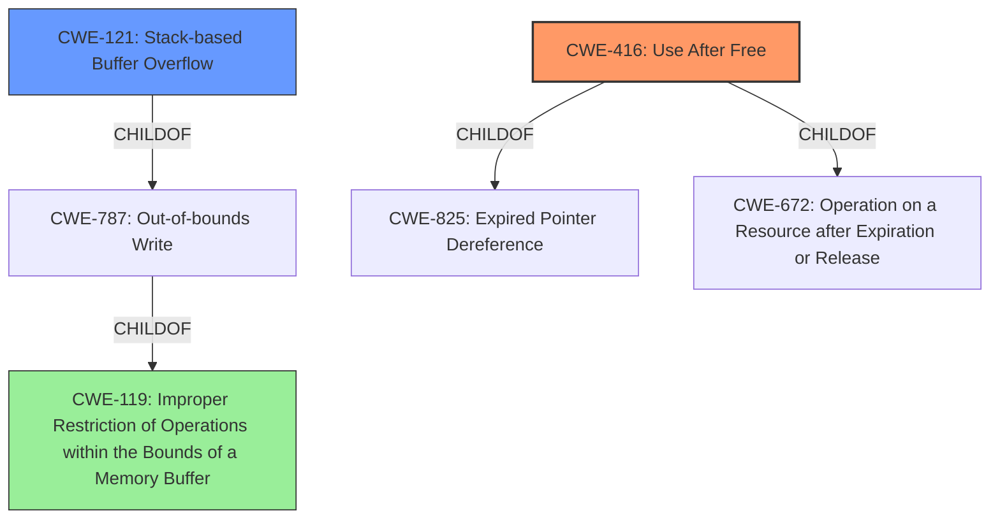

# Enhanced Analysis for CVE-2022-41193

# Summary
| CWE ID | CWE Name | Confidence | CWE Abstraction Level | CWE Vulnerability Mapping Label | CWE-Vulnerability Mapping Notes |
|---|---|---|---|---|---|
| CWE-416 | Use After Free | 0.8 | Variant | Allowed | Primary CWE |
| CWE-121 | Stack-based Buffer Overflow | 0.7 | Variant | Allowed | Secondary Candidate |
| CWE-119 | Improper Restriction of Operations within the Bounds of a Memory Buffer | 0.5 | Class | Discouraged | Secondary Candidate |

## Evidence and Confidence

*   **Confidence Score:** 0.8
*   **Evidence Strength:** MEDIUM

## Relationship Analysis
The primary CWE selected is CWE-416 **Use After Free**, which is a Variant of CWE-825 **Expired Pointer Dereference** and CWE-672 **Operation on a Resource after Expiration or Release**. CWE-416 can be preceded by CWE-123 **Write-what-where Condition**, and can follow CWE-754 **Improper Check for Unusual or Exceptional Conditions**.
CWE-121 **Stack-based Buffer Overflow** is a variant of CWE-787 **Out-of-bounds Write** and is a child of CWE-119 **Improper Restriction of Operations within the Bounds of a Memory Buffer**.
CWE-119 is a class level CWE, and the mapping guidance discourages its use. It is the parent of CWE-787 **Out-of-bounds Write**.



## Vulnerability Chain
The vulnerability chain starts with **lack of proper memory management**, leading to either a **stack-based overflow** or a **re-use of dangling pointer**. The **stack-based overflow** leads to CWE-121, and the **re-use of dangling pointer** leads to CWE-416. Both can result in Remote Code Execution.

## Summary of Analysis
The initial assessment identified a vulnerability due to **lack of proper memory management**, potentially leading to a **stack-based overflow or a re-use of dangling pointer**, resulting in Remote Code Execution. The key phrases pointed to CWE-119 as a primary match. However, the more specific weaknesses identified, namely the "stack-based overflow" and "re-use of dangling pointer," suggest more precise CWEs.

The phrase "**stack-based overflow**" directly aligns with CWE-121 **Stack-based Buffer Overflow**. This occurs when a buffer on the stack is overwritten, potentially allowing an attacker to control the program's execution flow.

The phrase "**re-use of dangling pointer**" strongly indicates CWE-416 **Use After Free**. This happens when memory is freed, but a pointer to that memory is still used, potentially leading to unexpected behavior or code execution if the memory is reallocated for another purpose.

The evidence for CWE-416 is: "it is possible that a Remote Code Execution can be triggered when payload forces a ... re-use of dangling pointer which refers to overwritten space in memory."

The evidence for CWE-121 is: "it is possible that a Remote Code Execution can be triggered when payload forces a stack-based overflow..."

CWE-119 **Improper Restriction of Operations within the Bounds of a Memory Buffer** was considered due to its presence in the similar CVE descriptions and the relationship to buffer overflows, but it is a high-level class and thus less specific than CWE-121 and CWE-416. The mapping guidance also discourages its use.

CWE-416 and CWE-121 are at the Variant level of abstraction, which is the preferred level.
CWE-416 and CWE-121 better represent the specific weaknesses described in the vulnerability description. Therefore, CWE-416 is the primary CWE, with CWE-121 as a secondary candidate.
CWE-119 is a secondary candidate due to the "stack-based overflow" which is related to the weakness but lacks the specificity of CWE-121.


## CWE Relationship Analysis

Current CWEs represent these abstraction levels: .


### Vulnerability Chain Analysis

**Chain starting from CWE-825:**
- 825 (Expired Pointer Dereference) - ROOT


**Chain starting from CWE-672:**
- 672 (Operation on a Resource after Expiration or Release) - ROOT


### CWE Relationship Diagram

```mermaid
graph TD
    classDef primary fill:#f96,stroke:#333,stroke-width:2px
    classDef secondary fill:#69f,stroke:#333
    classDef tertiary fill:#9e9,stroke:#333
```