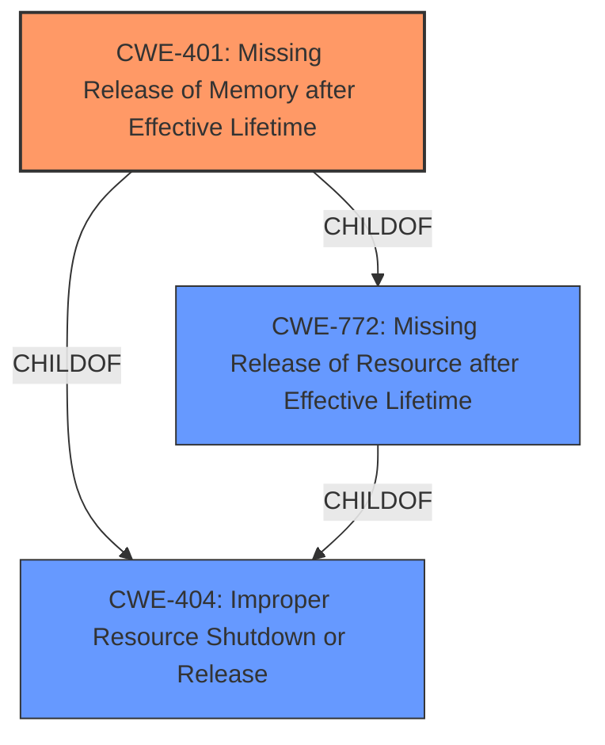

# Analysis for CVE-2022-41194

# Summary
| CWE ID | CWE Name | Confidence | CWE Abstraction Level | CWE Vulnerability Mapping Label | CWE-Vulnerability Mapping Notes |
|---|---|---|---|---|---|
| CWE-401 | Missing Release of Memory after Effective Lifetime | 0.8 | Variant | Allowed | Primary CWE |
| CWE-772 | Missing Release of Resource after Effective Lifetime | 0.7 | Base | Allowed | Secondary Candidate |
| CWE-404 | Improper Resource Shutdown or Release | 0.6 | Class | Allowed-with-Review | Secondary Candidate |

## Evidence and Confidence

*   **Confidence Score:** 0.8
*   **Evidence Strength:** MEDIUM

## Relationship Analysis
The primary CWE is CWE-401 (Missing Release of Memory after Effective Lifetime), a Variant of CWE-772 (Missing Release of Resource after Effective Lifetime) and CWE-404 (Improper Resource Shutdown or Release). The relationships helped refine the selection from the broader Class CWE-404 to the more specific Variant CWE-401, indicating a failure to release memory specifically.

## Vulnerability Chain
The vulnerability chain begins with the **lack of proper memory management** in SAP 3D Visual Enterprise Viewer. This **lack of proper memory management** leads to a condition where memory is not released after its effective lifetime (CWE-401). Consequently, opening a manipulated Encapsulated Postscript file causes the application to crash and become temporarily unavailable.

## Summary of Analysis
The analysis is primarily based on the vulnerability description, which explicitly mentions "**lack of proper memory management**" as the root cause. This statement directly supports the selection of CWE-401 (Missing Release of Memory after Effective Lifetime), as it indicates a failure to release allocated memory.

The description states: "Due to **lack of proper memory management**, when a victim opens a manipulated Encapsulated Postscript (.eps, ai.x3d) file received from untrusted sources in SAP 3D Visual Enterprise Viewer - version 9, it is possible for the application to crash and becomes temporarily unavailable to the user until restart of the application."

The graph relationships influenced the final selection by highlighting the hierarchical connections between CWE-401, CWE-772, and CWE-404, allowing for a more specific and accurate classification.

CWE-401 is chosen because it represents the specific issue of memory not being released, leading to a crash. While CWE-772 (Missing Release of Resource after Effective Lifetime) is a broader category, CWE-401 is more precise. CWE-404 (Improper Resource Shutdown or Release) is even broader, encompassing other types of resources besides memory. The abstraction level of Variant for CWE-401 makes it the most appropriate choice.

Relevant CWE Information:

# Enhanced Context (25 CWEs)
The following CWEs were identified as potentially relevant to this vulnerability:

## CWE-226: Sensitive Information in Resource Not Removed Before Reuse
**Abstraction Level**: Base
**Similarity Score**: 0.79
**Source**: dense

**Description**:
The product releases a resource such as memory or a file so that it can be made available for reuse, but it does not clear or "zeroize" the information contained in the resource before the product performs a critical state transition or makes the resource available for reuse by other entities.

**Mapping Guidance**:
- Usage: Allowed
- Rationale: This CWE entry is at the Base level of abstraction, which is a preferred level of abstraction for mapping to the root causes of vulnerabilities.

*Reasoning for exclusion*: This CWE is not relevant as the vulnerability description makes no mention of sensitive information.

## CWE-789: Memory Allocation with Excessive Size Value
**Abstraction Level**: Variant
**Similarity Score**: 0.77
**Source**: dense

**Description**:
The product allocates memory based on an untrusted, large size value, but it does not ensure that the size is within expected limits, allowing arbitrary amounts of memory to be allocated.

**Mapping Guidance**:
- Usage: Allowed
- Rationale: This CWE entry is at the Variant level of abstraction, which is a preferred level of abstraction for mapping to the root causes of vulnerabilities.

*Reasoning for exclusion*: This CWE is not relevant as the vulnerability description does not mention allocation based on untrusted size values. The issue is memory management and not memory allocation.

## CWE-404: Improper Resource Shutdown or Release
**Abstraction Level**: Class
**Similarity Score**: 0.77
**Source**: dense

**Description**:
The product does not release or incorrectly releases a resource before it is made available for re-use.

**Mapping Guidance**:
- Usage: Allowed-with-Review
- Rationale: This CWE entry is a Class and might have Base-level children that would be more appropriate

*Reasoning for exclusion*: This CWE is too general. The issue is with memory management so CWE-401 and CWE-772 are better choices.

## CWE-1325: Improperly Controlled Sequential Memory Allocation
**Abstraction Level**: Base
**Similarity Score**: 0.76
**Source**: dense

**Description**:
The product manages a group of objects or resources and performs a separate memory allocation for each object, but it does not properly limit the total amount of memory that is consumed by all of the combined objects.

**Mapping Guidance**:
- Usage: Allowed
- Rationale: This CWE entry is at the Base level of abstraction, which is a preferred level of abstraction for mapping to the root causes of vulnerabilities.

*Reasoning for exclusion*: This CWE is not relevant as the vulnerability description does not mention sequential memory allocation.

## CWE-131: Incorrect Calculation of Buffer Size
**Abstraction Level**: Base
**Similarity Score**: 0.76
**Source**: dense

**Description**:
The product does not correctly calculate the size to be used when allocating a buffer, which could lead to a buffer overflow.

**Mapping Guidance**:
- Usage: Allowed
- Rationale: This CWE entry is at the Base level of abstraction, which is a preferred level of abstraction for mapping to the root causes of vulnerabilities.

*Reasoning for exclusion*: This CWE is not relevant as the vulnerability description does not mention buffer size calculation.

## CWE-667: Improper Locking
**Abstraction Level**: Class
**Similarity Score**: 0.75
**Source**: dense

**Description**:
The product does not properly acquire or release a lock on a resource, leading to unexpected resource state changes and behaviors.

**Mapping Guidance**:
- Usage: Allowed-with-Review
- Rationale: This CWE entry is a Class and might have Base-level children that would be more appropriate

*Reasoning for exclusion*: This CWE is not relevant as the vulnerability description does not mention locking mechanisms.

## CWE-909: Missing Initialization of Resource
**Abstraction Level**: Class
**Similarity Score**: 0.75
**Source**: dense

**Description**:
The product does not initialize a critical resource.

**Mapping Guidance**:
- Usage: Allowed-with-Review
- Rationale: This CWE entry is a Class and might have Base-level children that would be more appropriate

*Reasoning for exclusion*: This CWE is not relevant as the vulnerability description does not mention resource initialization.

## CWE-125: Out-of-bounds Read
**Abstraction Level**: Base
**Similarity Score**: 0.75
**Source**: dense

**Description**:
The product reads data past the end, or before the beginning, of the intended buffer.

**Mapping Guidance**:
- Usage: Allowed
- Rationale: This CWE entry is at the Base level of abstraction, which is a preferred level of abstraction for mapping to the root causes of vulnerabilities.

*Reasoning for exclusion*: This CWE is not relevant as the vulnerability description does not mention out-of-bounds reads.

## CWE-665: Improper Initialization
**Abstraction Level**: Class
**Similarity Score**: 0.75
**Source**: dense

**Description**:
The product does not initialize or incorrectly initializes a resource, which might leave the resource in an unexpected state when it is accessed or used.

**Mapping Guidance**:
- Usage: Discouraged
- Rationale: This CWE entry is a level-1 Class (i.e., a child of a Pillar). It might have lower-level children that would be more appropriate

*Reasoning for exclusion*: This CWE is not relevant as the vulnerability description does not mention resource initialization.

## CWE-824: Access of Uninitialized