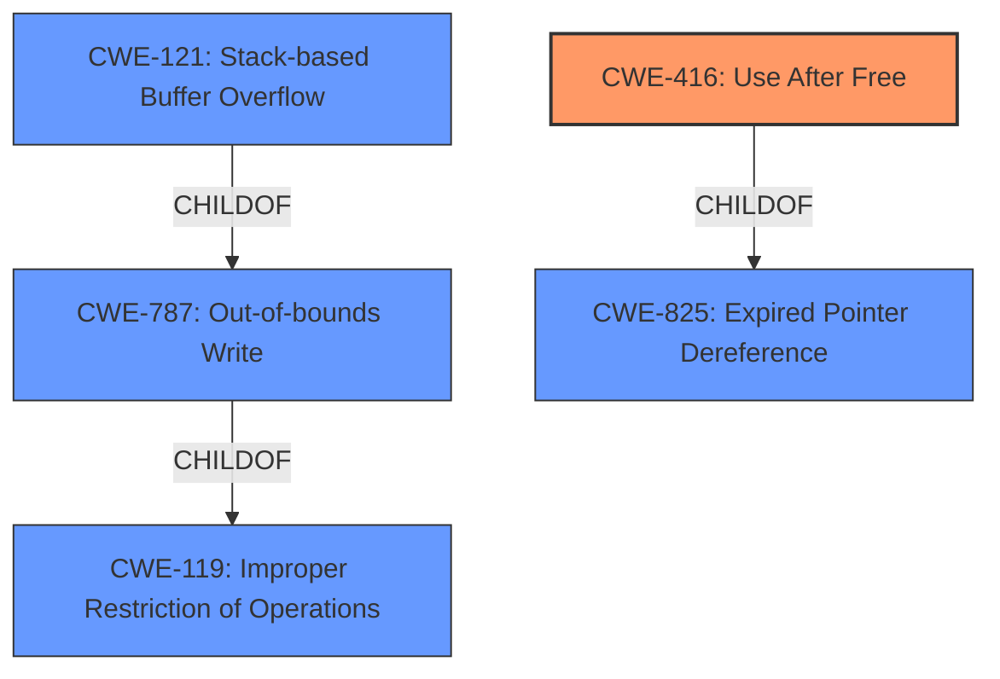

# Analysis Report for CVE-2022-41200

# Vulnerability Analysis Report: CVE-2022-41200

## Description


## Analysis (with Relationship Data)

# Summary
| CWE ID | CWE Name | Confidence | CWE Abstraction Level | CWE Vulnerability Mapping Label | CWE-Vulnerability Mapping Notes |
|---|---|---|---|---|---|
| CWE-416 | Use After Free | 0.85 | Variant | Allowed | Primary CWE |
| CWE-121 | Stack-based Buffer Overflow | 0.75 | Variant | Allowed | Secondary Candidate |
| CWE-119 | Improper Restriction of Operations within the Bounds of a Memory Buffer | 0.60 | Class | Discouraged | Secondary Candidate |

## Evidence and Confidence

*   **Confidence Score:** 0.80
*   **Evidence Strength:** MEDIUM

## Relationship Analysis
The primary CWE selected is CWE-416, which is a Variant of CWE-825 (Expired Pointer Dereference) and CWE-672 (Operation on Resource that is Dead, Dormant, or Obsolete). CWE-121 (Stack-based Buffer Overflow) is a variant of CWE-787 (Out-of-bounds Write), which in turn is a child of CWE-119 (Improper Restriction of Operations within the Bounds of a Memory Buffer). The description indicates either a **stack-based overflow or a re-use of dangling pointer**, leading to consideration of both CWE-416 and CWE-121. Since the vulnerability description explicitly mentions the **re-use of a dangling pointer**, CWE-416 is chosen as the primary CWE. CWE-119 is a more general class that is often misused, so I am choosing the specific variant.



## Vulnerability Chain
The vulnerability chain starts with **lack of proper memory management**. This leads to either a **stack-based overflow** (CWE-121) or a **re-use of dangling pointer** (CWE-416), ultimately resulting in Remote Code Execution.

## Summary of Analysis
The initial assessment considered both CWE-416 and CWE-121 based on the vulnerability description, which mentioned a **stack-based overflow or a re-use of dangling pointer**. The evidence from the vulnerability description key phrases supports this. The relationship graph shows that both CWE-416 and CWE-121 are specific variants that fall under broader categories. The decision to prioritize CWE-416 is based on the explicit mention of "dangling pointer," which directly aligns with the description of CWE-416. The final selection ensures that the CWEs are at the optimal level of specificity, representing the root cause (**lack of proper memory management**) and the resulting weaknesses (CWE-416 or CWE-121).

Relevant CWE Information:

# Enhanced Context (25 CWEs)

## CWE-416: Use After Free
**Abstraction:** Variant
**Similarity Score**: 0.80
**Source**: alternate_terms

**Description**:
The product reuses or references memory after it has been freed. At some point afterward, the memory may be allocated again and saved in another pointer, while the original pointer references a location somewhere within the new allocation. Any operations using the original pointer are no longer valid because the memory "belongs" to the code that operates on the new pointer.

**Mapping Guidance**:
- Usage: Allowed
- Rationale: This CWE entry is at the Variant level of abstraction, which is a preferred level of abstraction for mapping to the root causes of vulnerabilities.

The vulnerability description indicates a **re-use of a dangling pointer**, which directly aligns with the definition of CWE-416.

## CWE-121: Stack-based Buffer Overflow
**Abstraction:** Variant
**Similarity Score**: 0.685
**Source**: sparse

**Description**:
A stack-based buffer overflow condition is a condition where the buffer being overwritten is allocated on the stack (i.e., is a local variable or, rarely, a parameter to a function).

**Mapping Guidance**:
- Usage: Allowed
- Rationale: This CWE entry is at the Variant level of abstraction, which is a preferred level of abstraction for mapping to the root causes of vulnerabilities.

The vulnerability description mentions a **stack-based overflow**, suggesting a potential match for CWE-121.

## CWE-119: Improper Restriction of Operations within the Bounds of a Memory Buffer
**Abstraction:** Class
**Similarity Score**: 0.525
**Source**: sparse

**Description**:
The product performs operations on a memory buffer, but it reads from or writes to a memory location outside the buffer's intended boundary. This may result in read or write operations on unexpected memory locations that could be linked to other variables, data structures, or internal program data.

**Mapping Guidance**:
- Usage: Discouraged
- Rationale: CWE-119 is commonly misused in low-information vulnerability reports when lower-level CWEs could be used instead, or when more details about the vulnerability are available.

CWE-119 is a more general category. Given the specific details of either a **stack-based overflow** or a **re-use of dangling pointer**, the variants CWE-121 and CWE-416 are more appropriate.

I considered CWE-190 (Integer Overflow or Wraparound), CWE-825 (Expired Pointer Dereference), CWE-789 (Memory Allocation with Excessive Size Value), and CWE-123 (Write-what-where Condition). However, these CWEs do not directly align with the vulnerability description, which focuses on **stack-based overflow** and the **re-use of dangling pointer**. CWE-190 and CWE-789 relate to memory allocation size, while CWE-123 involves arbitrary write conditions, which are not explicitly mentioned in the description. While CWE-825 is related to dangling pointers, CWE-416 is a more specific variant that better captures the essence of the vulnerability.


## CWE Relationship Analysis

Current CWEs represent these abstraction levels: .


### Vulnerability Chain Analysis

**Chain starting from CWE-190:**
- 190 (Integer Overflow or Wraparound) - ROOT


**Chain starting from CWE-825:**
- 825 (Expired Pointer Dereference) - ROOT


### CWE Relationship Diagram

```mermaid
graph TD
    classDef primary fill:#f96,stroke:#333,stroke-width:2px
    classDef secondary fill:#69f,stroke:#333
    classDef tertiary fill:#9e9,stroke:#333
```


*Report generated on 2025-03-31 02:58:22*
