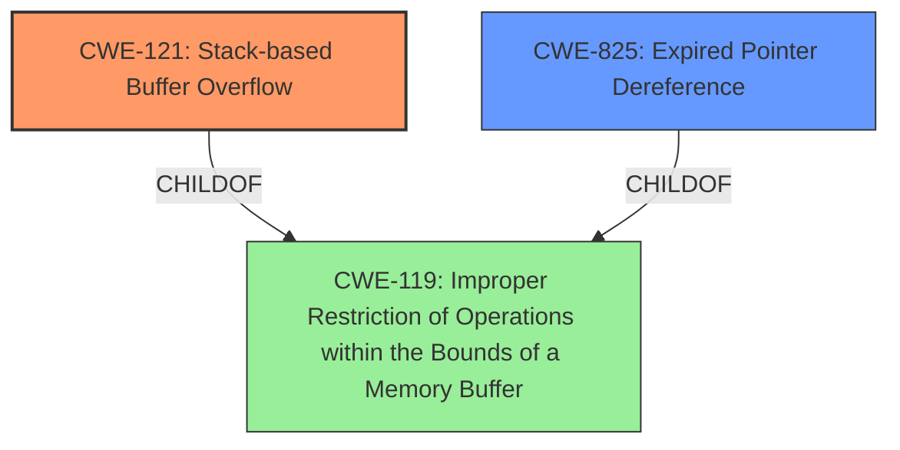

# Analysis for CVE-2022-41201

# Summary
| CWE ID  | CWE Name  | Confidence | CWE Abstraction Level | CWE Vulnerability Mapping Label | CWE-Vulnerability Mapping Notes |
|---|---|---|---|---|---|
| CWE-121 | Stack-based Buffer Overflow | 1.0 | Variant |  | Allowed |
| CWE-825 | Expired Pointer Dereference | 0.9 | Base |  | Allowed |
| CWE-119 | Improper Restriction of Operations within the Bounds of a Memory Buffer | 0.7 | Class |  | Discouraged |

## Evidence and Confidence

*   **Confidence Score:** 0.9
*   **Evidence Strength:** HIGH

## Relationship Analysis
The primary weakness is CWE-121, Stack-based Buffer Overflow, which is a variant of the more general CWE-119, Improper Restriction of Operations within the Bounds of a Memory Buffer. CWE-825, Expired Pointer Dereference, is included as a secondary weakness related to the re-use of a dangling pointer, potentially resulting from memory corruption caused by the buffer overflow.

## Vulnerability Chain
1.  **Root Cause:** **Lack of proper memory management** in SAP 3D Visual Enterprise Viewer.
2.  **Weakness 1:** A **stack-based buffer overflow** (CWE-121) occurs when processing a manipulated Right Hemisphere Binary file.
3.  **Weakness 2:** **Re-use of dangling pointer** (CWE-825) leading to access of overwritten memory.
4.  **Impact:** Remote Code Execution (RCE).

## Summary of Analysis
The analysis is based on the provided vulnerability description, which explicitly mentions a **stack-based overflow** and a **re-use of dangling pointer**. The primary CWE is CWE-121, Stack-based Buffer Overflow, due to the explicit mention of this condition. CWE-825, Expired Pointer Dereference, is included as a secondary CWE due to the reference to the **re-use of a dangling pointer**. CWE-119 is a more general case of a buffer overflow and is considered as a related CWE but at a higher abstraction level.

The evidence for CWE-121 is: "it is possible that a Remote Code Execution can be triggered when payload forces a **stack-based overflow**"
The evidence for CWE-825 is: "a Remote Code Execution can be triggered when payload forces a ... **re-use of dangling pointer** which refers to overwritten space in memory."

The selected CWEs are at the optimal level of specificity because CWE-121 is a Variant that directly describes the type of buffer overflow, and CWE-825 is a Base that describes the specific issue of dereferencing an expired pointer.

Relevant CWE Information:

# Enhanced Context (25 CWEs)
The following CWEs were identified as potentially relevant to this vulnerability:

## CWE-824: Access of Uninitialized Pointer
**Abstraction Level**: Base
**Similarity Score**: 0.74
**Source**: dense

**Description**:
The product accesses or uses a pointer that has not been initialized.

**Mapping Guidance**:
- Usage: Allowed
- Rationale: This CWE entry is at the Base level of abstraction, which is a preferred level of abstraction for mapping to the root causes of vulnerabilities.

## CWE-668: Exposure of Resource to Wrong Sphere
**Abstraction Level**: Class
**Similarity Score**: 0.74
**Source**: dense

**Description**:
The product exposes a resource to the wrong control sphere, providing unintended actors with inappropriate access to the resource.

**Mapping Guidance**:
- Usage: Discouraged
- Rationale: CWE-668 is high-level and is often misused as a catch-all when lower-level CWE IDs might be applicable. It is sometimes used for low-information vulnerability reports [REF-1287]. It is a level-1 Class (i.e., a child of a Pillar). It is not useful for trend analysis.

## CWE-129: Improper Validation of Array Index
**Abstraction Level**: Variant
**Similarity Score**: 0.74
**Source**: dense

**Description**:
The product uses untrusted input when calculating or using an array index, but the product does not validate or incorrectly validates the index to ensure the index references a valid position within the array.

**Mapping Guidance**:
- Usage: Allowed
- Rationale: This CWE entry is at the Variant level of abstraction, which is a preferred level of abstraction for mapping to the root causes of vulnerabilities.

## CWE-497: Exposure of Sensitive System Information to an Unauthorized Control Sphere
**Abstraction Level**: Base
**Similarity Score**: 0.73
**Source**: dense

**Description**:
The product does not properly prevent sensitive system-level information from being accessed by unauthorized actors who do not have the same level of access to the underlying system as the product does.

**Mapping Guidance**:
- Usage: Allowed
- Rationale: This CWE entry is at the Base level of abstraction, which is a preferred level of abstraction for mapping to the root causes of vulnerabilities.

## CWE-131: Incorrect Calculation of Buffer Size
**Abstraction Level**: Base
**Similarity Score**: 0.73
**Source**: dense

**Description**:
The product does not correctly calculate the size to be used when allocating a buffer, which could lead to a buffer overflow.

**Mapping Guidance**:
- Usage: Allowed
- Rationale: This CWE entry is at the Base level of abstraction, which is a preferred level of abstraction for mapping to the root causes of vulnerabilities.

## CWE-74: Improper Neutralization of Special Elements in Output Used by a Downstream Component ('Injection')
**Abstraction Level**: Class
**Similarity Score**: 0.73
**Source**: dense

**Description**:
The product constructs all or part of a command, data structure, or record using externally-influenced input from an upstream component, but it does not neutralize or incorrectly neutralizes special elements that could modify how it is parsed or interpreted when it is sent to a downstream component.

**Mapping Guidance**:
- Usage: Discouraged
- Rationale: CWE-74 is high-level and often misused when lower-level weaknesses are more appropriate.

## CWE-119: Improper Restriction of Operations within the Bounds of a Memory Buffer
**Abstraction Level**: Class
**Similarity Score**: 0.73
**Source**: dense

**Description**:
The product performs operations on a memory buffer, but it reads from or writes to a memory location outside the buffer's intended boundary. This may result in read or write operations on unexpected memory locations that could be linked to other variables, data structures, or internal program data.

**Mapping Guidance**:
- Usage: Discouraged
- Rationale: CWE-119 is commonly misused in low-information vulnerability reports when lower-level CWEs could be used instead, or when more details about the vulnerability are available.

## CWE-657: Violation of Secure Design Principles
**Abstraction Level**: Class
**Similarity Score**: 0.72
**Source**: dense

**Description**:
The product violates well-established principles for secure design.

**Mapping Guidance**:
- Usage: Discouraged
- Rationale: This CWE entry is a level-1 Class (i.e., a child of a Pillar). It might have lower-level children that would be more appropriate

## CWE-788: Access of Memory Location After End of Buffer
**Abstraction Level**: Base
**Similarity Score**: 0.72
**Source**: dense

**Description**:
The product reads or writes to a buffer using an index or pointer that references a memory location after the end of the buffer.

**Mapping Guidance**:
- Usage: Discouraged
- Rationale: The CWE entry might be misused when lower-level CWE entries might be available. It also overlaps existing CWE entries and might be deprecated in the future.

## CWE-703: Improper Check or Handling of Exceptional Conditions
**Abstraction Level**: Pillar
**Similarity Score**: 0.72
**Source**: dense

**Description**:
The product does not properly anticipate or handle exceptional conditions that rarely occur during normal operation of the product.

**Mapping Guidance**:
- Usage: Discouraged
- Rationale: This CWE entry is extremely high-level, a Pillar.

## CWE-125: Out-of-bounds Read
**Abstraction Level**: Base
**Similarity Score**: 3277.25
**Source**: sparse

**Description**:

# Enhanced Query for CVE-2022-41201

# Vulnerability Description

    Due to **lack of proper memory management**, when a victim opens a manipulated Right Hemisphere Binary (.rh, rh.x3d) file received from untrusted sources in SAP 3D Visual Enterprise Viewer - version 9, it is possible that a Remote Code Execution can be triggered when payload forces a **stack-based overflow** or a **re-use of dangling pointer** which refers to overwritten space in memory.

    # Keyphrase-Specific CWE Analysis
    This vulnerability contains multiple keyphrases that may map to different CWEs. 
    Please analyze each keyphrase separately and determine the most appropriate CWE(s) for each.

    ## ROOTCAUSE: 'lack of proper memory management'

Relevant CWEs for this ROOTCAUSE:

### 1. CWE-121: Stack-based Buffer Overflow (Score: 734.02)

A stack-based buffer overflow condition is a condition where the buffer being overwritten is allocated on the stack (i.e., is a local variable or, rarely, a parameter to a function)....

### 2. CWE-119: Improper Restriction of Operations within the Bounds of a Memory Buffer (Score: 590.13)

The product performs operations on a memory buffer, but it reads from or writes to a memory location outside the buffer's intended boundary. This may result in read or write operations on unexpected memory locations that could be linked to other variables, data structures, or internal program data....

### 3. CWE-20: Improper Input Validation (Score: 464.05)

The product receives input or data, but it does
        not validate or incorrectly validates that the input has the
        properties that are required to process the data safely and
        correctly....

### 4. CWE-787: Out-of-bounds Write (Score: 395.17)

The product writes data past the end, or before the beginning, of the intended buffer....

### 5. CWE-1284: Improper Validation of Specified Quantity in Input (Score: 370.02)

The product receives input that is expected to specify a quantity (such as size or length), but it does not validate or incorrectly validates that the quantity has the required properties....

## WEAKNESS: 'stack-based overflow'

Relevant CWEs for this WEAKNESS:

### 1. CWE-121: Stack-based Buffer Overflow (Score: 734.02)

A stack-based buffer overflow condition is a condition where the buffer being overwritten is allocated on the stack (i.e., is a local variable or, rarely, a parameter to a function)....

### 2. CWE-119: Improper Restriction of Operations within the Bounds of a Memory Buffer (Score: 590.13)

The product performs operations on a memory buffer, but it reads from or writes to a memory location outside the buffer's intended boundary. This may result in read or write operations on unexpected memory locations that could be linked to other variables, data structures, or internal program data....

### 3. CWE-20: Improper Input Validation (Score: 464.05)

The product receives input or data, but it does
        not validate or incorrectly validates that the input has the
        properties that are required to process the data safely and
        correctly....

### 4. CWE-1284: Improper Validation of Specified Quantity in Input (Score: 370.02)

The product receives input that is expected to specify a quantity (such as size or length), but it does not validate or incorrectly validates that the quantity has the required properties....

### 5. CWE-674: Uncontrolled Recursion (Score: 348.92)

The product does not properly control the amount of recursion that takes place,  consuming excessive resources, such as allocated memory or the program stack....

## WEAKNESS: 're-use of dangling pointer'

Relevant CWEs for this WEAKNESS:

### 1. CWE-121: Stack-based Buffer Overflow (Score: 734.02)

A stack-based buffer overflow condition is a condition where the buffer being overwritten is allocated on the stack (i.e., is a local variable or, rarely, a parameter to a function)....

### 2. CWE-119: Improper Restriction of Operations within the Bounds of a Memory Buffer (Score: 590.13)

The product performs operations on a memory buffer, but it reads from or writes to a memory location outside the buffer's intended boundary. This may result in read or write operations on unexpected memory locations that could be linked to other variables, data structures, or internal program data....

### 3. CWE-20: Improper Input Validation (Score: 464.05)

The product receives input or data, but it does
        not validate or incorrectly validates that the input has the
        properties that are required to process the data safely and
        correctly....

### 4. CWE-787: Out-of-bounds Write (Score: 395.17)

The product writes data past the end, or before the beginning, of the intended buffer....

### 5. CWE-825: Expired Pointer Dereference (Score: 387.67)

The product dereferences a pointer that contains a location for memory that was previously valid, but is no longer valid....

## IMPACT: 'Remote Code Execution'

Relevant CWEs for this IMPACT:

### 1. CWE-121: Stack-based Buffer Overflow (Score: 734.02)

A stack-based buffer overflow condition is a condition where the buffer being overwritten is allocated on the stack (i.e., is a local variable or, rarely, a parameter to a function)....

### 2. CWE-119: Improper Restriction of Operations within the Bounds of a Memory Buffer (Score: 590.13)

The product performs operations on a memory buffer, but it reads from or writes to a memory location outside the buffer's intended boundary. This may result in read or write operations on unexpected memory locations that could be linked to other variables, data structures, or internal program data....

### 3. CWE-20: Improper Input Validation (Score: 464.05)

The product receives input or data, but it does
        not validate or incorrectly validates that the input has the
        properties that are required to process the data safely and
        correctly....

### 4. CWE-787: Out-of-bounds Write (Score: 395.17)

The product writes data past the end, or before the beginning, of the intended buffer....

### 5. CWE-126: Buffer Over-read (Score: 112.02)

The product reads from a buffer using buffer access mechanisms such as indexes or pointers that reference memory locations after the targeted buffer....

## VECTOR: 'manipulated Right Hemisphere Binary file'

Relevant CWEs for this VECTOR:

### 1. CWE-121: Stack-based Buffer Overflow (Score: 734.02)

A stack-based buffer overflow condition is a condition where the buffer being overwritten is allocated on the stack (i.e., is a local variable or, rarely, a parameter to a function)....

### 2. CWE-119: Improper Restriction of Operations within the Bounds of a Memory Buffer (Score: 590.13)

The product performs operations on a memory buffer, but it reads from or writes to a memory location outside the buffer's intended boundary. This may result in read or write operations on unexpected memory locations that could be linked to other variables, data structures, or internal program data....

### 3. CWE-20: Improper Input Validation (Score: 464.05)

The product receives input or data, but it does
        not validate or incorrectly validates that the input has the
        properties that are required to process the data safely and
        correctly....

### 4. CWE-787: Out-of-bounds Write (Score: 395.17)

The product writes data past the end, or before the beginning, of the intended buffer....

### 5. CWE-126: Buffer Over-read (Score: 112.02)

The product reads from a buffer using buffer access mechanisms such as indexes or pointers that reference memory locations after the targeted buffer....

## PRODUCT: 'SAP 3D Visual Enterprise Viewer'

Relevant CWEs for this PRODUCT:

### 1. CWE-121: Stack-based Buffer Overflow (Score: 734.02)

A stack-based buffer overflow condition is a condition where the buffer being overwritten is allocated on the stack (i.e., is a local variable or, rarely, a parameter to a function)....

### 2. CWE-119: Improper Restriction of Operations within the Bounds of a Memory Buffer (Score: 590.13)

The product performs operations on a memory buffer, but it reads from or writes to a memory location outside the buffer's intended boundary. This may result in read or write operations on unexpected memory locations that could be linked to other variables, data structures, or internal program data....

### 3. CWE-20: Improper Input Validation (Score: 464.05)

The product receives input or data, but it does
        not validate or incorrectly validates that the input has the
        properties that are required to process the data safely and
        correctly....

### 4. CWE-787: Out-of-bounds Write (Score: 395.17)

The product writes data past the end, or before the beginning, of the intended buffer....

### 5. CWE-126: Buffer Over-read (Score: 112.02)

The product reads from a buffer using buffer access mechanisms such as indexes or pointers that reference memory locations after the targeted buffer....

## VERSION: '9'

Relevant CWEs for this VERSION:

### 1. CWE-121: Stack-based Buffer Overflow (Score: 734.02)

A stack-based buffer overflow condition is a condition where the buffer being overwritten is allocated on the stack (i.e., is a local variable or, rarely, a parameter to a function)....

### 2. CWE-119: Improper Restriction of Operations within the Bounds of a Memory Buffer (Score: 590.13)

The product performs operations on a memory buffer, but it reads from or writes to a memory location outside the buffer's intended boundary. This may result in read or write operations on unexpected memory locations that could be linked to other variables, data structures, or internal program data....

### 3. CWE-20: Improper Input Validation (Score: 464.05)

The product receives input or data, but it does
        not validate or incorrectly validates that the input has the
        properties that are required to process the data safely and
        correctly....

### 4. CWE-787: Out-of-bounds Write (Score: 395.17)

The product writes data past the end, or before the beginning, of the intended buffer....

### 5. CWE-126: Buffer Over-read (Score: 112.02)

The product reads from a buffer using buffer access mechanisms such as indexes or pointers that reference memory locations after the targeted buffer....

    # Analysis Instructions
    1. For each keyphrase, identify the most appropriate CWE(s) that represent the weakness.
    2. Consider how the different keyphrases might relate to each other in the vulnerability chain.
    3. Provide a final determination of primary CWE(s) and any secondary CWEs.
    4. Format your response using the standard analysis template.

    Please analyze how these different weaknesses interact and provide a comprehensive CWE classification.
    