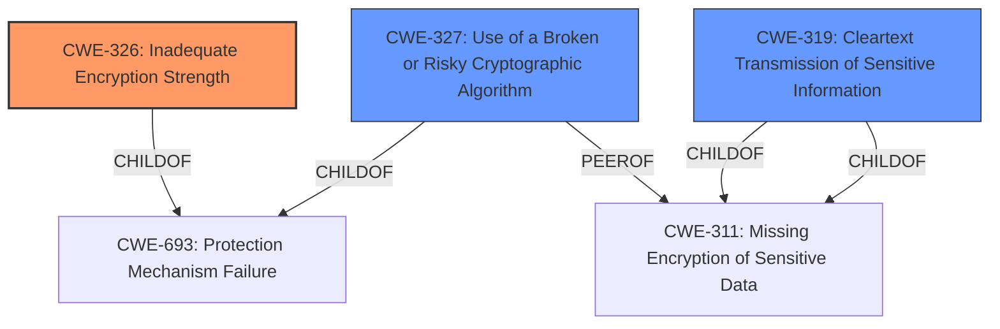

# Raw Analyzer Response for CVE-2022-41209

# Summary
| CWE ID  | CWE Name                      | Confidence | CWE Abstraction Level | CWE Vulnerability Mapping Label | CWE-Vulnerability Mapping Notes |
|---------|-------------------------------|------------|-----------------------|---------------------------------|---------------------------------|
| CWE-326 | Inadequate Encryption Strength | 0.8        | Class                 | Primary                           | Allowed-with-Review             |
| CWE-319 | Cleartext Transmission of Sensitive Information | 0.6        | Base                 | Secondary                          | Allowed             |
| CWE-327 | Use of a Broken or Risky Cryptographic Algorithm | 0.5        | Class                 | Secondary                           | Allowed-with-Review             |

## Evidence and Confidence

*   **Confidence Score:** 0.7
*   **Evidence Strength:** MEDIUM

## Relationship Analysis
The primary CWE is CWE-326, Inadequate Encryption Strength, which is a Class-level CWE. The retriever results also suggested CWE-327, Use of a Broken or Risky Cryptographic Algorithm, and CWE-319, Cleartext Transmission of Sensitive Information, both of which are related to encryption issues. The relationships between these CWEs highlight different aspects of cryptographic weaknesses. CWE-326 is a more general category, while CWE-327 specifies the use of broken algorithms, and CWE-319 indicates that sensitive data is transmitted in cleartext.

## Vulnerability Chain
The vulnerability chain starts with the **lack of proper diffusion** in the encryption method, which leads to potential information disclosure and replay attacks. The sequence is:
1.  **WEAKNESS**: **Lacks proper diffusion** in encryption.
2.  Impact: Information disclosure, susceptibility to replay attacks.

## Summary of Analysis
The initial assessment, based on the provided description, points to a cryptographic issue where the encryption method used **lacks proper diffusion**. The primary indicator is the phrase "**lacks proper diffusion**," which suggests a **weakness** in the cryptographic algorithm's implementation. This aligns well with CWE-326, Inadequate Encryption Strength. The vulnerability description also mentions potential information disclosure and susceptibility to replay attacks, which are common consequences of weak encryption.

The retriever results further support this assessment, with CWE-326 being the top match. Other relevant CWEs include CWE-319 (Cleartext Transmission of Sensitive Information) and CWE-327 (Use of a Broken or Risky Cryptographic Algorithm).

The evidence to quote from the text: "SAP Customer Data Cloud (Gigya mobile app for Android) - version 7.4, uses encryption method which **lacks proper diffusion** and does not hide the patterns well. This can lead to information disclosure. In certain scenarios, application might also be susceptible to replay attacks."

CWE-326 is chosen as the primary CWE because it directly addresses the core issue of **inadequate encryption strength**. The other CWEs are considered as secondary factors. While the description does not explicitly state that sensitive information is transmitted in cleartext (CWE-319), the **lack of proper diffusion** increases the risk of information exposure. Also, the description does not explicitly state that a broken algorithm is used, but the **lack of proper diffusion** could be a consequence of a broken algorithm.

The selected CWE is at an optimal level of specificity because it accurately represents the weakness without being overly broad (like a Pillar CWE) or requiring more detailed information that is not provided in the description (like a Variant CWE).

Relevant CWE Information:

**CWE-326: Inadequate Encryption Strength**
The product stores or transmits sensitive data using an encryption scheme that is theoretically sound, but is not strong enough for the level of protection required. The vulnerability description states that the encryption method **lacks proper diffusion**, which means that even if the algorithm itself is not broken, its implementation is not strong enough to provide adequate protection. This directly matches the description of CWE-326. The security implication is that sensitive information can be disclosed due to the **weakness** in the encryption scheme.

**CWE-319: Cleartext Transmission of Sensitive Information**
The product transmits sensitive or security-critical data in cleartext in a communication channel that can be sniffed by unauthorized actors. Although the primary issue is the **lack of proper diffusion**, leading to potential information disclosure, it is possible that sensitive information is also transmitted without encryption. If the app is transmitting data over a network without encryption, it becomes vulnerable to sniffing attacks. However, the evidence is not strong enough to confirm this.

**CWE-327: Use of a Broken or Risky Cryptographic Algorithm**
The product uses a broken or risky cryptographic algorithm or protocol. The description says the encryption method **lacks proper diffusion**. This does not necessarily mean the algorithm is broken, but the **lack of proper diffusion** could be a consequence of a risky algorithm.

CWEs considered but not used:
CWE-20: Improper Input Validation - This CWE is too general and does not fit the specific cryptographic **weakness** described.
CWE-311: Missing Encryption of Sensitive Data - While related to encryption, this CWE is more about the absence of encryption, whereas the described vulnerability involves a **weakness** in the encryption method used.