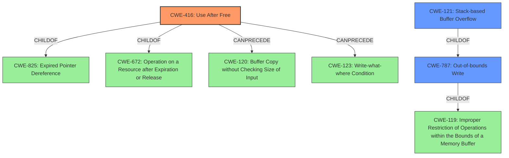

# Enhanced Analysis for CVE-2022-41211

# Summary
| CWE ID | CWE Name | Confidence | CWE Abstraction Level | CWE Vulnerability Mapping Label | CWE-Vulnerability Mapping Notes |
|---|---|---|---|---|---|
| CWE-416 | Use After Free | 1.0 | Variant | Allowed | Primary CWE |
| CWE-787 | Out-of-bounds Write | 0.7 | Base | Allowed | Secondary Candidate |
| CWE-121 | Stack-based Buffer Overflow | 0.6 | Variant | Allowed | Secondary Candidate |

## Evidence and Confidence

*   **Confidence Score:** 0.8
*   **Evidence Strength:** MEDIUM

## Relationship Analysis
The primary CWE selected is CWE-416, which is a Variant of CWE-825 (Expired Pointer Dereference) and CWE-672 (Operation on a Resource after Expiration or Release). CWE-416 can be caused by CWE-120 (Buffer Copy without Checking Size of Input) and CWE-123 (Write-what-where Condition). CWE-787 (Out-of-bounds Write) is a base CWE and a child of CWE-119 (Improper Restriction of Operations within the Bounds of a Memory Buffer). CWE-121 (Stack-based Buffer Overflow) is a variant and a child of CWE-787. The relationships support the selection of CWE-416 as the primary, with CWE-787 and CWE-121 as secondary, related issues potentially arising from the initial memory corruption.



## Vulnerability Chain
The vulnerability chain starts with the **lack of proper memory management**, leading to a **Use-After-Free** condition (CWE-416). This can potentially lead to an out-of-bounds write (CWE-787), and in this specific case, a stack-based buffer overflow (CWE-121), ultimately resulting in arbitrary code execution.

## Summary of Analysis
The initial assessment identified a **Use-After-Free** vulnerability due to a **lack of proper memory management**. This assessment is based on the provided "Vulnerability Description Key Phrases". The primary CWE, CWE-416 (Use After Free), directly reflects this weakness. The description explicitly mentions re-use of a dangling pointer, which aligns perfectly with the definition of a use-after-free condition.

The vulnerability description also mentions a "Stack-based buffer overflow." While the root cause is the use-after-free, the overflow is a potential consequence if the dangling pointer is re-allocated and then improperly written to. Therefore, CWE-121 (Stack-based Buffer Overflow) and CWE-787 (Out-of-bounds Write) are considered secondary candidates.

The retriever results support the selection of CWE-416 as the most relevant, with a score of 1.0. The retriever results also list CWE-121 and CWE-787. CWE-119 and CWE-20 are too general, and are thus discouraged.

The evidence for the primary CWE is strong, as the description explicitly mentions a dangling pointer and its re-use, which is the core of a use-after-free vulnerability. The confidence score is therefore high (0.8). The description states: "when a victim opens manipulated file received from untrusted sources in SAP 3D Visual Enterprise Author and SAP 3D Visual Enterprise Viewer, Arbitrary Code Execution can be triggered when payload forcesRe-use of dangling pointer which refers to overwritten space in memory." This directly supports the use-after-free assessment.

CWE-121 and CWE-787 are included as potential secondary weaknesses as the vulnerability description mentions a "Stack-based buffer overflow." However, this is a consequence of the use-after-free, and not the root cause. The memory overwritten is random, and success is not assured, indicating that the overflow is not the primary vulnerability.

The selected CWEs are at the optimal level of specificity. CWE-416 is a Variant, which is a preferred level of abstraction. CWE-787 is a Base, also a preferred level.


## CWE Relationship Analysis

Current CWEs represent these abstraction levels: .


### Vulnerability Chain Analysis

**Chain starting from CWE-825:**
- 825 (Expired Pointer Dereference) - ROOT


**Chain starting from CWE-672:**
- 672 (Operation on a Resource after Expiration or Release) - ROOT


### CWE Relationship Diagram

```mermaid
graph TD
    classDef primary fill:#f96,stroke:#333,stroke-width:2px
    classDef secondary fill:#69f,stroke:#333
    classDef tertiary fill:#9e9,stroke:#333
```