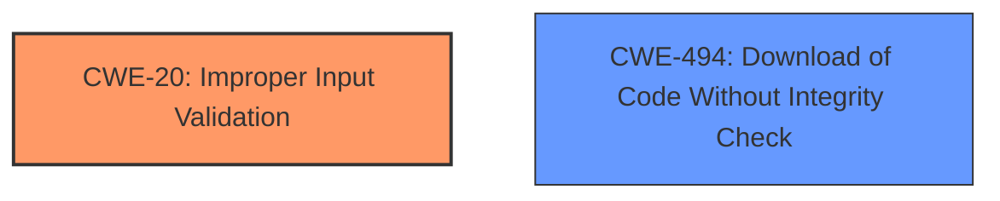

# Analysis for CVE-2022-41214

# Summary
| CWE ID | CWE Name | Confidence | CWE Abstraction Level | CWE Vulnerability Mapping Label | CWE-Vulnerability Mapping Notes |
|---|---|---|---|---|---|
| CWE-20 | Improper Input Validation | 0.9 | Class | Primary | Discouraged |
| CWE-494 | Download of Code Without Integrity Check | 0.7 | Base | Secondary | Allowed |

## Evidence and Confidence

*   **Confidence Score:** 0.9
*   **Evidence Strength:** MEDIUM

## Relationship Analysis
The primary relationship affecting my decision was the parent-child relationship where more specific CWEs exist as children of CWE-20. Since the description mentions **insufficient input validation** without further specifying the type of input or validation that is missing, I opted for the class-level CWE-20.
I also considered CWE-494 because the vulnerability allows an attacker to delete a file, which could be code. The file deletion, without integrity checks, could allow for the download of malicious code.

## Vulnerability Chain
The vulnerability chain starts with **insufficient input validation** (CWE-20), which allows an attacker with high privileges to delete restricted files. This could lead to the replacement of legitimate code with malicious code and potentially to arbitrary code execution.

## Summary of Analysis
My assessment is based on the provided vulnerability description, which clearly states that the root cause is **insufficient input validation**.

> Due to **insufficient input validation**, SAP NetWeaver Application Server ABAP and ABAP Platform allows an attacker with high level privileges to use a remote enabled function to delete a file which is otherwise restricted.

The graph relationships influenced my decision because they show how CWE-20 can lead to other vulnerabilities. The selection of CWE-20 is at the appropriate level of specificity, given the lack of detailed information about the specific input or validation process that is flawed.

Relevant CWE Information:

# Enhanced Context (25 CWEs)

## CWE-20: Improper Input Validation
**Technical Explanation:** The vulnerability description explicitly mentions **insufficient input validation** as the root cause. This aligns with the definition of CWE-20, which states that the product receives input but does not validate or incorrectly validates that the input has the required properties to process the data safely and correctly.
**Security Implications:** **Insufficient input validation** can allow an attacker to supply malicious input that could compromise the integrity and availability of the application. In this case, the attacker can delete restricted files.
**Relationship to other CWEs:** CWE-20 is a class-level CWE, and there are more specific child CWEs that could be considered if more information were available.
**Mapping Guidance Influence:** The mapping guidance for CWE-20 discourages its use when lower-level CWEs are applicable. However, in this case, the description does not provide enough information to select a more specific CWE.
**Confidence:** 0.9

## CWE-494: Download of Code Without Integrity Check
**Technical Explanation:** The vulnerability allows an attacker to delete restricted files. While the description doesn't explicitly state that code is downloaded, the deletion of a file could allow for the later downloading of code.
**Security Implications:** If an attacker can delete code files and then replace them with malicious code, they can compromise the integrity of the application and potentially achieve arbitrary code execution.
**Relationship to other CWEs:** CWE-494 is a base-level CWE.
**Mapping Guidance Influence:** The mapping guidance for CWE-494 suggests that it is a suitable mapping.
**Confidence:** 0.7

**CWEs Considered But Not Used:**

*   **CWE-444: Inconsistent Interpretation of HTTP Requests ('HTTP Request/Response Smuggling')**: This CWE is not applicable because the vulnerability is not related to HTTP request smuggling.
*   **CWE-94: Improper Control of Generation of Code ('Code Injection')**: This CWE is not applicable because the vulnerability doesn't directly involve code injection but file deletion due to **insufficient input validation**.
*   **CWE-285: Improper Authorization**: This CWE is too high-level, and the root cause is **insufficient input validation**, not the authorization mechanism itself.
*   **CWE-269: Improper Privilege Management**: While the attacker needs high privileges, the root cause is still **insufficient input validation**.
*   **CWE-807: Reliance on Untrusted Inputs in a Security Decision**: This CWE is similar, but the description focuses on the **insufficient input validation** rather than the reliance on untrusted inputs.
*   **CWE-22: Improper Limitation of a Pathname to a Restricted Directory ('Path Traversal')**: Not relevant as it focuses on path traversal, which is not the primary issue.
*   **CWE-749: Exposed Dangerous Method or Function**: While a remote-enabled function is used, the core issue is **insufficient input validation**, not the exposure of a dangerous method.
*   **CWE-863: Incorrect Authorization**: Not the primary cause. The **insufficient input validation** leads to the ability to delete restricted files.
*   **CWE-287: Improper Authentication**: Not relevant as authentication is not the primary issue.