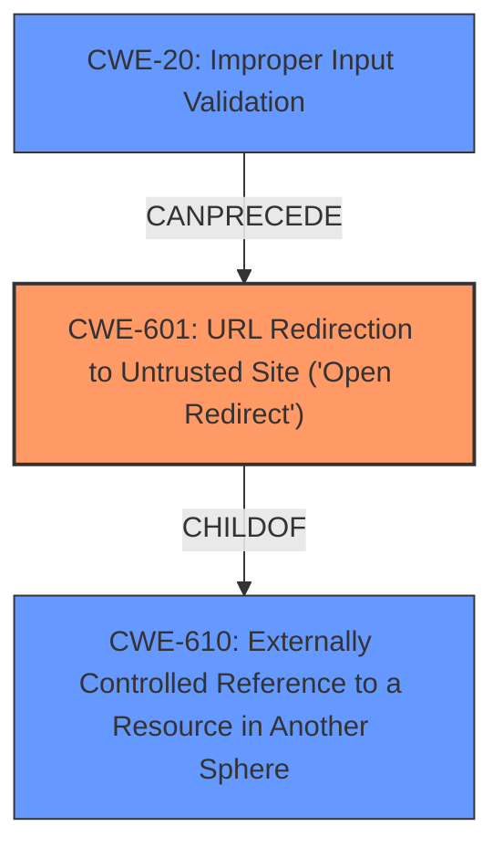

# Analysis Report for CVE-2022-41215

# Vulnerability Analysis Report: CVE-2022-41215

## Description


## Analysis (with Relationship Data)

# Summary
| CWE ID | CWE Name | Confidence | CWE Abstraction Level | CWE Vulnerability Mapping Label | CWE-Vulnerability Mapping Notes |
|---|---|---|---|---|---|
| CWE-601 | URL Redirection to Untrusted Site ('Open Redirect') | 0.9 | Base | Allowed | Primary CWE: This CWE directly addresses the vulnerability where users are redirected to malicious sites due to insufficient URL validation. |
| CWE-20 | Improper Input Validation | 0.6 | Class | Discouraged | Secondary CWE: While the description points to **insufficient URL validation**, which falls under input validation, it is a high-level classification. CWE-601 is more specific. |

## Evidence and Confidence

*   **Confidence Score:** 0.9
*   **Evidence Strength:** HIGH

## Relationship Analysis
The primary CWE is CWE-601, which is a Base level CWE.



## Vulnerability Chain
The vulnerability chain starts with **insufficient URL validation** (CWE-601), leading to the redirection of users to malicious sites. The impact is the potential disclosure of personal information.

## Summary of Analysis
The initial analysis identified the **root cause** as **insufficient URL validation**, which directly leads to the potential redirection of users to malicious sites. This aligns with CWE-601, "URL Redirection to Untrusted Site ('Open Redirect')", which is at the Base level of abstraction and accurately represents the vulnerability.

The description states: "SAP NetWeaver ABAP Server and ABAP Platform allows an unauthenticated attacker to redirect users to a malicious site due to **insufficient URL validation**. This could lead to the user being tricked to disclose personal information."

CWE-20, "Improper Input Validation", was considered because **insufficient URL validation** is a form of improper input validation. However, CWE-20 is a Class-level CWE, and CWE-601 provides a more specific description of the vulnerability.

The final decision to select CWE-601 is based on its precise match with the vulnerability description and its Base level of abstraction, making it the most appropriate CWE for this case.

Relevant CWE Information:

# Enhanced Context (25 CWEs)

## CWE-601: URL Redirection to Untrusted Site ('Open Redirect')
**Abstraction Level**: Base
**Similarity Score**: 0.81
**Source**: dense

**Description**:
The web application accepts a user-controlled input that specifies a link to an external site, and uses that link in a redirect.

**Mapping Guidance**:
- Usage: Allowed
- Rationale: This CWE entry is at the Base level of abstraction, which is a preferred level of abstraction for mapping to the root causes of vulnerabilities.


## CWE Relationship Analysis

Current CWEs represent these abstraction levels: .


### Vulnerability Chain Analysis

**Chain starting from CWE-601:**
- 601 (URL Redirection to Untrusted Site ('Open Redirect')) - ROOT


**Chain starting from CWE-20:**
- 20 (Improper Input Validation) - ROOT


### CWE Relationship Diagram

```mermaid
graph TD
    classDef primary fill:#f96,stroke:#333,stroke-width:2px
    classDef secondary fill:#69f,stroke:#333
    classDef tertiary fill:#9e9,stroke:#333
```


*Report generated on 2025-03-30 11:21:23*
