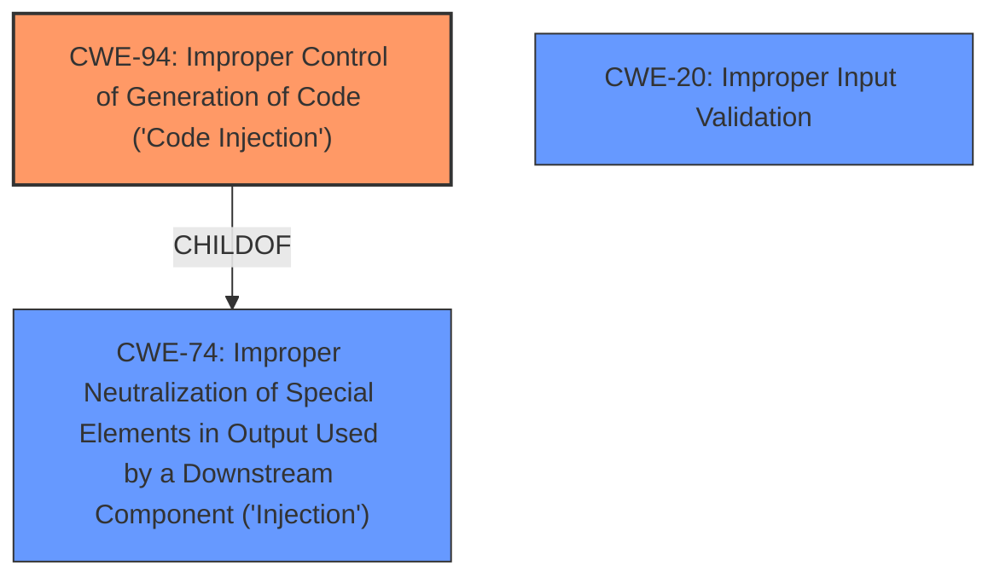

# Enhanced Analysis for CVE-2022-41223

# Summary
| CWE ID | CWE Name | Confidence | CWE Abstraction Level | CWE Vulnerability Mapping Label | CWE-Vulnerability Mapping Notes |
|---|---|---|---|---|---|
| CWE-94 | Improper Control of Generation of Code ('Code Injection') | 0.9 | Base | Allowed-with-Review | Primary CWE |
| CWE-20 | Improper Input Validation | 0.5 | Class | Discouraged | Secondary Candidate |

## Evidence and Confidence

*   **Confidence Score:** 0.9
*   **Evidence Strength:** HIGH

## Relationship Analysis
The primary relationship influencing the decision is that CWE-94 is a **Base** level CWE, which is more specific than its parent CWE-74. CWE-20 was considered as a possible contributing factor, but the primary issue is the **improper generation of code** due to **insufficient restrictions**. The relationship between CWE-94 and CWE-74 (ChildOf) highlights the need for a more specific classification than simply "Improper Neutralization."



## Vulnerability Chain
The vulnerability chain starts with the **insufficient restrictions on the database data type**, which leads to the **improper control of generation of code**, resulting in a code injection vulnerability.

## Summary of Analysis
The analysis is based on the provided evidence, specifically the vulnerability description and the CVE reference summary. The description clearly states that the root cause is "**insufficient restrictions on the database data type**," leading to a code injection vulnerability.

The CVE Reference Links Content Summary confirms this by stating:
"The vulnerability is due to a code injection flaw in the Director component of Mitel MiVoice Connect."

The relationship graph influenced the selection by emphasizing the importance of selecting the most specific CWE available. CWE-94 is more specific than CWE-74 and accurately reflects the **improper generation of code**.

The selected CWEs are at the optimal level of specificity because CWE-94 directly addresses the code injection aspect, while CWE-20 is a more general weakness that might contribute but isn't the primary cause.

Relevant CWE Information:

# Enhanced Context (25 CWEs)
The following CWEs were identified as potentially relevant to this vulnerability:

## CWE-94: Improper Control of Generation of Code ('Code Injection')
**Abstraction:** Base
**Similarity Score**: 0.250
**Source**: sparse

**Description**:
The product constructs all or part of a code segment using externally-influenced input from an upstream component, but it does not neutralize or incorrectly neutralizes special elements that could modify the syntax or behavior of the intended code segment.

**Mapping Guidance**:
**Usage:** Allowed-with-Review
**Rationale:** This entry is frequently misused for vulnerabilities with a technical impact of "code execution," which does not by itself indicate a root cause weakness, since dozens of weaknesses can enable code execution.
**Comments:** This weakness only applies when the product's functionality intentionally constructs all or part of a code segment. It could be that executing code could be the result of other weaknesses that do not involve the construction of code segments.

### Analysis for Selected CWEs

*   **CWE-94: Improper Control of Generation of Code ('Code Injection')**
    *   **Explanation:** The vulnerability description and CVE summary explicitly mention "code injection." CWE-94 directly addresses this by stating: "The product constructs all or part of a code segment using externally-influenced input...but it does not neutralize or incorrectly neutralizes special elements." The **insufficient restrictions** on the database data type allows an attacker to inject malicious code.
    *   **Security Implications:** An attacker can execute arbitrary code within the context of the application.
    *   **Relationships:** CWE-94 is a child of CWE-74 (Improper Neutralization of Special Elements in Output Used by a Downstream Component ('Injection')), making it a more specific classification.
    *   **Mapping Guidance:** The "Allowed-with-Review" usage is appropriate, and the description matches the vulnerability details.
*   **CWE-20: Improper Input Validation**
    *   **Explanation:** While the root cause is **insufficient restrictions on the database data type**, it can also be considered a form of **improper input validation**. The database data type is not being properly validated, which leads to the ability to inject code.
    *   **Security Implications:** Failure to validate input can lead to various vulnerabilities, including code injection.
    *   **Relationships:** CWE-20 is a class-level CWE, making it less specific than CWE-94.
    *   **Mapping Guidance:** CWE-20 is discouraged as a primary mapping, and the explanation above shows that this is because it is a high-level class.

### Analysis for Other CWEs Considered But Not Used

*   **CWE-611: Improper Restriction of XML External Entity Reference:** This CWE is specific to XML-based vulnerabilities, which is not the case here.
*   **CWE-90: Improper Neutralization of Special Elements used in an LDAP Query ('LDAP Injection'):** This CWE is specific to LDAP injection, which is not the case here.
*   **CWE-89: Improper Neutralization of Special Elements used in an SQL Command ('SQL Injection'):** This CWE is specific to SQL injection, which is not explicitly mentioned. Though the database is mentioned, it is the data type not SQL elements that are being restricted.
*   **CWE-269: Improper Privilege Management:** This CWE is related to privilege management, not code injection.
*   **CWE-120: Buffer Copy without Checking Size of Input ('Classic Buffer Overflow'):** This CWE is related to buffer overflows, not code injection.
*   **CWE-434: Unrestricted Upload of File with Dangerous Type:** This CWE is related to file uploads, not code injection.
*   **CWE-923: Improper Restriction of Communication Channel to Intended Endpoints:** This CWE is related to communication channels, not code injection.


## CWE Relationship Analysis

Current CWEs represent these abstraction levels: .


### Vulnerability Chain Analysis

**Chain starting from CWE-89:**
- 89 (Improper Neutralization of Special Elements used in an SQL Command ('SQL Injection')) - ROOT


**Chain starting from CWE-434:**
- 434 (Unrestricted Upload of File with Dangerous Type) - ROOT


### CWE Relationship Diagram

```mermaid
graph TD
    classDef primary fill:#f96,stroke:#333,stroke-width:2px
    classDef secondary fill:#69f,stroke:#333
    classDef tertiary fill:#9e9,stroke:#333
```