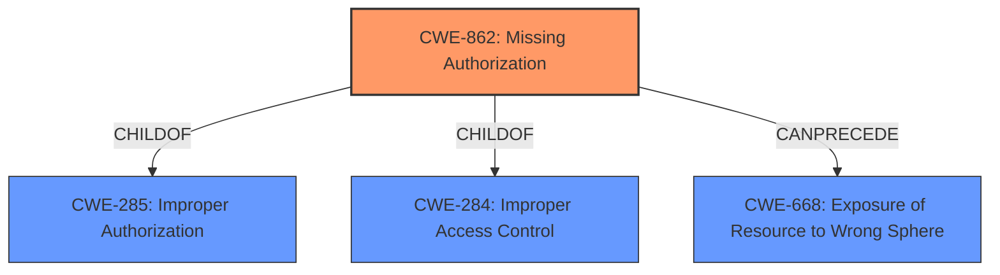

# Analysis for CVE-2022-41230

# Summary
| CWE ID | CWE Name | Confidence | CWE Abstraction Level | CWE Vulnerability Mapping Label | CWE-Vulnerability Mapping Notes |
|---|---|---|---|---|---|
| CWE-862 | Missing Authorization | 1.0 | Class | Primary | Allowed-with-Review |
| CWE-668 | Exposure of Resource to Wrong Sphere | 0.7 | Class | Secondary | Discouraged |

## Evidence and Confidence

*   **Confidence Score:** 1.0
*   **Evidence Strength:** HIGH

## Relationship Analysis
The primary CWE is CWE-862 which is a Class-level CWE. There is a parent relationship from CWE-862 to CWE-285 (Improper Authorization) and also CWE-284. The other CWE that was strongly considered was CWE-668, since the lack of authorization leads to the exposure of resource to the wrong control sphere. CWE-668 is a Class and is discouraged. The relationship between CWE-862 and CWE-668 is that CWE-862 can PRECEDE CWE-668.

## Vulnerability Chain
The chain of events starts with the **missing authorization** check (CWE-862). This leads to the **exposure of resource to the wrong sphere** (CWE-668), allowing attackers to obtain sensitive information.

## Summary of Analysis
The vulnerability description states that the "Jenkins Build-Publisher Plugin 1.22 and earlier **does not perform a permission check** in an HTTP endpoint." The "CVE Reference Links Content Summary" section states that the **Root cause** is a "Missing permission check in an HTTP endpoint". This vulnerability allows "attackers with Overall/Read permission to obtain names and URLs of Jenkins servers that the plugin is configured to publish builds to, as well as builds pending for publication to those Jenkins servers."

CWE-862 (Missing Authorization) is a Class-level CWE whose description states: "The product **does not perform an authorization check** when an actor attempts to access a resource or perform an action." This aligns perfectly with the vulnerability description.

CWE-668 (Exposure of Resource to Wrong Sphere) is a Class-level CWE whose description states: "The product exposes a resource to the wrong control sphere, providing unintended actors with inappropriate access to the resource." This is a consequence of the **missing authorization check**. MITRE discourages the usage of this CWE, since it is high-level and lower-level CWEs can frequently be used instead.

I am confident that CWE-862 is the primary CWE for this vulnerability, with CWE-668 as a secondary consideration.

Relevant CWE Information: